# 01 · Navigation Flow

Mermaid diagrams of every reachable path in Salon Khata. If a path is not diagrammed here, it is not reachable.

All diagrams derive from [../ux/02-navigation-architecture.md](../ux/02-navigation-architecture.md), [../ux/04-screen-flows.md](../ux/04-screen-flows.md), and [../navigation.md](../navigation.md). Screen IDs match [00-screen-map.md](00-screen-map.md).

## Root Navigation

The auth boundary is hard. Sign-in crosses from Auth Root to Main Tabs; sign-out crosses back.

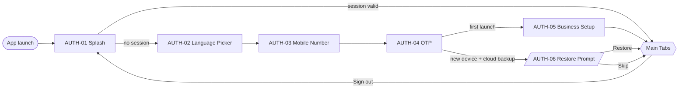

## Main Tab Structure

Four tabs. Fixed order. Each tab has an independent stack.

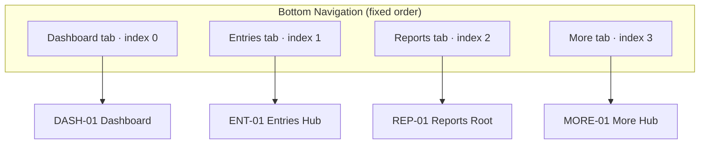

## Flow · Golden Path (Add Income, ≤ 10 s)

The single most important flow in the app. Every screen along this path is `P0`.

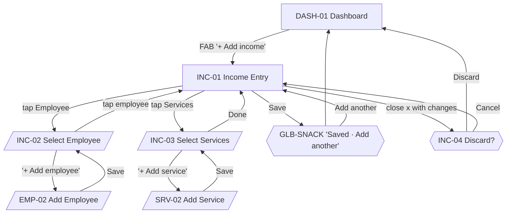

## Flow · Add Expense

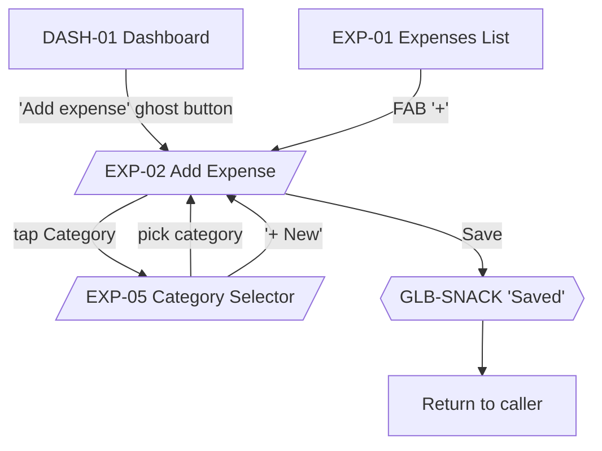

## Flow · Employees Stack

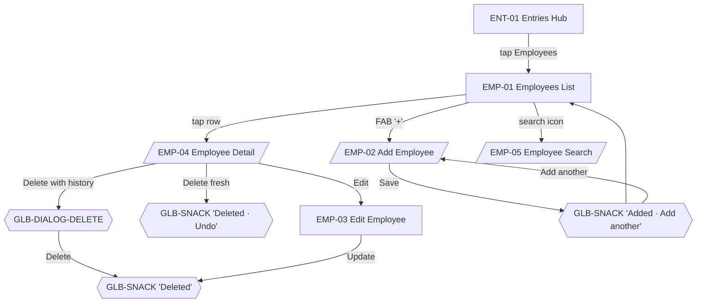

## Flow · Services Stack

Structure mirrors Employees.

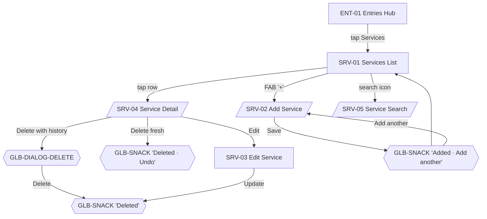

## Flow · Commission Rules

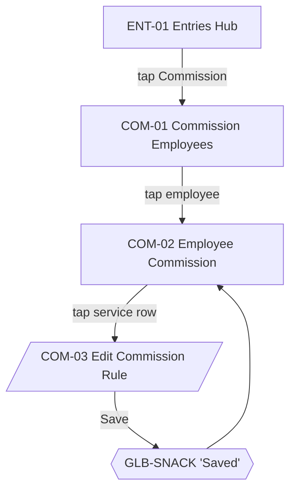

## Flow · Expenses Stack

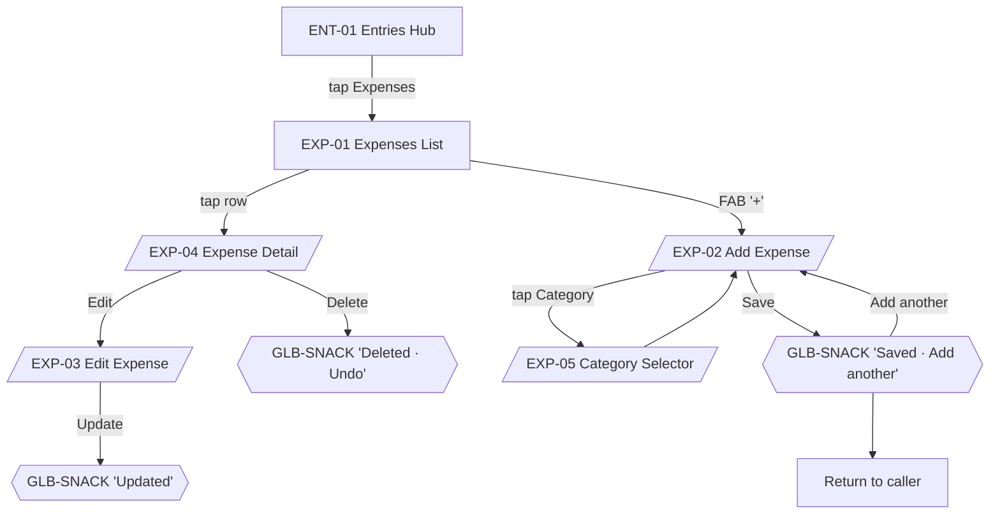

## Flow · Reports

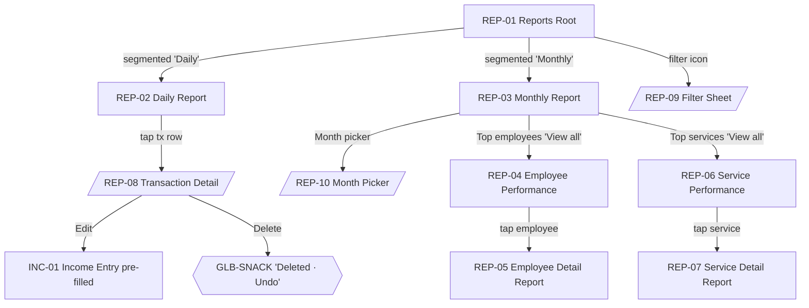

## Flow · More & Settings

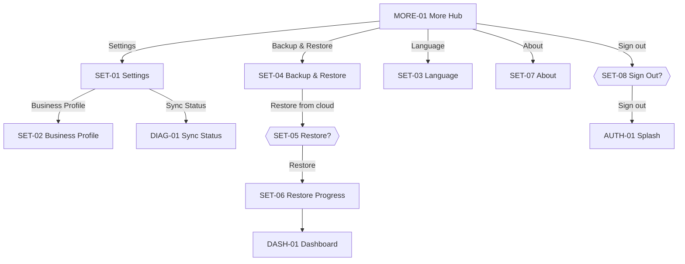

## Flow · Backup & Restore (state machine)

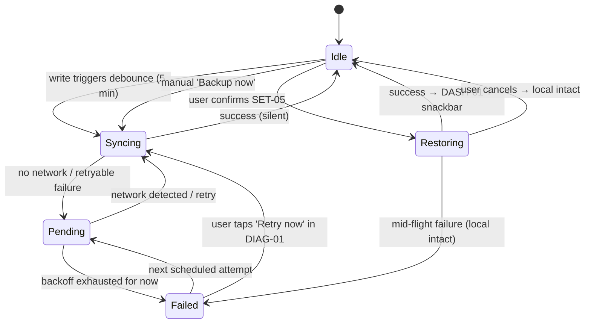

## Deep Links

Deep links land on the correct tab. If the session is invalid, the app routes to AUTH-03 and remembers the intended destination for post-auth.

| Link | Destination | Notes |
| --- | --- | --- |
| `salonkhata://income/new` | Dashboard tab → INC-01 | Golden path entry from outside the app |
| `salonkhata://expense/new` | Dashboard tab → EXP-02 (as sheet over DASH-01) | Same as Dashboard ghost button |
| `salonkhata://reports/daily` | Reports tab → REP-02 | Default tab position preserved |
| `salonkhata://reports/monthly` | Reports tab → REP-03 | Fallback to REP-02 if unresolved |
| `salonkhata://settings` | More tab → SET-01 | |
| `salonkhata://sync` | More tab → DIAG-01 | Used by support / diagnostics |
| _invalid_ | Dashboard tab → DASH-01 | Silent fallback |

## Back Behavior Summary

Full rules in [../ux/02-navigation-architecture.md#back-behavior](../ux/02-navigation-architecture.md#back-behavior). Enforced everywhere:

- Back on a nested screen pops the stack.
- Back with a bottom sheet open dismisses only the sheet.
- Back on any form with unsaved changes shows GLB-DIALOG-DISCARD.
- Back at tab root with tab history → previous tab.
- Back on DASH-01 with no history → Android exit toast (GLB-TOAST-EXIT), then second back exits.

## Reachability Invariants

Every screen must satisfy:

1. **Every Primary CTA has a destination diagrammed above.**
2. **Every screen is reachable from a tab root in ≤ 3 hops** (max depth per [../ux/02-navigation-architecture.md#deep-navigation](../ux/02-navigation-architecture.md#deep-navigation)).
3. **Every screen has an exit** — back, close, or CTA-return.
4. **No modal-within-modal-within-modal** — the only permitted nesting is `sheet → dialog` (e.g., GLB-DIALOG-DISCARD closing a form modal).
5. **No screen at depth ≥ 4** — refactor into siblings or a bottom sheet.
