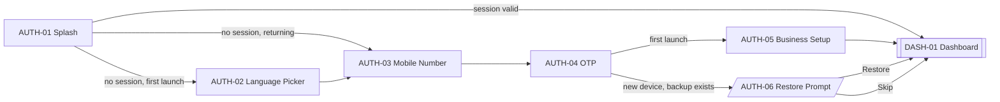

# 03 · Auth & Onboarding

The auth funnel takes a new user from cold launch to a working Dashboard, and returns existing users to their data with as little friction as the phone number and OTP require.

Source flows: [../ux/04-screen-flows.md#flow-1--first-launch--dashboard](../ux/04-screen-flows.md#flow-1--first-launch--dashboard), [Flow 2](../ux/04-screen-flows.md#flow-2--returning-user-login-existing-device), [Flow 3](../ux/04-screen-flows.md#flow-3--returning-user-login-new-device--reinstall), [Flow 17–19](../ux/04-screen-flows.md#flow-17--wrong-otp).

## Feature Navigation

## Cross-Feature Dependencies

- **Requires**: Firebase Auth configured ([../firebase/auth.ts](../../src/firebase/auth.ts)); i18n loaded ([../i18n/index.ts](../../src/i18n/index.ts)); default locale detection.
- **Provides**: authenticated session; `settings.business` row populated (name, owner, currency, language); optional cloud restore into local SQLite.

---

### AUTH-01 · Splash

- **Surface type**: Screen
- **Template**: T7 (7a Splash) — see [../design-system/17-screen-templates.md#7a-splash](../design-system/17-screen-templates.md#7a-splash)
- **Route / trigger**: App cold launch
- **Purpose**: Show identity while the app checks session state and routes forward.
- **Business goal**: Removes visible loading friction on cold launch · Protects [Speed Over Complexity](../product-principles.md#speed-over-complexity).

**Primary CTA**

- **Label**: `N/A` — automatic transition.
- **Destination**: DASH-01 if session valid, else AUTH-02 (first launch) or AUTH-03 (returning device without local session).

**Secondary CTA**

- `N/A`.

**Entry points**

- Cold launch.
- Redirect after Sign Out from SET-08 (session cleared) → Splash → AUTH-03.

**Exit points**

- Auto → DASH-01 (session valid + local data present).
- Auto → AUTH-02 (session invalid + no language preference).
- Auto → AUTH-03 (session invalid + language preference set).

**Design System components**

- App logo (icon, `brand.primary`)
- Optional tagline (Body Small)

**Content data**

- **Reads**: local session token, i18n language preference.
- **Writes**: none.

**States**

- **Loading**: implicit — the screen *is* the loading indicator. Max 1.5 s per [17-screen-templates.md#7a-splash](../design-system/17-screen-templates.md#7a-splash).
- **Empty**: `N/A` — no content surface.
- **Offline**: identical; session check falls back to local token.
- **Success**: auto-transition to next screen.
- **Error**: session refresh failure is silent (see [../ux/10-error-ux.md#session-expired](../ux/10-error-ux.md#session-expired)); routes to AUTH-03 with a snackbar on that screen `Please sign in again.`.

**Motion**

- **Enter**: OS launch.
- **Exit**: cross-fade 200 ms per [../ux/13-motion-flow.md#screen-transitions](../ux/13-motion-flow.md#screen-transitions).

**Accessibility**

- Screen reader announces app name once.
- No interactive elements.

**Dependencies**

- **Required first**: none.
- **Data written**: none.

**Priority**

- **MVP wave**: `P0`.
- **Rationale**: Every launch passes through here.

---

### AUTH-02 · Language Picker

- **Surface type**: Screen
- **Template**: T7
- **Route / trigger**: First launch only, when no language preference is stored.
- **Purpose**: Let the user pick the app language before any other decision.
- **Business goal**: Non-English owners see the app in their language from screen one · Protects [Translation Ready](../product-principles.md#translation-ready).

**Primary CTA**

- **Label**: `t("common.continue")` — `Continue`
- **Destination**: AUTH-03.

**Secondary CTA**

- `N/A`.

**Entry points**

- From AUTH-01 on first launch.

**Exit points**

- Continue → AUTH-03.

**Design System components**

- [App Bar](../design-system/08-component-library.md#app-bar) (no back, title `t("auth.chooseLanguage")`)
- [List Item](../design-system/08-component-library.md#list-item) rows (one per language, native script names)
- [Radio](../design-system/08-component-library.md#radio) trailing indicator per row
- [Button](../design-system/08-component-library.md#button) primary in fixed footer

**Content data**

- **Reads**: device locale (pre-select match).
- **Writes**: `settings.language` on Continue.
- **Validation**: exactly one selection required (default = device locale match, else English).

**States**

- **Loading**: `N/A` — static list.
- **Empty**: `N/A` — list is defined.
- **Offline**: identical.
- **Success**: silent → AUTH-03.
- **Error**: `N/A` — write is local-only.

**Motion**

- **Enter**: cross-fade from AUTH-01.
- **Exit**: push (slide from right) to AUTH-03.

**Accessibility**

- First focus: the row matching the OS locale.
- Screen reader announces language name in its own script (per [Language Selector](../design-system/08-component-library.md#language-selector) rule).
- Primary CTA above keyboard is `N/A` — no keyboard.

**Dependencies**

- **Required first**: none.
- **Data written**: `settings.language`.

**Priority**

- **MVP wave**: `P0`.
- **Rationale**: Localization is a first-class product principle.

---

### AUTH-03 · Mobile Number Entry

- **Surface type**: Screen
- **Template**: T7 (7b Mobile Number Entry)
- **Route / trigger**: After AUTH-02 (first launch) or after AUTH-01 (returning device without local session).
- **Purpose**: Capture the 10-digit mobile number that identifies the salon.
- **Business goal**: One mobile number per salon per [../business-workflows.md#authentication](../business-workflows.md#authentication) · Protects [Simple Over Feature Rich](../product-principles.md#simple-over-feature-rich).

**Primary CTA**

- **Label**: `t("auth.sendOtp")` — `Send OTP`
- **Destination**: AUTH-04.

**Secondary CTA**

- `N/A`.

**Entry points**

- From AUTH-02.
- From AUTH-01 (returning device).
- Redirect after silent sign-out (see [../ux/10-error-ux.md#session-expired](../ux/10-error-ux.md#session-expired)).
- Deep-link fallback when the user is signed out.

**Exit points**

- Send OTP → AUTH-04.
- Hardware back (no history) → app exit.

**Design System components**

- [App Bar](../design-system/08-component-library.md#app-bar) (no back)
- Illustration slot (icon only)
- Body copy (title H1 + body per [17-screen-templates.md#7b-mobile-number-entry](../design-system/17-screen-templates.md#7b-mobile-number-entry))
- [Text Field · mobile](../design-system/08-component-library.md#text-field) with `+91` prefix
- [Button](../design-system/08-component-library.md#button) primary in fixed footer

**Content data**

- **Inputs**: mobile (10 digits).
- **Writes**: transient — sends OTP request to Firebase.
- **Validation**: exactly 10 digits, numeric. Error copy per [../ux/10-error-ux.md#validation-errors-form-level](../ux/10-error-ux.md#validation-errors-form-level) — `Enter a 10-digit mobile number.` on blur.

**States**

- **Loading**: Send OTP button shows loading state (per [Button](../design-system/08-component-library.md#button)) while OTP request is in flight.
- **Empty**: `N/A` — form.
- **Offline**: Send OTP fails with subtle snackbar `Couldn't send the code · Retry` per [../ux/10-error-ux.md#network-errors-backend-request-failed](../ux/10-error-ux.md#network-errors-backend-request-failed).
- **Success**: silent transition to AUTH-04.
- **Error**: blocking dialog `Couldn't send the code` if no network — see [../ux/10-error-ux.md#tier-blocking-auth](../ux/10-error-ux.md#tier-blocking-auth).

**Motion**

- Standard push transitions.

**Accessibility**

- Auto-focus mobile field on mount (per [../ux/06-form-ux.md#auto-focus](../ux/06-form-ux.md#auto-focus)).
- Keyboard: `phone-pad`.
- Primary CTA remains visible above the keyboard.

**Dependencies**

- **Required first**: Firebase Auth configured, network needed for Send OTP (per [../ux/12-offline-ux.md#offline-operation](../ux/12-offline-ux.md#offline-operation)).
- **Data written**: none (OTP request is transient).

**Priority**

- **MVP wave**: `P0`.

---

### AUTH-04 · OTP Verification

- **Surface type**: Screen
- **Template**: T7 (7c OTP Verification)
- **Route / trigger**: After successful Send OTP from AUTH-03.
- **Purpose**: Verify the 6-digit code and establish a session.
- **Business goal**: Provable ownership of the mobile number · Protects [Local Truth](../product-principles.md#local-truth) by tying the salon to a real identity.

**Primary CTA**

- **Label**: `t("auth.verify")` — `Verify` (auto-triggers on 6 digits)
- **Destination**: AUTH-05 (first launch), AUTH-06 (returning device + cloud backup), or DASH-01 (returning device + no backup).

**Secondary CTA**

- **Label**: `t("auth.change")` — `Change` (in "Sent to +91 ····· ·····. Change")
- **Destination**: AUTH-03 with mobile pre-filled (Flow 19).

**Entry points**

- From AUTH-03 on Send OTP success.

**Exit points**

- Auto-verify → route as per [../ux/04-screen-flows.md#flow-1--first-launch--dashboard](../ux/04-screen-flows.md#flow-1--first-launch--dashboard) and [Flow 3](../ux/04-screen-flows.md#flow-3--returning-user-login-new-device--reinstall).
- Change → AUTH-03.
- Hardware back → AUTH-03.

**Design System components**

- [App Bar](../design-system/08-component-library.md#app-bar) (leading back)
- OTP input (6 boxes with auto-advance) — [Text Field · OTP](../design-system/08-component-library.md#text-field)
- Body Small (`Resend in 30s` timer with `Resend` link when expired)
- [Button](../design-system/08-component-library.md#button) primary in fixed footer

**Content data**

- **Inputs**: 6-digit OTP.
- **Writes**: session token on verify success.
- **Validation**: exactly 6 numeric digits; server-verified. Wrong code copy: `The code doesn't match. Try again.` per [../ux/10-error-ux.md#validation-errors-form-level](../ux/10-error-ux.md#validation-errors-form-level).

**States**

- **Loading**: Verify button loading state during verification request.
- **Empty**: `N/A`.
- **Offline**: verify request fails with blocking dialog `Couldn't send the code` (auth requires network per [../ux/10-error-ux.md#tier-blocking-auth](../ux/10-error-ux.md#tier-blocking-auth)).
- **Success**: silent → next screen.
- **Error**:
  - Wrong OTP → field error + clear input + focus first box (Flow 17).
  - Expired OTP → field error `Code expired. Send a new one.` + highlight Resend.
  - Network fail → snackbar with Retry.

**Motion**

- Standard push. Auto-advance between digits animates opacity only.

**Accessibility**

- Auto-focus first OTP box on mount.
- Keyboard: `number-pad` with `oneTimeCode` autofill hint.
- Announce field error via `accessibilityLiveRegion`.

**Dependencies**

- **Required first**: AUTH-03; network.
- **Data written**: session token; `settings.mobile`.

**Priority**

- **MVP wave**: `P0`.

---

### AUTH-05 · Business Setup

- **Surface type**: Screen
- **Template**: T7 (7d Business Setup)
- **Route / trigger**: After AUTH-04 on first launch (no existing local salon).
- **Purpose**: Capture the minimum details required to render the Dashboard: business name (and optional owner name).
- **Business goal**: The Dashboard title, currency, and greeting are personal from launch one · Protects [Simple Over Feature Rich](../product-principles.md#simple-over-feature-rich) by capturing only what's required.

**Primary CTA**

- **Label**: `t("common.continue")` — `Continue`
- **Destination**: DASH-01 (empty state).

**Secondary CTA**

- `N/A`.

**Entry points**

- From AUTH-04 on first launch.

**Exit points**

- Continue → DASH-01.
- Hardware back → suppressed (no history; first-launch cannot skip).

**Design System components**

- [App Bar](../design-system/08-component-library.md#app-bar) (no back)
- H1 title
- [Text Field · name](../design-system/08-component-library.md#text-field) × 2 (business name required; owner name optional)
- [Button](../design-system/08-component-library.md#button) primary in fixed footer

**Content data**

- **Inputs**: business name (required), owner name (optional).
- **Writes**: `settings` row — business name, owner name, currency defaults to `INR`, language already set.
- **Validation**: business name non-empty on blur; owner name unvalidated. Error copy `Give your salon a name.`.

**States**

- **Loading**: Continue button loading state during SQLite write (near-instant).
- **Empty**: `N/A`.
- **Offline**: identical — write is local. See [../ux/12-offline-ux.md#offline-operation](../ux/12-offline-ux.md#offline-operation).
- **Success**: silent → DASH-01.
- **Error**: local storage failure per [../ux/10-error-ux.md#storage-errors-device-out-of-space](../ux/10-error-ux.md#storage-errors-device-out-of-space) — snackbar `Couldn't save · your device is out of storage.`.

**Motion**

- Standard push. No auto-focus (avoids pushing CTA off-screen on small phones — actually per [../ux/06-form-ux.md#auto-focus](../ux/06-form-ux.md#auto-focus) business name **is** auto-focused because it's the primary intent; verified).
- Auto-focus business name.

**Accessibility**

- First focus: business name.
- Keyboard: `default` with `autoCapitalize="words"`.
- Optional field labeled `Owner name (optional)` per [../ux/06-form-ux.md#required-vs-optional](../ux/06-form-ux.md#required-vs-optional).

**Dependencies**

- **Required first**: AUTH-04; SQLite migrations run.
- **Data written**: `settings` (business name, owner name, currency, language).

**Priority**

- **MVP wave**: `P0`.

---

### AUTH-06 · Restore Prompt

- **Surface type**: Bottom Sheet
- **Template**: T6
- **Route / trigger**: After AUTH-04 on a new device or reinstall, only if a cloud backup exists for the mobile number.
- **Purpose**: Ask whether to restore cloud data before showing the Dashboard.
- **Business goal**: Returning owners don't re-enter services, employees, or commission rules · Protects [Local Truth](../product-principles.md#local-truth) by preventing local/cloud drift.

**Primary CTA**

- **Label**: `t("auth.restore")` — `Restore`
- **Destination**: DASH-01 with silent restore progress line + snackbar `Restored` on completion (per [Flow 3](../ux/04-screen-flows.md#flow-3--returning-user-login-new-device--reinstall)).

**Secondary CTA**

- **Label**: `t("common.skip")` — `Skip`
- **Destination**: DASH-01 empty state.

**Entry points**

- From AUTH-04 when backup detection returns positive.

**Exit points**

- Restore → DASH-01 (with progress).
- Skip → DASH-01 (empty).
- Swipe-down / scrim tap: **disabled** — this sheet is `blocking` per [Bottom Sheet variants](../design-system/08-component-library.md#bottom-sheet) because dismissing without deciding leaves the app in an ambiguous state.

**Design System components**

- [Bottom Sheet](../design-system/08-component-library.md#bottom-sheet) (blocking variant, no swipe dismiss)
- Icon (`cloud-download`)
- H3 title, Body body
- Two [Button](../design-system/08-component-library.md#button) actions in fixed footer (Primary + Secondary/Ghost)

**Content data**

- **Reads**: backup metadata (existence + timestamp) from Firebase.
- **Writes**: on Restore — triggers restore flow (see [../sync/restore-service.ts](../../src/sync/restore-service.ts)).
- **Validation**: `N/A`.

**States**

- **Loading**: `N/A` — sheet appears only after backup check succeeds.
- **Empty**: if no backup found, this sheet is not shown; falls through to DASH-01 empty.
- **Offline**: sheet is only shown when backup check succeeded, so network was available; if network drops before Restore, tapping Restore falls back to error dialog per [../ux/12-offline-ux.md#restore--no-network](../ux/12-offline-ux.md#restore--no-network).
- **Success**: DASH-01 shows silent restore progress + snackbar `Restored`.
- **Error**: restore mid-flight failure — local data intact; dialog per [../ux/10-error-ux.md#restore-failures](../ux/10-error-ux.md#restore-failures).

**Motion**

- Sheet slide-up 200 ms per [../ux/13-motion-flow.md#bottom-sheets](../ux/13-motion-flow.md#bottom-sheets).

**Accessibility**

- First focus: Restore button.
- Sheet title read as `Restore from cloud?`.

**Dependencies**

- **Required first**: AUTH-04, backup metadata query available.
- **Data written**: potentially entire local SQLite (atomic restore).

**Priority**

- **MVP wave**: `P1`.
- **Rationale**: Restore is required for returning users but not for first-launch owners. Ships in the wave that lands sync.
