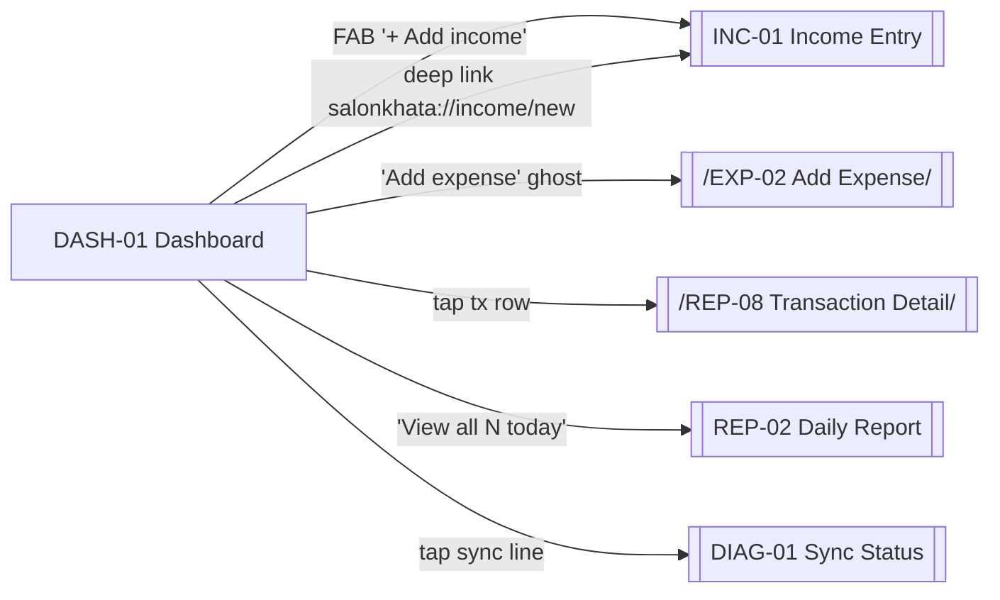

# 04 · Dashboard

The Dashboard is the app's front door. It answers "how is today going?" in ≤ 3 seconds and points to the next likely action (`+ Add income`).

Sources: [../ux/08-dashboard-ux.md](../ux/08-dashboard-ux.md), [../ux/04-screen-flows.md#flow-2--returning-user-login-existing-device](../ux/04-screen-flows.md#flow-2--returning-user-login-existing-device), [../design-system/17-screen-templates.md#template-1-dashboard](../design-system/17-screen-templates.md#template-1-dashboard).

## Feature Navigation

## Cross-Feature Dependencies

- **Requires**: AUTH-05 complete; SQLite migrations run; [income-repository](../../src/repositories/income-repository.ts) and [expense-repository](../../src/repositories/expense-repository.ts); report service today-aggregates.
- **Provides**: entry to golden path (INC-01) and secondary expense capture (EXP-02).

---

### DASH-01 · Dashboard

- **Surface type**: Screen
- **Template**: T1 Dashboard — see [../design-system/17-screen-templates.md#template-1-dashboard](../design-system/17-screen-templates.md#template-1-dashboard)
- **Route / trigger**: Dashboard tab (index 0), the default landing screen after auth.
- **Purpose**: Show today's income, expenses, net collection, and recent transactions at a glance; expose the Add Income golden path.
- **Business goal**: Owner-Operator sees "am I making money today?" in ≤ 3 seconds and records the next customer in ≤ 10 seconds · Protects [Speed Over Complexity](../product-principles.md#speed-over-complexity) and [Offline First](../product-principles.md#offline-first).

**Primary CTA**

- **Label**: `t("dashboard.addIncome")` — `+ Add income`
- **Destination**: INC-01 (Income Entry full-screen modal).

**Secondary CTA**

- **Label**: `t("dashboard.addExpense")` — `Add expense` (ghost button, inline below peer money cards per [08-dashboard-ux.md#anchor-elements](../ux/08-dashboard-ux.md#anchor-elements))
- **Destination**: EXP-02 (Add Expense bottom sheet).

**Entry points**

- Dashboard tab tap.
- Re-tap current Dashboard tab: scroll to top, then second re-tap pops to root (already root).
- After Save from INC-01 / EXP-02 (Return to Dashboard per [../ux/11-success-ux.md#success-feedback-matrix](../ux/11-success-ux.md#success-feedback-matrix)).
- Auto-transition from AUTH-01 (session valid).
- Auto-transition from AUTH-05 (first launch) or AUTH-06 (post-restore).
- Deep link `salonkhata://income/new` lands here then immediately opens INC-01 (per [01-navigation-flow.md#deep-links](01-navigation-flow.md#deep-links)).
- Deep link `salonkhata://expense/new` lands here then immediately opens EXP-02.

**Exit points**

- FAB → INC-01.
- Ghost `Add expense` → EXP-02.
- Transaction card tap → REP-08 sheet.
- `View all (N today) →` → REP-02.
- Sync line tap → DIAG-01.
- Bottom nav tap → other tab root.
- Hardware back → GLB-TOAST-EXIT (first press), exit app (second press).

**Design System components**

- [App Bar](../design-system/08-component-library.md#app-bar) (business name H2, no back, trailing avatar; `bell` icon reserved post-MVP)
- [Money Card · Hero](../design-system/08-component-library.md#money-card) — today's income
- [Money Card · Large](../design-system/08-component-library.md#money-card) × 2 — expenses, net collection
- [Button · Ghost](../design-system/08-component-library.md#button) — `Add expense`
- [Section Header](../design-system/08-component-library.md#section-header) — `Recent transactions`
- [Transaction Card](../design-system/08-component-library.md#transaction-card) × up to 5
- Text row (Body Small, `text.muted`) — `Last synced <time>` per [08-dashboard-ux.md#sync-status-line](../ux/08-dashboard-ux.md#sync-status-line)
- [FAB · Extended](../design-system/08-component-library.md#fab-floating-action-button) — `+ Add income`
- [Bottom Navigation](../design-system/08-component-library.md#bottom-navigation)

**Content data**

- **Reads**:
  - Today's income sum from `transactions` (business-day boundary per [08-dashboard-ux.md#business-day-boundary](../ux/08-dashboard-ux.md#business-day-boundary): 04:00 local).
  - Today's expense sum from `expenses`.
  - Delta vs yesterday for hero (post-first-day only).
  - Last 5 income/expense entries for today (mixed feed).
  - Last sync timestamp from sync engine.
- **Writes**: none directly.
- **Validation**: `N/A` — read-only.
- **Computed values**: net collection = income − expenses; delta = today − yesterday (hidden on day one).

**States**

- **Loading**: DASH-01-LOADING — skeleton cards for hero + 2 peers + 3 transaction rows, no spinner. See [08-dashboard-ux.md#loading-state-first-launch-after-install](../ux/08-dashboard-ux.md#loading-state-first-launch-after-install).
- **Empty**: DASH-01-EMPTY — hero shows `₹0`, peers show `₹0`, recent-transactions section replaced with inline prompt `No income yet · Add your first entry` per [09-empty-states.md#dashboard-no-transactions-today](../ux/09-empty-states.md#dashboard-no-transactions-today). FAB Extended remains prominent.
- **Offline**: DASH-01-OFFLINE — visually identical to online per [08-dashboard-ux.md#offline-state](../ux/08-dashboard-ux.md#offline-state). Sync line still shows `Last synced <time>` (no `Offline` label in MVP).
- **Success**: not a screen state — success arrives via GLB-SNACK after Save from INC-01/EXP-02.
- **Error**: DB read failure is rare; show inline `Something went wrong · Retry` in the money card region per [09-empty-states.md#loading-timeout--rare-db-failure](../ux/09-empty-states.md#loading-timeout--rare-db-failure).
- **Syncing**: DASH-01-SYNCING — sync line updates to `Syncing…` per [12-offline-ux.md#sync-states-user-visible](../ux/12-offline-ux.md#sync-states-user-visible); screen stays fully interactive.

**Motion**

- **Enter**: hero + peer cards fade + slide up 8 dp on first render, staggered 40 ms per card. Cross-fade on subsequent renders. See [../ux/13-motion-flow.md#money-card-first-appear-dashboard](../ux/13-motion-flow.md#money-card-first-appear-dashboard).
- **Exit**: standard cross-fade to other tabs; slide-up modal to INC-01.
- **In-screen**: FAB scale-in on first render; hide on scroll down, reappear on scroll up. New transaction row slides in at correct sorted position after save.

**Accessibility**

- First focus (screen reader): app bar business name → hero card label + value → peer cards → `Add expense` → recent tx → FAB.
- FAB Extended positioned 16 dp above bottom nav, well within thumb reach.
- Money values use tabular figures; must not truncate under 200% OS text (values right-align, labels wrap).
- Sync line copy respects language direction.

**Dependencies**

- **Required first**: AUTH-05 complete; SQLite migrations; income + expense repositories.
- **Data written**: none.

**Priority**

- **MVP wave**: `P0`.
- **Rationale**: Central hub for the golden path.

---

### DASH-01-EMPTY · Empty State

- **Surface type**: State variant of DASH-01
- **Template**: T1 with T8 inline prompt in the recent-transactions region
- **Trigger**: `transactions` sum for today is 0 AND `expenses` sum for today is 0.
- **Purpose**: Communicate zero collection without judgment and guide the owner to the first Add Income tap.
- **Business goal**: First-launch owner immediately understands where to start · Protects [Product Principle · Consistent Interactions](../product-principles.md#consistent-interactions) — the empty state uses the same primary CTA as the populated state.

**Notable differences from populated state**

- Hero card renders `₹0` with label `Today's income` and no delta line.
- Peer cards render `₹0`.
- Recent-transactions section replaces the list with a compact prompt `No income yet · Add your first entry` (left-aligned, no icon per [09-empty-states.md#empty-state-positioning](../ux/09-empty-states.md#empty-state-positioning)).
- FAB Extended is unchanged and prominent.

Empty state copy: [09-empty-states.md#dashboard-no-transactions-today](../ux/09-empty-states.md#dashboard-no-transactions-today).

---

### DASH-01-LOADING · Loading State

- **Surface type**: State variant of DASH-01
- **Template**: T1 skeletons
- **Trigger**: First render after app install / restore; local aggregate query not yet resolved.
- **Purpose**: Signal that content is arriving without blocking interaction.
- **Business goal**: Perceived performance parity with a native app · Protects [Speed Over Complexity](../product-principles.md#speed-over-complexity).

**Notable differences from populated state**

- Skeleton hero card + 2 skeleton peer cards + 3 skeleton transaction rows.
- Shimmer animation per [../design-system/09-motion-system.md](../design-system/09-motion-system.md).
- FAB is hidden until first render completes (avoids letting the owner tap into an INC-01 whose employee list is still loading).

Skeleton behavior: [08-component-library.md#loading-skeleton](../design-system/08-component-library.md#loading-skeleton).

---

### DASH-01-OFFLINE · Offline State

- **Surface type**: State variant of DASH-01
- **Template**: T1 (visually identical to online)
- **Trigger**: Device network state is offline.
- **Purpose**: Prove that offline is not an error.
- **Business goal**: Owner never wonders "is this working right now?" · Protects [Offline First](../product-principles.md#offline-first).

**Notable differences from populated state**

- None visible on MVP. Sync line continues to show the last successful sync timestamp per [08-dashboard-ux.md#offline-state](../ux/08-dashboard-ux.md#offline-state).
- After 24 h without a successful sync, sync line prepends a subtle badge `Not synced · Xh ago` per [12-offline-ux.md#sync-failed](../ux/12-offline-ux.md#sync-failed).

**Anti-pattern check**: no banner, no overlay, no warning, no disabled buttons.

---

### DASH-01-SYNCING · Syncing State

- **Surface type**: State variant of DASH-01
- **Template**: T1
- **Trigger**: Sync engine is actively pushing/pulling.
- **Purpose**: Reassure that sync is happening without demanding attention.
- **Business goal**: Trust · Protects [Offline First](../product-principles.md#offline-first).

**Notable differences from populated state**

- Sync line reads `Syncing…` with a small activity indicator.
- Screen remains fully interactive.
- On completion: line updates to `Last synced just now` with no snackbar per [12-offline-ux.md#sync-completed](../ux/12-offline-ux.md#sync-completed).
- If the pull changes data currently visible, list animates changes in via row-insert / row-update motion.

**Anti-pattern check**: no progress bar on the Dashboard; no snackbar on background sync completion.
