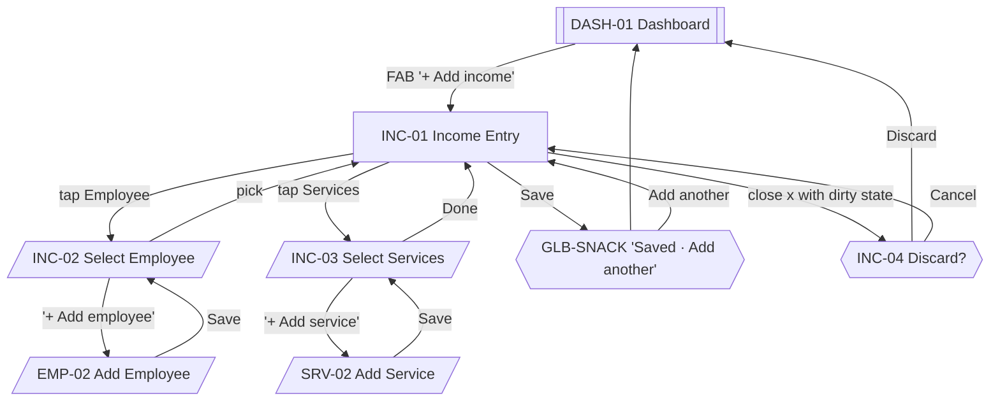

# 05 · Income Entry

The golden path. INC-01 and its two selection sheets are the most important flow in the app. Every micro-decision here — auto-focus, defaults, sheet-to-sheet handoff — is subordinate to the ≤ 10-second target from [../ux/README.md#prime-directive](../ux/README.md#prime-directive).

Sources: [../ux/04-screen-flows.md#flow-4--record-income-the-golden-10-second-flow](../ux/04-screen-flows.md#flow-4--record-income-the-golden-10-second-flow), [Flow 4a](../ux/04-screen-flows.md#flow-4a--inline-add-missing-employee-during-income-entry), [../business-workflows.md#income-entry](../business-workflows.md#income-entry).

## Feature Navigation

## Cross-Feature Dependencies

- **Requires**: ≥ 1 active Employee (EMP-01 populated); ≥ 1 active Service (SRV-01 populated); commission rules per COM-02 (optional — defaults to zero if unset per [../business-workflows.md#employee-commission](../business-workflows.md#employee-commission)); payment mode defaults from last used.
- **Provides**: `transactions` insert; commission snapshots protecting historical reports.

---

### INC-01 · Income Entry

- **Surface type**: Full-screen Modal
- **Template**: T3 Form (Full Screen)
- **Route / trigger**: DASH-01 FAB `+ Add income`; deep link `salonkhata://income/new`; snackbar `Add another`; REP-08 `Edit` action.
- **Purpose**: Record a single customer transaction — employee, services, payment mode — with amount and commission auto-computed.
- **Business goal**: The 10-second golden path · Protects [Speed Over Complexity](../product-principles.md#speed-over-complexity) and [Minimum Typing](../product-principles.md#minimum-typing).

**Primary CTA**

- **Label**: `t("income.save")` — `Save`
- **Destination**: DASH-01 with GLB-SNACK `Saved · Add another`.

**Secondary CTA**

- **Label**: `t("common.close")` — `x` close icon in app bar
- **Destination**: DASH-01 (clean state); INC-04 discard dialog if dirty.

**Entry points**

- DASH-01 FAB.
- Deep link `salonkhata://income/new`.
- GLB-SNACK `Add another` action after previous save.
- REP-08 Transaction Detail → `Edit` (opens INC-01 pre-filled with existing transaction; primary CTA becomes `Update`).

**Exit points**

- Save → DASH-01 + GLB-SNACK.
- `Add another` from snackbar → re-opens INC-01 with defaults preserved (payment mode) and content cleared (employee, services).
- Close `x` (clean) → DASH-01.
- Close `x` (dirty) → INC-04 Discard dialog.
- Hardware back mirrors close.
- Save failure (rare, storage full) → snackbar with `Retry`; form preserved per [../ux/10-error-ux.md#storage-errors-device-out-of-space](../ux/10-error-ux.md#storage-errors-device-out-of-space).

**Design System components**

- [App Bar](../design-system/08-component-library.md#app-bar) (leading `x`, title H2 `Add income` or `Edit income`, no trailing)
- Field row: Employee (looks like a text field with `chevron-down`, opens INC-02) — [Dropdown / Bottom Sheet Select](../design-system/08-component-library.md#dropdown--bottom-sheet-select) single-select
- Field row: Services (multi-select, chip summary shows picked services with count) — Dropdown BS Select multi-select
- Read-only row: Amount (Money Body, right-aligned; computed)
- Read-only row: Commission (Money Body, right-aligned; computed; per employee-service rule)
- [Payment Mode Selector](../design-system/08-component-library.md#payment-mode-selector) — 4 chips (Cash, UPI, Card, Other); default = last used
- [Button](../design-system/08-component-library.md#button) primary in fixed footer — `Save` / `Update`

**Content data**

- **Inputs**: employee (required, single), services (required, multi ≥ 1), payment mode (required, defaulted).
- **Reads**: active employees (recent first), active services (recent first), commission rules per employee+service, last-used payment mode.
- **Writes**: `transactions` row + `transaction_items` rows (one per service) with commission snapshot per [../business-workflows.md#income-entry](../business-workflows.md#income-entry); `sync_outbox` enqueue.
- **Validation**: employee non-null, services length ≥ 1, payment mode non-null. Errors on submit only (there are no free-text fields to blur). Error copy: `Pick an employee to continue.`, `Pick at least one service.`.
- **Computed values**:
  - **Amount** = sum of service prices at time of entry (uses current service price; historical entries retain snapshot).
  - **Commission** = sum over services of the per-employee-service rule (percent of amount OR fixed) per [../business-workflows.md#employee-commission](../business-workflows.md#employee-commission). Zero when no rule.

**States**

- **Loading**: Save button loading state during SQLite write (near-instant).
- **Empty**: `N/A` — this form is triggered, not landed.
- **Offline**: identical — writes go to SQLite immediately, queue in `sync_outbox` per [12-offline-ux.md#offline-operation](../ux/12-offline-ux.md#offline-operation).
- **Success**: GLB-SNACK `Saved · Add another` (5 s duration per [11-success-ux.md#snackbar-anatomy](../ux/11-success-ux.md#snackbar-anatomy)); light haptic; return to DASH-01.
- **Error**: submit-time validation errors highlight the offending field; storage failure surfaces via snackbar with `Retry`.

**Motion**

- **Enter**: slide-from-bottom + scrim fade, 200 ms per [../ux/13-motion-flow.md#screen-transitions](../ux/13-motion-flow.md#screen-transitions).
- **Exit**: slide-to-bottom + scrim fade, 200 ms.
- **In-screen**: amount + commission cross-fade on recomputation (120 ms) per [../ux/13-motion-flow.md#money-card-value-change-after-sync](../ux/13-motion-flow.md#money-card-value-change-after-sync).

**Accessibility**

- **Focus order**: Employee → Services → Payment mode → Save. No auto-focus (user came to tap, not type) per [../ux/06-form-ux.md#auto-focus](../ux/06-form-ux.md#auto-focus).
- Payment mode chips have 44 dp touch targets per [Payment Mode Selector](../design-system/08-component-library.md#payment-mode-selector).
- Amount + commission are announced by screen reader when they change, using `accessibilityLiveRegion="polite"`.
- Save button remains visible above keyboard on any screen size (no free-text input pushes it away in MVP).
- All copy via translation keys.

**Dependencies**

- **Required first**: ≥ 1 active Employee, ≥ 1 active Service. If either is absent, the FAB still opens INC-01 but INC-02/INC-03 route into inline `+ Add employee` / `+ Add service` via [Flow 4a](../ux/04-screen-flows.md#flow-4a--inline-add-missing-employee-during-income-entry).
- **Data written**: `transactions`, `transaction_items`, `sync_outbox`.

**Priority**

- **MVP wave**: `P0`.
- **Rationale**: The single most important screen in the app.

---

### INC-02 · Select Employee

- **Surface type**: Bottom Sheet
- **Template**: T6
- **Route / trigger**: Tap on Employee field in INC-01.
- **Purpose**: Pick the employee who performed the service, with a recent-first ordering that minimizes taps.
- **Business goal**: Repeat entries land on the same employee in one tap · Protects [Minimum Typing](../product-principles.md#minimum-typing).

**Primary CTA**

- **Label**: implicit — tapping an employee row selects and dismisses per single-select [Dropdown / Bottom Sheet Select](../design-system/08-component-library.md#dropdown--bottom-sheet-select) rule.
- **Destination**: INC-01 with employee filled.

**Secondary CTA**

- **Label**: `t("employees.addNew")` — `+ Add employee` (inline row above the list, or as empty-state action)
- **Destination**: EMP-02 Add Employee sheet, which **replaces** this sheet per the inline-create pattern in [02-navigation-architecture.md#bottom-sheet-navigation](../ux/02-navigation-architecture.md#bottom-sheet-navigation). On EMP-02 Save, control returns here with the new employee pre-selected.

**Entry points**

- INC-01 Employee field tap.

**Exit points**

- Tap employee row → INC-01 with selection applied.
- `+ Add employee` → EMP-02 → back to INC-02.
- Swipe-down / scrim tap / hardware back → INC-01 unchanged.

**Design System components**

- [Bottom Sheet](../design-system/08-component-library.md#bottom-sheet) (standard, dismissible)
- [Search](../design-system/08-component-library.md#search) (appears only when active employee count > 6 per [Dropdown](../design-system/08-component-library.md#dropdown--bottom-sheet-select))
- [Section Header](../design-system/08-component-library.md#section-header) — `Recent`, `All`
- [Employee Card](../design-system/08-component-library.md#employee-card) rows (selection-ready)
- Inline row: `+ Add employee` (icon + label, list-item pattern)

**Content data**

- **Reads**: active employees ordered by last-used-in-transaction desc; secondary sort by name.
- **Writes**: `settings` — record last-selected employee for recency (in-memory OK; persistence post-MVP).
- **Validation**: `N/A`.

**States**

- **Loading**: skeleton employee rows if repository read exceeds 100 ms (rare).
- **Empty**: EMP-01-EMPTY-inline — full empty state per [09-empty-states.md#employees-list-empty](../ux/09-empty-states.md#employees-list-empty) rendered inside the sheet with primary action `+ Add employee` (leads to EMP-02).
- **Offline**: identical — reads are local.
- **Success**: sheet dismisses on selection; no snackbar (selection is the feedback).
- **Error**: DB read failure per [09-empty-states.md#loading-timeout--rare-db-failure](../ux/09-empty-states.md#loading-timeout--rare-db-failure) inside the sheet.

**Motion**

- Sheet slide-up 200 ms per [13-motion-flow.md#bottom-sheets](../ux/13-motion-flow.md#bottom-sheets).
- On EMP-02 replacement: current sheet swaps to the new sheet without visible stack per [../ux/02-navigation-architecture.md#bottom-sheet-navigation](../ux/02-navigation-architecture.md#bottom-sheet-navigation).

**Accessibility**

- First focus: Search when present, else first employee row.
- Row touch target 72 dp per [Employee Card](../design-system/08-component-library.md#employee-card).
- Screen reader announces `Recent` and `All` group headings.

**Dependencies**

- **Required first**: employee repository; INC-01 opened.
- **Data written**: optional recency signal.

**Priority**

- **MVP wave**: `P0`.

---

### INC-03 · Select Services

- **Surface type**: Bottom Sheet
- **Template**: T6
- **Route / trigger**: Tap on Services field in INC-01.
- **Purpose**: Multi-select the services performed, with a `Done` action.
- **Business goal**: Typical 1–3 services picked in seconds · Protects [Minimum Typing](../product-principles.md#minimum-typing).

**Primary CTA**

- **Label**: `t("common.done")` — `Done` (fixed footer)
- **Destination**: INC-01 with selection applied and amount + commission recomputed.

**Secondary CTA**

- **Label**: `t("services.addNew")` — `+ Add service` (inline)
- **Destination**: SRV-02 Add Service sheet, replaces INC-03, returns with new service pre-selected.

**Entry points**

- INC-01 Services field tap.

**Exit points**

- `Done` → INC-01.
- `+ Add service` → SRV-02 → back to INC-03.
- Swipe-down / scrim tap / hardware back → INC-01, changes discarded (no partial multi-select persistence).

**Design System components**

- [Bottom Sheet](../design-system/08-component-library.md#bottom-sheet) (standard)
- [Search](../design-system/08-component-library.md#search) (when active service count > 6)
- [Section Header](../design-system/08-component-library.md#section-header) — `Recent`, `All`
- [Service Card](../design-system/08-component-library.md#service-card) rows (selected state uses `interactive.selected` bg + check icon per Service Card selection rule)
- Selected count summary in sheet header (e.g., `Services · 2 selected`)
- Inline `+ Add service` row
- [Button](../design-system/08-component-library.md#button) primary in fixed footer — `Done`

**Content data**

- **Reads**: active services ordered by last-used desc; secondary by name.
- **Writes**: none (selection is transient until INC-01 Save).
- **Validation**: `N/A` at this level; INC-01 enforces ≥ 1 service on Save.

**States**

- **Loading**: skeleton service rows if slow.
- **Empty**: SRV-01-EMPTY-inline per [09-empty-states.md#services-list-empty](../ux/09-empty-states.md#services-list-empty) with `+ Add service` primary action.
- **Offline**: identical.
- **Success**: sheet dismisses on `Done`; no snackbar.
- **Error**: DB read failure — inline retry per [09-empty-states.md#loading-timeout--rare-db-failure](../ux/09-empty-states.md#loading-timeout--rare-db-failure).

**Motion**

- Sheet slide-up 200 ms.
- Selection toggle: chip / card fill animates 120 ms per [13-motion-flow.md#payment-mode-chip-selection](../ux/13-motion-flow.md#payment-mode-chip-selection) (same easing).

**Accessibility**

- First focus: Search when present, else first service row.
- Row touch target 72 dp per [Service Card](../design-system/08-component-library.md#service-card).
- Selected state announced as `Selected` by screen reader.
- Done button always visible in footer.

**Dependencies**

- **Required first**: service repository; INC-01 opened.
- **Data written**: none.

**Priority**

- **MVP wave**: `P0`.

---

### INC-04 · Discard Changes

- **Surface type**: Dialog
- **Template**: — (Dialog is a component, not a template)
- **Route / trigger**: User taps close `x` (or hardware back) on INC-01 when the form is dirty (any field changed from its initial state).
- **Purpose**: Prevent silent data loss.
- **Business goal**: Reinforces trust — the app never loses user input silently · Protects the guarantee in [../ux/02-navigation-architecture.md#back-behavior](../ux/02-navigation-architecture.md#back-behavior).

**Primary CTA**

- **Label**: `t("common.discard")` — `Discard` (destructive)
- **Destination**: DASH-01 with GLB-SNACK `Discarded` per [../ux/04-screen-flows.md#flow-20--discard-unsaved-changes](../ux/04-screen-flows.md#flow-20--discard-unsaved-changes).

**Secondary CTA**

- **Label**: `t("common.cancel")` — `Cancel`
- **Destination**: INC-01 (unchanged, form intact).

**Entry points**

- INC-01 close `x` or hardware back when dirty.
- INC-01 swipe-to-dismiss (rare for full-screen modal).

**Exit points**

- Discard → DASH-01.
- Cancel → INC-01.
- Scrim tap / hardware back → treated as Cancel (safe default).

**Design System components**

- [Dialog](../design-system/08-component-library.md#dialog) (destructive variant)
- Title H3 `Discard changes?`
- Body `Your changes will not be saved.`
- Two [Button](../design-system/08-component-library.md#button) rows: Secondary `Cancel`, Primary Destructive `Discard`

**Content data**

- **Reads**: none.
- **Writes**: none (discard is passive — INC-01's transient state is dropped).
- **Validation**: `N/A`.

**States**

- All states are `N/A` — dialogs have no loading/empty/offline/success/error variants.

**Motion**

- Fade + slight scale (0.96 → 1.0), 200 ms per [13-motion-flow.md#dialogs](../ux/13-motion-flow.md#dialogs). Never bounce.

**Accessibility**

- First focus: Cancel (safe default).
- Screen reader reads title + body + both button labels.
- Scrim tap defaults to Cancel — never silently commits Discard.

**Dependencies**

- **Required first**: INC-01 open.
- **Data written**: none.

**Priority**

- **MVP wave**: `P0`.

**Note**: This dialog is the specialization of the generic [GLB-DIALOG-DISCARD](13-global-overlays.md#glb-dialog-discard--discard-changes) template used across every form. INC-04 exists as a dedicated ID because it appears in the golden path and is referenced by [../ux/03-screen-inventory.md](../ux/03-screen-inventory.md).
