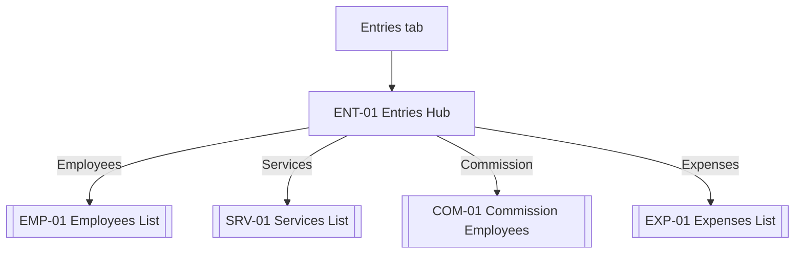

# 06 · Entries Hub

The Entries tab is a plain menu, not a screen with data. It reduces the four "manage business" surfaces (Employees, Services, Commission, Expenses) to one predictable row list.

Sources: [../ux/02-navigation-architecture.md#entries-tab](../ux/02-navigation-architecture.md#entries-tab), [../ux/03-screen-inventory.md#entries-tab](../ux/03-screen-inventory.md#entries-tab).

## Feature Navigation

## Cross-Feature Dependencies

- **Requires**: AUTH-05 complete.
- **Provides**: entry point to Employees, Services, Commission, Expenses stacks.

---

### ENT-01 · Entries Hub

- **Surface type**: Screen
- **Template**: T5 Settings (used here as a list-of-list-roots — the list variant of the Settings template)
- **Route / trigger**: Entries tab (index 1).
- **Purpose**: Navigate to one of four business-management stacks (Employees, Services, Commission, Expenses).
- **Business goal**: Family-helper persona finds any management surface without hunting · Protects [Consistent Interactions](../product-principles.md#consistent-interactions).

**Primary CTA**

- **Label**: `N/A` — the screen is a menu; every row is equally weighted.
- **Destination**: chosen row's list screen.

**Secondary CTA**

- `N/A`.

**Entry points**

- Entries tab tap.
- Re-tap current tab: scroll to top; second re-tap already at root (no-op).

**Exit points**

- `Employees` row → EMP-01.
- `Services` row → SRV-01.
- `Commission` row → COM-01.
- `Expenses` row → EXP-01.
- Bottom nav tap → other tab.
- Hardware back at tab root: previous tab per [../ux/02-navigation-architecture.md#back-behavior](../ux/02-navigation-architecture.md#back-behavior).

**Design System components**

- [App Bar](../design-system/08-component-library.md#app-bar) (title `Entries`, no back, no trailing)
- [Section Header](../design-system/08-component-library.md#section-header) (optional — only if we later add sub-groups; MVP omits)
- [List Item](../design-system/08-component-library.md#list-item) × 4 (leading icon, primary text, trailing chevron)
- [Bottom Navigation](../design-system/08-component-library.md#bottom-navigation)

**Content data**

- **Reads**: none — static row content, but each row may display a subtitle count post-MVP (e.g., `12 employees`). MVP: labels only.
- **Writes**: none.
- **Validation**: `N/A`.

**States**

- **Loading**: `N/A` — static.
- **Empty**: `N/A` — always four rows.
- **Offline**: identical.
- **Success**: `N/A` — nothing to succeed.
- **Error**: `N/A`.

**Motion**

- **Enter**: instant cross-fade on tab switch (120 ms per [13-motion-flow.md#tab-switch](../ux/13-motion-flow.md#tab-switch)).
- **Exit**: standard push to list screens.

**Accessibility**

- First focus: first row (`Employees`).
- Each row has `accessibilityRole="button"` with label + hint (`Manage employees`).
- Row touch target 56 dp per [List Item](../design-system/08-component-library.md#list-item).

**Dependencies**

- **Required first**: AUTH-05 complete.
- **Data written**: none.

**Priority**

- **MVP wave**: `P0`.
- **Rationale**: Required to reach Employees and Services, which are prerequisites for INC-01.

## Shared List Conventions For Child Stacks

All list screens reachable from ENT-01 (EMP-01, SRV-01, EXP-01, and COM-01) share the following conventions. Feature files below inherit these unless they specify otherwise:

| Convention | Rule | Source |
| --- | --- | --- |
| Template | T2 Grouped List | [17-screen-templates.md#template-2-list-screen](../design-system/17-screen-templates.md#template-2-list-screen) |
| App bar | Title (H2), leading back, trailing `search` icon | [App Bar](../design-system/08-component-library.md#app-bar) |
| FAB | Regular `+` bottom-right (except COM-01 which uses regular `+` to open Add Employee) | [FAB](../design-system/08-component-library.md#fab-floating-action-button) |
| Grouping | Active above Inactive; each group a Section Header | [12-lists.md](../design-system/12-lists.md) |
| Row tap | Opens Detail sheet (BS) — never navigates directly to Edit | [Detail Sheet Pattern](../design-system/17-screen-templates.md#detail-sheet-pattern) |
| Empty state | T8 with primary action `+ Add X` | [09-empty-states.md](../ux/09-empty-states.md) |
| Loading | Row skeletons on first load only | [Loading Skeleton](../design-system/08-component-library.md#loading-skeleton) |
| Offline | Identical to online | [12-offline-ux.md](../ux/12-offline-ux.md) |
| Pull-to-refresh | Triggers sync; silent success, subtle snackbar on failure | [12-offline-ux.md#manual-retry](../ux/12-offline-ux.md#manual-retry) |
| Search | Local-only, 200 ms debounce, empty-search shows full list | [Search](../design-system/08-component-library.md#search) |
| Delete flavor | Fresh entity → snackbar-undo (8 s); with-history → confirm dialog (GLB-DIALOG-DELETE) | [06-form-ux.md#deleting-data](../ux/06-form-ux.md#deleting-data) |
