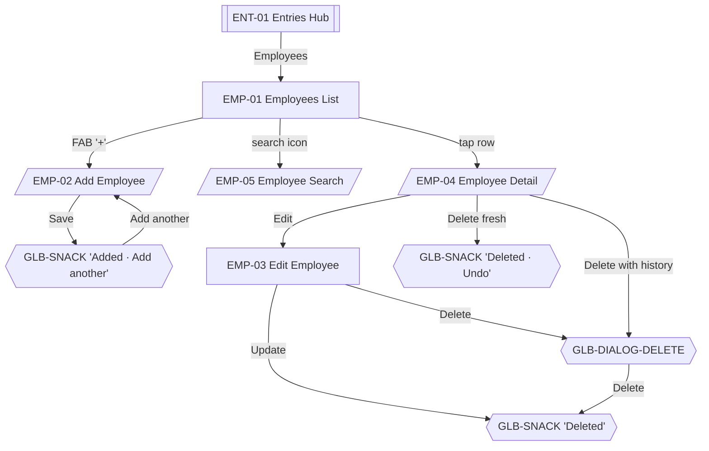

# 07 · Employees

Employees are the people who perform services and earn commission. This feature owns their CRUD surfaces. Historical transactions always retain their employee reference — deletion is soft and never removes past data.

Sources: [../business-workflows.md#employees](../business-workflows.md#employees), [../ux/06-form-ux.md#deleting-data](../ux/06-form-ux.md#deleting-data), [../ux/09-empty-states.md#employees-list-empty](../ux/09-empty-states.md#employees-list-empty).

Shared list conventions: [06-entries-hub.md#shared-list-conventions-for-child-stacks](06-entries-hub.md#shared-list-conventions-for-child-stacks).

## Feature Navigation

## Cross-Feature Dependencies

- **Requires**: [employee-repository](../../src/repositories/employee-repository.ts) and SQLite migration.
- **Provides**: employee selection for INC-02 and COM-01; commission targets for COM-02/COM-03; report grouping for REP-04/REP-05.

---

### EMP-01 · Employees List

- **Surface type**: Screen
- **Template**: T2 List Screen
- **Route / trigger**: ENT-01 `Employees` row.
- **Purpose**: Browse all employees grouped by Active / Inactive, and open Add/Detail/Edit for any of them.
- **Business goal**: Owner-Operator manages who is currently working without touching Settings · Protects [Consistent Interactions](../product-principles.md#consistent-interactions) via the shared list conventions.

**Primary CTA**

- **Label**: `t("employees.add")` — `+` (Regular FAB)
- **Destination**: EMP-02 Add Employee sheet.

**Secondary CTA**

- **Label**: `t("common.search")` — search icon in app bar
- **Destination**: EMP-05 Employee Search sheet.

**Entry points**

- ENT-01 → Employees row.
- Post-save return from EMP-02 (Snackbar dismiss).
- Post-update return from EMP-03.

**Exit points**

- FAB → EMP-02.
- Search icon → EMP-05.
- Row tap → EMP-04 Detail sheet.
- Hardware back → ENT-01.
- Pull-to-refresh → triggers sync; stays on EMP-01.

**Design System components**

- [App Bar](../design-system/08-component-library.md#app-bar) (title `Employees`, leading back, trailing `search`)
- [Section Header](../design-system/08-component-library.md#section-header) × 2 (`Active`, `Inactive`)
- [Employee Card](../design-system/08-component-library.md#employee-card) rows (initials avatar, name, optional today's commission trailing metric)
- [Divider](../design-system/08-component-library.md#divider) between groups
- [FAB](../design-system/08-component-library.md#fab-floating-action-button) Regular `+`
- [Bottom Navigation](../design-system/08-component-library.md#bottom-navigation)

**Content data**

- **Reads**: employees WHERE `deleted_at IS NULL` grouped by `is_active`; each row optionally displays today's commission sum from `transaction_items`.
- **Writes**: none on this screen.
- **Validation**: `N/A`.

**States**

- **Loading**: EMP-01-LOADING — row skeletons; no spinner.
- **Empty**: EMP-01-EMPTY — full T8 empty state per [09-empty-states.md#employees-list-empty](../ux/09-empty-states.md#employees-list-empty).
- **Offline**: identical.
- **Success**: `N/A` at this level — success events land as snackbars during Add/Edit/Delete.
- **Error**: DB read failure per [09-empty-states.md#loading-timeout--rare-db-failure](../ux/09-empty-states.md#loading-timeout--rare-db-failure).

**Motion**

- **Enter**: standard push from ENT-01.
- **In-screen**: row-insert (new employee), row-remove (delete), row-edit (in-place pulse) per [13-motion-flow.md#lists](../ux/13-motion-flow.md#lists).

**Accessibility**

- First focus: first Active row (or FAB when list empty).
- Group headers announced by screen reader.
- Inactive rows use opacity 0.6 per [Employee Card](../design-system/08-component-library.md#employee-card).

**Dependencies**

- **Required first**: employee repository.
- **Data written**: none.

**Priority**

- **MVP wave**: `P0`.

---

### EMP-01-EMPTY · Empty State

- **Surface type**: State variant of EMP-01
- **Template**: T8 Empty
- **Trigger**: Employee repository returns zero non-deleted rows.
- **Purpose**: Guide the first-run owner to add themselves and their staff.
- **Business goal**: EMP-01 populated is a prerequisite for INC-01; empty state points there directly · Protects the golden path.

Full copy: [09-empty-states.md#employees-list-empty](../ux/09-empty-states.md#employees-list-empty).

Primary action: `Add employee` → EMP-02.

---

### EMP-01-LOADING · Loading State

- **Surface type**: State variant of EMP-01
- **Template**: T2 skeletons
- **Trigger**: First load only.
- **Purpose**: Communicate that content is arriving without a spinner.

Uses [Loading Skeleton](../design-system/08-component-library.md#loading-skeleton) rows matching Employee Card dimensions.

---

### EMP-02 · Add Employee

- **Surface type**: Bottom Sheet
- **Template**: T6
- **Route / trigger**: FAB `+` on EMP-01; `+ Add employee` in INC-02.
- **Purpose**: Capture a new employee with the minimum fields required.
- **Business goal**: Adding a walk-in staff member never breaks the golden path · Protects [Speed Over Complexity](../product-principles.md#speed-over-complexity).

**Primary CTA**

- **Label**: `t("common.save")` — `Save`
- **Destination**: caller — EMP-01 with GLB-SNACK `Added · Add another`; or INC-02 with the new employee auto-selected.

**Secondary CTA**

- **Label**: `t("common.close")` — `x` in sheet header
- **Destination**: caller unchanged; INC-04-equivalent discard dialog only if any field is dirty.

**Entry points**

- EMP-01 FAB.
- INC-02 `+ Add employee` (inline-create per [../ux/04-screen-flows.md#flow-4a--inline-add-missing-employee-during-income-entry](../ux/04-screen-flows.md#flow-4a--inline-add-missing-employee-during-income-entry)).

**Exit points**

- Save → caller + snackbar.
- Save + `Add another` from snackbar → re-open EMP-02 cleared.
- Close `x` clean → caller.
- Close `x` dirty → GLB-DIALOG-DISCARD.

**Design System components**

- [Bottom Sheet](../design-system/08-component-library.md#bottom-sheet) with handle bar, title `Add employee`, close `x`
- [Text Field · name](../design-system/08-component-library.md#text-field) — Name (required)
- [Text Field · mobile](../design-system/08-component-library.md#text-field) — Mobile (optional)
- [Button](../design-system/08-component-library.md#button) primary in fixed footer

**Content data**

- **Inputs**: name (required), mobile (optional, 10 digits if entered).
- **Writes**: `employees` insert; `sync_outbox` enqueue.
- **Validation**: on blur — name non-empty (`Give this employee a name.` per [10-error-ux.md#validation-errors-form-level](../ux/10-error-ux.md#validation-errors-form-level)); mobile length exactly 10 when present.
- **Uniqueness**: name should be unique among non-deleted employees for this salon per [../business-workflows.md#services](../business-workflows.md#services) applied analogously.

**States**

- **Loading**: Save button loading state during write.
- **Empty**: `N/A` — form.
- **Offline**: identical.
- **Success**: GLB-SNACK `Added · Add another` (5 s); light haptic; sheet closes.
- **Error**: validation errors inline; storage error via snackbar.

**Motion**

- Sheet slide-up 200 ms.
- Auto-focus name on mount per [../ux/06-form-ux.md#auto-focus](../ux/06-form-ux.md#auto-focus).

**Accessibility**

- First focus: name field.
- Keyboards: name → `default` + `autoCapitalize="words"`; mobile → `phone-pad`.
- Return key: name → Next → mobile → Done (submits if valid).

**Dependencies**

- **Required first**: EMP-01 open (or INC-02 open) + employee repository.
- **Data written**: `employees`, `sync_outbox`.

**Priority**

- **MVP wave**: `P0`.

---

### EMP-03 · Edit Employee

- **Surface type**: Screen (full screen because form has 4 elements: name, mobile, active toggle, delete)
- **Template**: T3 Form
- **Route / trigger**: EMP-04 Detail sheet → `Edit`.
- **Purpose**: Modify an existing employee including active/inactive state and deletion.
- **Business goal**: Retire staff without losing historical records · Protects report continuity.

**Primary CTA**

- **Label**: `t("common.update")` — `Update`
- **Destination**: EMP-01 with GLB-SNACK `Updated`.

**Secondary CTA**

- **Label**: `t("common.close")` — `x` (leading in app bar per T3)
- **Destination**: EMP-01 unchanged; GLB-DIALOG-DISCARD if dirty.

**Entry points**

- EMP-04 Detail → `Edit`.

**Exit points**

- Update → EMP-01 + snackbar.
- Delete → per delete-flavor rules below.
- Close `x` → EMP-01 (or Discard dialog if dirty).
- Active toggle: **saves immediately** per [Switch component rule](../design-system/08-component-library.md#switch) (switches change state immediately, no explicit Save needed for that field). Snackbar `Updated`.

**Design System components**

- [App Bar](../design-system/08-component-library.md#app-bar) (leading `x`, title `Edit employee`)
- [Text Field · name](../design-system/08-component-library.md#text-field) — Name
- [Text Field · mobile](../design-system/08-component-library.md#text-field) — Mobile (optional)
- [Switch](../design-system/08-component-library.md#switch) — Active (immediate save)
- [Button · Destructive Ghost](../design-system/08-component-library.md#button) — `Delete`
- [Button](../design-system/08-component-library.md#button) primary in fixed footer — `Update`

**Content data**

- **Inputs**: name (required), mobile (optional), active (boolean).
- **Reads**: current employee row.
- **Writes**: `employees` update; on delete, sets `deleted_at`.
- **Validation**: same as EMP-02.

**States**

- **Loading**: Update button loading state during write.
- **Empty**: `N/A` — always pre-filled.
- **Offline**: identical.
- **Success**: GLB-SNACK `Updated` (3 s); return to EMP-01.
- **Error**: field-level inline; storage snackbar.

**Delete flavor** (per [06-form-ux.md#deleting-data](../ux/06-form-ux.md#deleting-data)):

- **Flavor A (fresh, no transaction references)**: Row disappears immediately; GLB-SNACK `Deleted · Undo` (8 s). Timeout commits.
- **Flavor B (has transaction references)**: GLB-DIALOG-DELETE: `Delete this employee? Past transactions will keep this employee's records.` Primary Destructive `Delete`; Secondary `Cancel`. On confirm, soft delete + GLB-SNACK `Deleted` (no undo).

**Motion**

- Standard push from EMP-04 (which replaces the sheet).

**Accessibility**

- First focus: name field.
- Delete button labeled with `Delete employee`.
- Switch labeled `Active`; state announced.

**Dependencies**

- **Required first**: EMP-04 opened.
- **Data written**: `employees`, `sync_outbox`.

**Priority**

- **MVP wave**: `P1`.
- **Rationale**: Editing exists in MVP but not on the golden path; adding is P0.

---

### EMP-04 · Employee Detail

- **Surface type**: Bottom Sheet (Detail Sheet Pattern per [17-screen-templates.md#detail-sheet-pattern](../design-system/17-screen-templates.md#detail-sheet-pattern))
- **Template**: T6
- **Route / trigger**: Tap a row on EMP-01.
- **Purpose**: Read-only detail with Edit / Delete actions.
- **Business goal**: Owners preview before editing — reduces accidental changes · Protects [Consistent Interactions](../product-principles.md#consistent-interactions).

**Primary CTA**

- **Label**: `t("common.edit")` — `Edit` (Secondary Button in footer)
- **Destination**: EMP-03.

**Secondary CTA**

- **Label**: `t("common.delete")` — `Delete` (Destructive Ghost)
- **Destination**: per delete-flavor rules from EMP-03.

**Entry points**

- EMP-01 row tap.

**Exit points**

- Edit → EMP-03.
- Delete → snackbar-undo or GLB-DIALOG-DELETE.
- Swipe-down / scrim tap / hardware back → EMP-01.

**Design System components**

- [Bottom Sheet](../design-system/08-component-library.md#bottom-sheet)
- [Avatar](../design-system/08-component-library.md#avatar) (size lg)
- Name (H2), mobile (Body Small, if present)
- [Section Header](../design-system/08-component-library.md#section-header) — `Today` / `This month` (post-MVP metrics; MVP can omit or show only counts)
- Row of [Statistic Card](../design-system/08-component-library.md#statistic-card)s (post-MVP) — MVP shows plain rows: `Transactions today`, `Commission today`
- Fixed footer with `Edit` + `Delete` buttons

**Content data**

- **Reads**: employee row; aggregate today counts from `transactions` / `transaction_items`.
- **Writes**: none directly.

**States**

- **Loading**: skeleton while aggregates load (rare).
- **Empty**: `N/A` — always has content.
- **Offline**: identical.
- **Success**: `N/A` at this level.
- **Error**: aggregate read failure — hide the aggregates row rather than blocking the sheet.

**Motion**

- Sheet slide-up 200 ms.

**Accessibility**

- First focus: `Edit` button (primary action expected).
- Sheet title labeled with employee name for screen readers.

**Dependencies**

- **Required first**: EMP-01 populated.
- **Data written**: none.

**Priority**

- **MVP wave**: `P1`.
- **Rationale**: Row tap must lead somewhere; MVP can ship without the aggregates row if it delays the wave.

---

### EMP-05 · Employee Search

- **Surface type**: Bottom Sheet
- **Template**: T6
- **Route / trigger**: Tap search icon in EMP-01 app bar.
- **Purpose**: Locate a specific employee by name in large lists.
- **Business goal**: Beauty Parlour Owner (up to 8 employees) finds staff without scrolling · Protects the [Minimum Typing](../product-principles.md#minimum-typing) principle even in this typing-heavy surface.

**Primary CTA**

- **Label**: implicit — tapping a result row opens EMP-04 for that employee.
- **Destination**: EMP-04.

**Secondary CTA**

- **Label**: `t("common.close")` — `x` (or scrim tap, swipe-down)
- **Destination**: EMP-01 unchanged.

**Entry points**

- EMP-01 search icon.

**Exit points**

- Row tap → EMP-04.
- Close → EMP-01.

**Design System components**

- [Bottom Sheet](../design-system/08-component-library.md#bottom-sheet)
- [Search](../design-system/08-component-library.md#search) input (autofocus)
- [Employee Card](../design-system/08-component-library.md#employee-card) rows filtered by name

**Content data**

- **Reads**: employees WHERE `name LIKE ?` (SQLite local, 200 ms debounce).
- **Writes**: none.
- **Validation**: `N/A`.

**States**

- **Loading**: `N/A` — local search is instant.
- **Empty**: search-empty per [09-empty-states.md#search-no-results](../ux/09-empty-states.md#search-no-results) — `No matches` compact variant, no action.
- **Offline**: identical.
- **Success**: `N/A`.
- **Error**: `N/A`.

**Motion**

- Sheet slide-up 200 ms.
- Result list re-renders on debounce (no shimmer for local queries).

**Accessibility**

- Auto-focus search input.
- Screen reader announces result count changes (`5 matches`, `No matches`).

**Dependencies**

- **Required first**: EMP-01 populated.
- **Data written**: none.

**Priority**

- **MVP wave**: `P2`.
- **Rationale**: Nice-to-have. With ≤ 8 employees typical, scrolling suffices for MVP launch.
