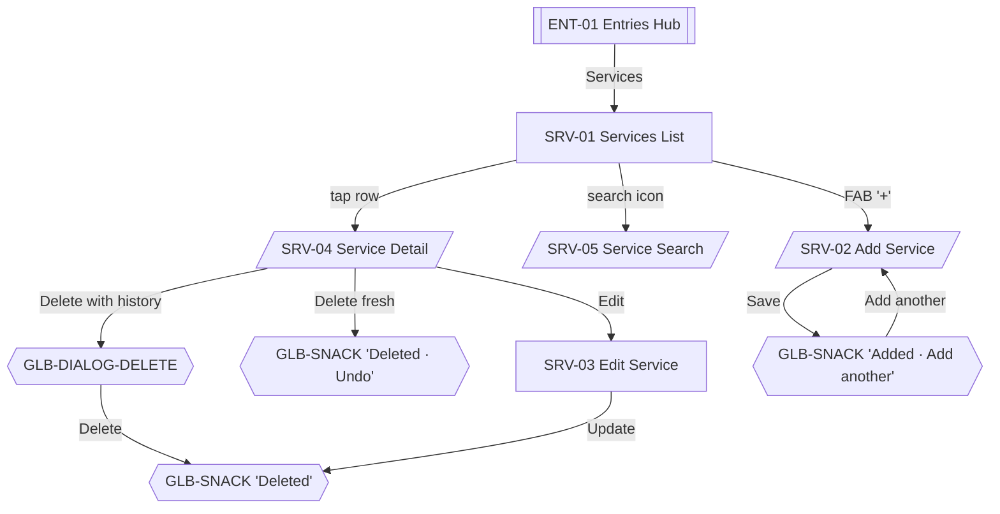

# 08 · Services

Services define what the salon offers and at what price. Historical transactions freeze service names and prices at the time of sale — editing a service never re-prices past records.

Sources: [../business-workflows.md#services](../business-workflows.md#services), [../ux/04-screen-flows.md#flow-7--edit-a-service-price](../ux/04-screen-flows.md#flow-7--edit-a-service-price), [../ux/09-empty-states.md#services-list-empty](../ux/09-empty-states.md#services-list-empty).

Shared list conventions: [06-entries-hub.md#shared-list-conventions-for-child-stacks](06-entries-hub.md#shared-list-conventions-for-child-stacks).

## Feature Navigation

## Cross-Feature Dependencies

- **Requires**: [service-repository](../../src/repositories/service-repository.ts) and SQLite migration.
- **Provides**: service selection for INC-03; commission targets for COM-02/COM-03; service reporting for REP-06/REP-07.

---

### SRV-01 · Services List

- **Surface type**: Screen
- **Template**: T2 List Screen
- **Route / trigger**: ENT-01 `Services` row.
- **Purpose**: Browse all services grouped by Active / Inactive; open Add/Detail/Edit.
- **Business goal**: Owner maintains the salon's menu without spreadsheet-level ceremony · Protects [Simple Over Feature Rich](../product-principles.md#simple-over-feature-rich).

**Primary CTA**

- **Label**: `t("services.add")` — `+` (Regular FAB)
- **Destination**: SRV-02.

**Secondary CTA**

- **Label**: `t("common.search")` — search icon in app bar
- **Destination**: SRV-05.

**Entry points**

- ENT-01 → Services row.
- Post-save return from SRV-02.
- Post-update return from SRV-03.

**Exit points**

- FAB → SRV-02.
- Search icon → SRV-05.
- Row tap → SRV-04 Detail sheet.
- Hardware back → ENT-01.

**Design System components**

- [App Bar](../design-system/08-component-library.md#app-bar) (title `Services`, leading back, trailing `search`)
- [Section Header](../design-system/08-component-library.md#section-header) × 2 (`Active`, `Inactive`)
- [Service Card](../design-system/08-component-library.md#service-card) rows
- [FAB](../design-system/08-component-library.md#fab-floating-action-button) Regular `+`
- [Bottom Navigation](../design-system/08-component-library.md#bottom-navigation)

**Content data**

- **Reads**: services WHERE `deleted_at IS NULL` grouped by `is_active`, ordered by name within group.
- **Writes**: none on this screen.
- **Validation**: `N/A`.

**States**

- **Loading**: SRV-01-LOADING skeleton rows.
- **Empty**: SRV-01-EMPTY per [09-empty-states.md#services-list-empty](../ux/09-empty-states.md#services-list-empty).
- **Offline**: identical.
- **Success**: `N/A` at this level.
- **Error**: DB read failure per [09-empty-states.md#loading-timeout--rare-db-failure](../ux/09-empty-states.md#loading-timeout--rare-db-failure).

**Motion**

- Standard push from ENT-01.
- Row-insert / row-remove / row-edit motion per [13-motion-flow.md#lists](../ux/13-motion-flow.md#lists).

**Accessibility**

- First focus: first Active row (or FAB when empty).
- Inactive rows use opacity 0.6 per [Service Card](../design-system/08-component-library.md#service-card) rule.
- Prices announced as `<amount> rupees`.

**Dependencies**

- **Required first**: service repository.
- **Data written**: none.

**Priority**

- **MVP wave**: `P0`.
- **Rationale**: Populated services list is a prerequisite for INC-01.

---

### SRV-01-EMPTY · Empty State

- **Surface type**: State variant of SRV-01
- **Template**: T8 Empty
- **Trigger**: Service repository returns zero non-deleted rows.
- **Purpose**: Prompt the owner to add their first services.

Copy: [09-empty-states.md#services-list-empty](../ux/09-empty-states.md#services-list-empty). Primary action `Add service` → SRV-02.

---

### SRV-01-LOADING · Loading State

- **Surface type**: State variant of SRV-01
- **Template**: T2 skeletons
- **Trigger**: First load only.

Uses [Loading Skeleton](../design-system/08-component-library.md#loading-skeleton) rows matching Service Card dimensions.

---

### SRV-02 · Add Service

- **Surface type**: Bottom Sheet
- **Template**: T6
- **Route / trigger**: SRV-01 FAB `+`; INC-03 inline `+ Add service`.
- **Purpose**: Add a service with name and price.
- **Business goal**: Adding a new service during a customer visit never breaks the golden path · Protects [Speed Over Complexity](../product-principles.md#speed-over-complexity).

**Primary CTA**

- **Label**: `t("common.save")` — `Save`
- **Destination**: caller — SRV-01 with GLB-SNACK `Added · Add another`; or INC-03 with the new service auto-selected.

**Secondary CTA**

- **Label**: `t("common.close")` — `x` in sheet header
- **Destination**: caller unchanged; GLB-DIALOG-DISCARD if dirty.

**Entry points**

- SRV-01 FAB.
- INC-03 `+ Add service` (inline-create, replaces INC-03 sheet).

**Exit points**

- Save → caller + snackbar.
- Save + `Add another` from snackbar → re-open SRV-02 cleared.
- Close `x` clean → caller.
- Close `x` dirty → GLB-DIALOG-DISCARD.

**Design System components**

- [Bottom Sheet](../design-system/08-component-library.md#bottom-sheet)
- [Text Field · name](../design-system/08-component-library.md#text-field) — Name (required)
- [Text Field · money](../design-system/08-component-library.md#text-field) — Price (required, `₹` prefix, decimal-pad)
- [Button](../design-system/08-component-library.md#button) primary in fixed footer

**Content data**

- **Inputs**: name (required), price (required, > 0, stored in paise per [06-form-ux.md#currency-entry](../ux/06-form-ux.md#currency-entry)).
- **Writes**: `services` insert; `sync_outbox` enqueue.
- **Validation**: on blur — name non-empty (`Give this service a name.`), price > 0 (`Enter a price greater than zero.`). Unique name per [../business-workflows.md#services](../business-workflows.md#services).

**States**

- **Loading**: Save button loading state during write.
- **Empty**: `N/A`.
- **Offline**: identical.
- **Success**: GLB-SNACK `Added · Add another` (5 s); light haptic.
- **Error**: field-level inline; storage snackbar.

**Motion**

- Sheet slide-up 200 ms.
- Auto-focus name per [06-form-ux.md#auto-focus](../ux/06-form-ux.md#auto-focus).

**Accessibility**

- First focus: name field.
- Keyboards: name → `default` + `autoCapitalize="words"` → Next; price → `decimal-pad` → Done.
- Price format on blur only per [06-form-ux.md#currency-entry](../ux/06-form-ux.md#currency-entry).

**Dependencies**

- **Required first**: SRV-01 open (or INC-03 open).
- **Data written**: `services`, `sync_outbox`.

**Priority**

- **MVP wave**: `P0`.

---

### SRV-03 · Edit Service

- **Surface type**: Screen
- **Template**: T3 Form
- **Route / trigger**: SRV-04 Detail sheet → `Edit`.
- **Purpose**: Modify an existing service — name, price, active state, delete.
- **Business goal**: Update prices for new season without affecting historical records · Protects report accuracy via commission snapshot rules.

**Primary CTA**

- **Label**: `t("common.update")` — `Update`
- **Destination**: SRV-01 with GLB-SNACK `Updated`.

**Secondary CTA**

- **Label**: `t("common.close")` — `x` (leading in app bar)
- **Destination**: SRV-01 unchanged; GLB-DIALOG-DISCARD if dirty.

**Entry points**

- SRV-04 → `Edit`.

**Exit points**

- Update → SRV-01 + snackbar.
- Delete → per delete-flavor rules (same as EMP-03).
- Close `x` → SRV-01 (or Discard).

**Design System components**

- [App Bar](../design-system/08-component-library.md#app-bar) (leading `x`, title `Edit service`)
- [Text Field · name](../design-system/08-component-library.md#text-field)
- [Text Field · money](../design-system/08-component-library.md#text-field) — Price
- [Switch](../design-system/08-component-library.md#switch) — Active (immediate save)
- [Button · Destructive Ghost](../design-system/08-component-library.md#button) — `Delete`
- [Button](../design-system/08-component-library.md#button) primary in fixed footer — `Update`

**Content data**

- **Inputs**: name, price, active.
- **Reads**: current service row.
- **Writes**: `services` update; delete sets `deleted_at`.
- **Validation**: same as SRV-02.

**States**

- **Loading**: Update button loading state during write.
- **Empty**: `N/A`.
- **Offline**: identical.
- **Success**: GLB-SNACK `Updated`; return to SRV-01.
- **Error**: inline validation; storage snackbar.

**Delete flavor** (per [06-form-ux.md#deleting-data](../ux/06-form-ux.md#deleting-data)):

- **Flavor A (no transaction references)**: snackbar-undo (8 s).
- **Flavor B (has transaction references)**: GLB-DIALOG-DELETE: `Delete this service? Past transactions will keep this service's records.` Snackbar `Deleted` (no undo) after confirm.

**Note on historical pricing**: `services` row update never re-prices `transaction_items` per [../business-workflows.md#services](../business-workflows.md#services) — historical entries retain their `price_at_sale` snapshot.

**Motion**

- Standard push from SRV-04.

**Accessibility**

- First focus: name field.
- Delete button labeled `Delete service`.

**Dependencies**

- **Required first**: SRV-04 opened.
- **Data written**: `services`, `sync_outbox`.

**Priority**

- **MVP wave**: `P1`.

---

### SRV-04 · Service Detail

- **Surface type**: Bottom Sheet (Detail Sheet Pattern)
- **Template**: T6
- **Route / trigger**: Tap row on SRV-01.
- **Purpose**: Read-only detail with Edit / Delete actions.
- **Business goal**: Consistent detail-then-edit rhythm across the app.

**Primary CTA**

- **Label**: `t("common.edit")` — `Edit`
- **Destination**: SRV-03.

**Secondary CTA**

- **Label**: `t("common.delete")` — `Delete`
- **Destination**: snackbar-undo or GLB-DIALOG-DELETE per delete-flavor rules.

**Entry points**

- SRV-01 row tap.

**Exit points**

- Edit → SRV-03.
- Delete → snackbar or dialog.
- Swipe-down / scrim tap → SRV-01.

**Design System components**

- [Bottom Sheet](../design-system/08-component-library.md#bottom-sheet)
- Service name (H2), price ([Currency Display](../design-system/08-component-library.md#currency-display) Money Medium), active badge if inactive
- Row of plain rows: `Sold today: N`, `Revenue today: ₹X` (MVP can omit if delayed)
- Fixed footer with `Edit` + `Delete`

**Content data**

- **Reads**: service row; aggregate today from `transaction_items`.
- **Writes**: none.

**States**

- **Loading**: skeleton if aggregates slow.
- **Empty**: `N/A`.
- **Offline**: identical.
- **Success**: `N/A`.
- **Error**: hide aggregates row on read failure; keep the sheet functional.

**Motion**

- Sheet slide-up 200 ms.

**Accessibility**

- First focus: `Edit` button.
- Sheet title labeled with service name.

**Dependencies**

- **Required first**: SRV-01 populated.
- **Data written**: none.

**Priority**

- **MVP wave**: `P1`.

---

### SRV-05 · Service Search

- **Surface type**: Bottom Sheet
- **Template**: T6
- **Route / trigger**: Tap search icon on SRV-01 app bar.
- **Purpose**: Locate a service by name in large service catalogs.
- **Business goal**: Parlours with 20+ services find items in seconds.

**Primary CTA**

- **Label**: implicit — row tap opens SRV-04.
- **Destination**: SRV-04.

**Secondary CTA**

- **Label**: `t("common.close")` — `x` / scrim / swipe-down.
- **Destination**: SRV-01 unchanged.

**Entry points**

- SRV-01 search icon.

**Exit points**

- Row tap → SRV-04.
- Close → SRV-01.

**Design System components**

- [Bottom Sheet](../design-system/08-component-library.md#bottom-sheet)
- [Search](../design-system/08-component-library.md#search) (autofocus)
- [Service Card](../design-system/08-component-library.md#service-card) rows

**Content data**

- **Reads**: services WHERE `name LIKE ?` (local, 200 ms debounce).
- **Writes**: none.

**States**

- **Loading**: `N/A`.
- **Empty**: search-empty per [09-empty-states.md#search-no-results](../ux/09-empty-states.md#search-no-results).
- **Offline**: identical.
- **Success**: `N/A`.
- **Error**: `N/A`.

**Motion**

- Sheet slide-up 200 ms.

**Accessibility**

- Auto-focus search input.
- Screen reader announces result count.

**Dependencies**

- **Required first**: SRV-01 populated.
- **Data written**: none.

**Priority**

- **MVP wave**: `P2`.
