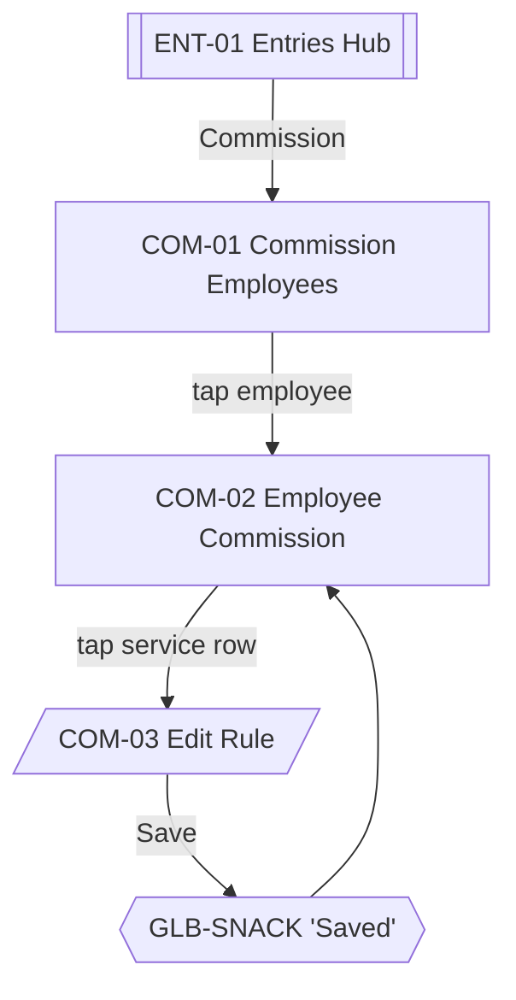

# 09 · Commission Rules

Commission rules are per-employee, per-service. Every income entry writes commission **snapshots** onto `transaction_items` so historical reports are immune to future rule changes. See [../business-workflows.md#employee-commission](../business-workflows.md#employee-commission).

Sources: [../ux/04-screen-flows.md#flow-11--setting-commission-rules](../ux/04-screen-flows.md#flow-11--setting-commission-rules), [../domain/commission-service.ts](../../src/domain/commission-service.ts).

## Feature Navigation

## Cross-Feature Dependencies

- **Requires**: ≥ 1 Employee (EMP-01 populated); ≥ 1 Service (SRV-01 populated); [commission-repository](../../src/repositories/commission-repository.ts) and [commission-service](../../src/domain/commission-service.ts).
- **Provides**: rule data consumed by INC-01 auto-computation.

---

### COM-01 · Commission Employees List

- **Surface type**: Screen
- **Template**: T2 List Screen (subset — a chevron list of employees)
- **Route / trigger**: ENT-01 `Commission` row.
- **Purpose**: Pick which employee's commission rules to configure.
- **Business goal**: Beauty Parlour Owner assigns different rates to different employees without ceremony · Protects [Simple Over Feature Rich](../product-principles.md#simple-over-feature-rich).

**Primary CTA**

- **Label**: `t("employees.add")` — `+` (Regular FAB, opens EMP-02) per [../ux/02-navigation-architecture.md#fab-rules](../ux/02-navigation-architecture.md#fab-rules)
- **Destination**: EMP-02 (adds a new employee to configure).

**Secondary CTA**

- `N/A`.

**Entry points**

- ENT-01 → Commission row.
- Back from COM-02.

**Exit points**

- Row tap → COM-02.
- FAB → EMP-02 (returns here on save).
- Hardware back → ENT-01.

**Design System components**

- [App Bar](../design-system/08-component-library.md#app-bar) (title `Commission`, leading back)
- [Employee Card](../design-system/08-component-library.md#employee-card) rows, trailing [Commission Badge](../design-system/08-component-library.md#commission-badge) summary (`3 rules set` or `No rules`)
- [FAB](../design-system/08-component-library.md#fab-floating-action-button) `+`
- [Bottom Navigation](../design-system/08-component-library.md#bottom-navigation)

**Content data**

- **Reads**: active employees; per employee, count of non-null commission rules.
- **Writes**: none.
- **Validation**: `N/A`.

**States**

- **Loading**: row skeletons.
- **Empty**: COM-01-EMPTY per [09-empty-states.md#commission-no-rules-set](../ux/09-empty-states.md#commission-no-rules-set). If no employees exist, this screen shows the [Employees empty state](../ux/09-empty-states.md#employees-list-empty) instead.
- **Offline**: identical.
- **Success**: `N/A`.
- **Error**: DB read failure per [09-empty-states.md#loading-timeout--rare-db-failure](../ux/09-empty-states.md#loading-timeout--rare-db-failure).

**Motion**

- Standard push from ENT-01.

**Accessibility**

- First focus: first row or FAB when empty.
- Row hint: `Configure commission for <employee>`.

**Dependencies**

- **Required first**: employee repository; commission repository.
- **Data written**: none.

**Priority**

- **MVP wave**: `P0`.
- **Rationale**: Without commission configuration, INC-01 auto-commission is always zero — degrading the primary product value.

---

### COM-01-EMPTY · Empty State

- **Surface type**: State variant of COM-01
- **Template**: T8 Empty
- **Trigger**: Zero employees OR zero rules across all employees.
- **Purpose**: Route to the correct prerequisite (add employees first).

Copy: [09-empty-states.md#commission-no-rules-set](../ux/09-empty-states.md#commission-no-rules-set).

Primary action `Set up commission` → COM-01 populated (or EMP-02 if no employees).

---

### COM-02 · Employee Commission Screen

- **Surface type**: Screen
- **Template**: T2 List Screen (rows of services with trailing rule badge)
- **Route / trigger**: Tap employee row on COM-01.
- **Purpose**: See every service alongside this employee's rule for that service; tap any row to edit.
- **Business goal**: Owner scans and edits rules in one place instead of one-at-a-time dialogs · Protects [Speed Over Complexity](../product-principles.md#speed-over-complexity).

**Primary CTA**

- **Label**: `N/A` — the row tap is the primary action; every row can be edited.
- **Destination**: COM-03 for the tapped service.

**Secondary CTA**

- **Label**: `t("commission.applyToAll")` — `Apply to all` (Post-MVP: opens COM-04)
- **Destination**: COM-04 Post-MVP; hidden in MVP.

**Entry points**

- COM-01 row tap.

**Exit points**

- Service row tap → COM-03.
- Hardware back → COM-01.

**Design System components**

- [App Bar](../design-system/08-component-library.md#app-bar) (title = employee name, leading back)
- Grouped [List Item](../design-system/08-component-library.md#list-item) rows: service name (primary text), price (Body Small `text.secondary`), trailing [Commission Badge](../design-system/08-component-library.md#commission-badge) (`20%` / `₹50` / `No commission`)
- [Section Header](../design-system/08-component-library.md#section-header) `Active services`

**Content data**

- **Reads**: active services; LEFT JOIN `commission_rules` on `(employee_id, service_id)`.
- **Writes**: none on this screen (edits happen in COM-03).
- **Validation**: `N/A`.

**States**

- **Loading**: row skeletons.
- **Empty**: if no services exist, show SRV-01-EMPTY-inline with action to Add service.
- **Offline**: identical.
- **Success**: `N/A` at this level — save success arrives via GLB-SNACK after COM-03 dismiss.
- **Error**: DB read failure per [09-empty-states.md#loading-timeout--rare-db-failure](../ux/09-empty-states.md#loading-timeout--rare-db-failure).

**Motion**

- Standard push from COM-01.
- On COM-03 save: brief in-place pulse on the affected row per [13-motion-flow.md#row-edit-updated-in-place](../ux/13-motion-flow.md#row-edit-updated-in-place).

**Accessibility**

- First focus: first service row.
- Commission badge announced with amount and type (`20 percent`, `50 rupees`, `no commission`).

**Dependencies**

- **Required first**: COM-01 selection; ≥ 1 Service.
- **Data written**: none.

**Priority**

- **MVP wave**: `P0`.

---

### COM-03 · Edit Commission Rule

- **Surface type**: Bottom Sheet
- **Template**: T6
- **Route / trigger**: Tap a service row on COM-02.
- **Purpose**: Set (or clear) the rule for one (employee, service) pair.
- **Business goal**: One decision per sheet — % or ₹, and the value · Protects [Consistent Interactions](../product-principles.md#consistent-interactions).

**Primary CTA**

- **Label**: `t("common.save")` — `Save`
- **Destination**: COM-02 with GLB-SNACK `Saved`.

**Secondary CTA**

- **Label**: `t("commission.clear")` — `Clear` (destructive ghost, only visible when a rule exists)
- **Destination**: COM-02 with GLB-SNACK `Cleared` (rule removed; commission for future entries defaults to zero).

**Entry points**

- COM-02 row tap.

**Exit points**

- Save → COM-02 + snackbar.
- Clear → COM-02 + snackbar.
- Close `x` / swipe-down / scrim tap → COM-02 unchanged.

**Design System components**

- [Bottom Sheet](../design-system/08-component-library.md#bottom-sheet) (title = service name)
- [Segmented Control](../design-system/08-component-library.md#segmented-control) — `%` / `₹` (2 segments)
- [Text Field · numeric or money](../design-system/08-component-library.md#text-field) — Value (decimal-pad; unit adapts based on segment)
- Optional inline preview (`Body Small`, `text.secondary`) — e.g., `On a ₹500 haircut, commission = ₹100.` (computed live; MVP nice-to-have)
- [Button](../design-system/08-component-library.md#button) primary in fixed footer — `Save`
- [Button · Destructive Ghost](../design-system/08-component-library.md#button) — `Clear` (only when rule exists)

**Content data**

- **Inputs**: type (`percent` | `fixed`), value (number > 0).
- **Reads**: existing rule if present; service price for the preview.
- **Writes**: `commission_rules` upsert (on Save); delete row on Clear.
- **Validation**: value > 0; if `percent`, value ≤ 100. Error copy: `Enter a value greater than zero.`, `Percentage must be 100 or less.`.

**States**

- **Loading**: Save button loading state during write.
- **Empty**: `N/A` — form.
- **Offline**: identical.
- **Success**: GLB-SNACK `Saved` (3 s); sheet closes.
- **Error**: inline validation; storage snackbar.

**Motion**

- Sheet slide-up 200 ms.
- Segmented control selection slides pill 200 ms per [13-motion-flow.md#segmented-control](../ux/13-motion-flow.md#segmented-control).
- Preview recomputes on change with 120 ms cross-fade.

**Accessibility**

- First focus: value input (auto-focused).
- Segmented control labels: `Percent`, `Rupees`.
- Preview line uses `accessibilityLiveRegion="polite"` so screen readers hear the recomputation.

**Dependencies**

- **Required first**: COM-02 open.
- **Data written**: `commission_rules`, `sync_outbox`.

**Priority**

- **MVP wave**: `P0`.

---

### COM-04 · Apply-to-all Sheet (Post-MVP)

- **Surface type**: Bottom Sheet
- **Template**: T6
- **Route / trigger**: `Apply to all` action on COM-02 (Post-MVP).
- **Purpose**: Bulk-apply a single rule to every service for one employee.
- **Business goal**: Post-MVP convenience for parlours with many services.

**Primary CTA**

- **Label**: `Apply`
- **Destination**: COM-02 with snackbar and updated badges.

**Secondary CTA**

- **Label**: `Cancel`
- **Destination**: COM-02 unchanged.

**States, motion, accessibility**: same conventions as COM-03. Deferred — no spec beyond identifying the surface.

**Priority**

- **MVP wave**: `Post-MVP`.
- **Rationale**: Per [../ux/03-screen-inventory.md#commission](../ux/03-screen-inventory.md#commission) explicit Post-MVP designation.
