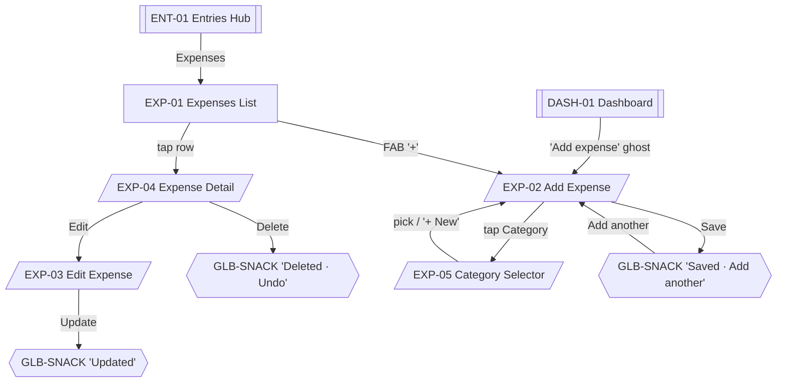

# 10 · Expenses

Expenses track outgoing money — rent, supplies, salaries, utilities, other. MVP ships default categories seeded on first run per [../business-workflows.md#expense-entry](../business-workflows.md#expense-entry). Expenses appear on DASH-01 peer card and REP-02.

Sources: [../ux/04-screen-flows.md#flow-5--record-expense](../ux/04-screen-flows.md#flow-5--record-expense), [../business-workflows.md#expense-entry](../business-workflows.md#expense-entry).

Shared list conventions: [06-entries-hub.md#shared-list-conventions-for-child-stacks](06-entries-hub.md#shared-list-conventions-for-child-stacks).

## Feature Navigation

## Cross-Feature Dependencies

- **Requires**: [expense-repository](../../src/repositories/expense-repository.ts); default categories seeded (Rent, Salary Advance, Products, Utilities, Maintenance, Other per [../business-workflows.md#expense-entry](../business-workflows.md#expense-entry)).
- **Provides**: expense sum for DASH-01 peer card; daily/monthly totals for reports.

---

### EXP-01 · Expenses List

- **Surface type**: Screen
- **Template**: T2 List Screen
- **Route / trigger**: ENT-01 `Expenses` row.
- **Purpose**: Browse expenses grouped by date (most recent first).
- **Business goal**: Owner sees today's outgoings in one place; opens Add for fresh entries · Protects [Consistent Interactions](../product-principles.md#consistent-interactions).

**Primary CTA**

- **Label**: `t("expenses.add")` — `+` (Regular FAB)
- **Destination**: EXP-02.

**Secondary CTA**

- **Label**: `t("common.filter")` — filter icon in app bar (opens REP-09 for date range; Post-MVP for EXP)
- **Destination**: Post-MVP; hidden in MVP list.

**Entry points**

- ENT-01 → Expenses row.
- Deep link `salonkhata://expense/new` lands on DASH-01 then opens EXP-02 (not this screen).

**Exit points**

- FAB → EXP-02.
- Row tap → EXP-04.
- Hardware back → ENT-01.

**Design System components**

- [App Bar](../design-system/08-component-library.md#app-bar) (title `Expenses`, leading back)
- [Section Header](../design-system/08-component-library.md#section-header) per date group (`Today`, `Yesterday`, date strings)
- [Expense Card](../design-system/08-component-library.md#expense-card) rows
- [FAB](../design-system/08-component-library.md#fab-floating-action-button) Regular `+`
- [Bottom Navigation](../design-system/08-component-library.md#bottom-navigation)

**Content data**

- **Reads**: expenses WHERE `deleted_at IS NULL` ordered by `date DESC, created_at DESC`, grouped by date.
- **Writes**: none.
- **Validation**: `N/A`.

**States**

- **Loading**: EXP-01-LOADING — row skeletons.
- **Empty**: EXP-01-EMPTY per [09-empty-states.md#expenses-no-expenses-today](../ux/09-empty-states.md#expenses-no-expenses-today) (today variant) or [no-expenses-ever](../ux/09-empty-states.md#expenses-no-expenses-ever) if the entire history is empty.
- **Offline**: identical.
- **Success**: `N/A` at this level.
- **Error**: DB read failure per [09-empty-states.md#loading-timeout--rare-db-failure](../ux/09-empty-states.md#loading-timeout--rare-db-failure).

**Motion**

- Standard push from ENT-01.
- Row-insert / row-remove per [13-motion-flow.md#lists](../ux/13-motion-flow.md#lists).

**Accessibility**

- First focus: first row (or FAB when empty).
- Group headers announce dates in the current locale.

**Dependencies**

- **Required first**: expense repository; default categories.
- **Data written**: none.

**Priority**

- **MVP wave**: `P1`.
- **Rationale**: Not on the 10-second golden path; ships with the daily-report wave.

---

### EXP-01-EMPTY · Empty State

- **Surface type**: State variant of EXP-01
- **Template**: T8 Empty
- **Trigger**: Expense repository returns zero non-deleted rows for the relevant period.
- **Purpose**: Guide the owner to add the first expense.

Copy: [09-empty-states.md#expenses-no-expenses-today](../ux/09-empty-states.md#expenses-no-expenses-today) / [no-expenses-ever](../ux/09-empty-states.md#expenses-no-expenses-ever).

Primary action `Add expense` → EXP-02.

---

### EXP-01-LOADING · Loading State

- **Surface type**: State variant of EXP-01
- **Template**: T2 skeletons
- **Trigger**: First load only.

Uses [Loading Skeleton](../design-system/08-component-library.md#loading-skeleton) rows matching Expense Card dimensions.

---

### EXP-02 · Add Expense

- **Surface type**: Bottom Sheet
- **Template**: T6
- **Route / trigger**: DASH-01 `Add expense` ghost button; EXP-01 FAB; deep link `salonkhata://expense/new`.
- **Purpose**: Record an expense with category, amount, optional remarks, date.
- **Business goal**: Second-most-common daily action, kept close to the Dashboard · Protects [Speed Over Complexity](../product-principles.md#speed-over-complexity).

**Primary CTA**

- **Label**: `t("common.save")` — `Save`
- **Destination**: caller (DASH-01 or EXP-01) with GLB-SNACK `Saved · Add another`.

**Secondary CTA**

- **Label**: `t("common.close")` — `x` in sheet header
- **Destination**: caller unchanged; GLB-DIALOG-DISCARD if dirty.

**Entry points**

- DASH-01 ghost button.
- EXP-01 FAB.
- Deep link `salonkhata://expense/new`.
- GLB-SNACK `Add another`.

**Exit points**

- Save → caller + snackbar.
- Add another from snackbar → re-open EXP-02 with category preserved, amount + remarks cleared.
- Close `x` clean → caller.
- Close `x` dirty → GLB-DIALOG-DISCARD.

**Design System components**

- [Bottom Sheet](../design-system/08-component-library.md#bottom-sheet)
- Field row: Category (looks like a text field, opens EXP-05) — [Dropdown / Bottom Sheet Select](../design-system/08-component-library.md#dropdown--bottom-sheet-select)
- [Text Field · money](../design-system/08-component-library.md#text-field) — Amount (₹ prefix, decimal-pad)
- Field row: Date — [Date Picker](../design-system/08-component-library.md#date-picker) trigger, default `Today`
- [Text Field · multi-line](../design-system/08-component-library.md#text-field) — Remarks (optional)
- [Button](../design-system/08-component-library.md#button) primary in fixed footer

**Content data**

- **Inputs**: category (required), amount (required, > 0, paise), date (default today), remarks (optional).
- **Writes**: `expenses` insert; `sync_outbox` enqueue.
- **Validation**: category non-null (`Pick a category to continue.`), amount > 0 (`Enter an amount to save.`), date not in future (`Pick today or an earlier date.`).

**States**

- **Loading**: Save button loading state during write.
- **Empty**: `N/A` — form.
- **Offline**: identical.
- **Success**: GLB-SNACK `Saved · Add another` (5 s); light haptic.
- **Error**: inline validation; storage snackbar.

**Motion**

- Sheet slide-up 200 ms.
- **No auto-focus** per [06-form-ux.md#auto-focus](../ux/06-form-ux.md#auto-focus) — the user picks category first.

**Accessibility**

- First focus: Category field.
- Amount keyboard: `decimal-pad`; format on blur.
- Remarks: `default` keyboard, multi-line.
- Date picker button labeled `Change date`.

**Dependencies**

- **Required first**: default categories seeded; expense repository.
- **Data written**: `expenses`, `sync_outbox`.

**Priority**

- **MVP wave**: `P1`.

---

### EXP-03 · Edit Expense

- **Surface type**: Bottom Sheet
- **Template**: T6
- **Route / trigger**: EXP-04 Detail sheet → `Edit`.
- **Purpose**: Modify an existing expense.
- **Business goal**: Fix typos in the same rhythm they were entered · Protects [Consistent Interactions](../product-principles.md#consistent-interactions).

Structure is identical to EXP-02 with:

- Sheet title `Edit expense`.
- Primary CTA label `Update`.
- Fields pre-filled from current row.
- No `Add another` (per [11-success-ux.md#success-feedback-matrix](../ux/11-success-ux.md#success-feedback-matrix)).
- Delete action (destructive ghost) below the form — snackbar-undo flavor.

**Primary CTA**

- **Label**: `t("common.update")` — `Update`
- **Destination**: caller (EXP-01 or EXP-04) with GLB-SNACK `Updated`.

**Secondary CTA**

- **Label**: `t("common.delete")` — `Delete`
- **Destination**: caller with GLB-SNACK `Deleted · Undo` (8 s). No dialog required — expenses have no downstream references (unlike Employees / Services).

**Entry points**

- EXP-04 → `Edit`.

**Exit points**

- Update → caller + snackbar.
- Delete → caller + snackbar-undo.
- Close `x` clean → caller.
- Close `x` dirty → GLB-DIALOG-DISCARD.

**Design System components**

- Same as EXP-02, plus:
- [Button · Destructive Ghost](../design-system/08-component-library.md#button) — `Delete`

**Content data**

- **Reads**: current expense row.
- **Writes**: `expenses` update; `deleted_at` set on Delete.
- **Validation**: same as EXP-02.

**States, motion, accessibility**: as EXP-02.

**Priority**

- **MVP wave**: `P1`.

---

### EXP-04 · Expense Detail

- **Surface type**: Bottom Sheet (Detail Sheet Pattern)
- **Template**: T6
- **Route / trigger**: Tap row on EXP-01.
- **Purpose**: Read-only view with Edit / Delete actions.
- **Business goal**: Consistent detail-then-edit rhythm.

**Primary CTA**

- **Label**: `t("common.edit")` — `Edit`
- **Destination**: EXP-03.

**Secondary CTA**

- **Label**: `t("common.delete")` — `Delete`
- **Destination**: EXP-01 with GLB-SNACK `Deleted · Undo`.

**Entry points**

- EXP-01 row tap.

**Exit points**

- Edit → EXP-03.
- Delete → snackbar-undo.
- Swipe-down / scrim tap → EXP-01.

**Design System components**

- [Bottom Sheet](../design-system/08-component-library.md#bottom-sheet)
- Category chip (leading), amount (H2), date (Body Small), remarks (Body if present)
- Fixed footer with `Edit` + `Delete`

**Content data**

- **Reads**: expense row.
- **Writes**: none directly.

**States**

- **Loading**: `N/A` — single row read.
- **Empty**: `N/A`.
- **Offline**: identical.
- **Success**: `N/A` at this level.
- **Error**: `N/A`.

**Motion**

- Sheet slide-up 200 ms.

**Accessibility**

- First focus: `Edit`.
- Sheet title labeled with category and amount.

**Dependencies**

- **Required first**: EXP-01 populated.
- **Data written**: none.

**Priority**

- **MVP wave**: `P1`.

---

### EXP-05 · Category Selector

- **Surface type**: Bottom Sheet
- **Template**: T6
- **Route / trigger**: Tap Category field on EXP-02 or EXP-03.
- **Purpose**: Pick a category, with `+ New` inline creation.
- **Business goal**: Fast selection with escape hatch for missing categories.

**Primary CTA**

- **Label**: implicit — tapping a chip selects and dismisses (single-select).
- **Destination**: caller (EXP-02 / EXP-03) with the category filled.

**Secondary CTA**

- **Label**: `t("categories.new")` — `+ New` (inline row)
- **Destination**: opens a mini inline text input in the same sheet; on Save, the new category is created and auto-selected. Per [06-form-ux.md#dropdowns](../ux/06-form-ux.md#dropdowns), the sheet does not push a second sheet; the input is inline.

**Entry points**

- EXP-02 / EXP-03 Category field tap.

**Exit points**

- Chip tap → caller with selection.
- `+ New` inline save → caller with new category selected.
- Swipe-down / scrim tap → caller unchanged.

**Design System components**

- [Bottom Sheet](../design-system/08-component-library.md#bottom-sheet)
- [Section Header](../design-system/08-component-library.md#section-header) — `Recent`, `All`
- [Chip](../design-system/08-component-library.md#chip) rows (wrap onto multiple lines; category color tint per [Expense Card](../design-system/08-component-library.md#expense-card) rule)
- Inline `+ New` row; on tap → inline [Text Field](../design-system/08-component-library.md#text-field) with Save action

**Content data**

- **Reads**: expense categories.
- **Writes**: new category → `expense_categories` insert; `sync_outbox` enqueue.
- **Validation**: category name non-empty and unique.

**States**

- **Loading**: `N/A` — categories are seeded and few.
- **Empty**: seeded defaults ship on first run; the only empty case is a user who deleted all — see [09-empty-states.md#categories-no-categories-set](../ux/09-empty-states.md#categories-no-categories-set).
- **Offline**: identical.
- **Success**: silent (selection is the feedback); on `+ New` save, GLB-SNACK `Added`.
- **Error**: uniqueness violation on `+ New` → inline error `A category with that name already exists.`.

**Motion**

- Sheet slide-up 200 ms.
- Chip selection fill 120 ms.

**Accessibility**

- First focus: search or first chip (no search in MVP unless > 6 categories).
- New-category input auto-focus when `+ New` is tapped.

**Dependencies**

- **Required first**: seeded categories (default set per [../business-workflows.md#expense-entry](../business-workflows.md#expense-entry)).
- **Data written**: optional `expense_categories` insert.

**Priority**

- **MVP wave**: `P1`.

---

### EXP-06 · Category Manager (Post-MVP)

- **Surface type**: Screen
- **Template**: T2 List Screen
- **Route / trigger**: (Post-MVP) MORE-01 → Categories.
- **Purpose**: Add, edit, archive expense categories in bulk.
- **Business goal**: Post-MVP convenience.

**Priority**

- **MVP wave**: `Post-MVP`.
- **Rationale**: Per [../ux/03-screen-inventory.md#expenses](../ux/03-screen-inventory.md#expenses) explicit Post-MVP designation and [00-screen-map.md#ambiguities--reconciliations](00-screen-map.md#ambiguities--reconciliations) (Ref A2). MVP inline-creates categories via EXP-05.

No further spec until promoted.
