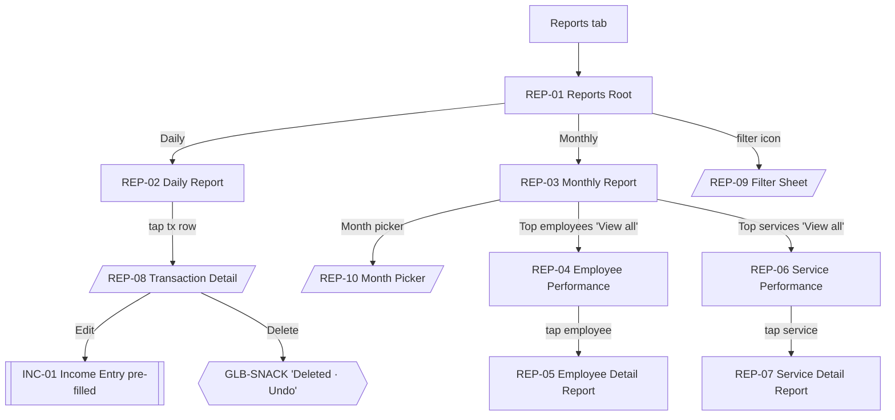

# 11 · Reports

Reports are numeric-first, offline, and derived from local SQLite. No pie charts, no line graphs — a single horizontal bar list is the only visualization per [../ux/08-dashboard-ux.md#should-reports-be-visual-or-numeric](../ux/08-dashboard-ux.md#should-reports-be-visual-or-numeric).

Sources: [../ux/04-screen-flows.md#flow-8--view-daily-report](../ux/04-screen-flows.md#flow-8--view-daily-report), [Flow 9](../ux/04-screen-flows.md#flow-9--view-monthly-report), [Flow 10](../ux/04-screen-flows.md#flow-10--drill-into-employee-performance), [../business-workflows.md#reports](../business-workflows.md#reports), [../domain/report-service.ts](../../src/domain/report-service.ts).

## Feature Navigation

## Cross-Feature Dependencies

- **Requires**: [report-service](../../src/domain/report-service.ts); transactions, transaction_items, expenses.
- **Provides**: drill-down navigation to INC-01 (Edit) and GLB-DIALOG-DELETE via REP-08.

---

### REP-01 · Reports Root

- **Surface type**: Screen
- **Template**: T4 Report
- **Route / trigger**: Reports tab (index 2).
- **Purpose**: Show a segmented Daily / Monthly view of business performance.
- **Business goal**: Owner reviews the day at closing time; parlour owner reviews the month for planning · Protects [Local Truth](../product-principles.md#local-truth) — every number comes from SQLite.

**Primary CTA**

- **Label**: `N/A` — the segmented control acts as the primary decision.
- **Destination**: REP-02 (Daily default) or REP-03 (Monthly).

**Secondary CTA**

- **Label**: `t("common.filter")` — filter icon in app bar
- **Destination**: REP-09 Filter Sheet.

**Entry points**

- Reports tab tap.
- Deep link `salonkhata://reports/daily` → default `Daily` segment.
- Deep link `salonkhata://reports/monthly` → default `Monthly` segment.
- Back from REP-04 / REP-05 / REP-06 / REP-07 → REP-01 with previous segment state preserved.

**Exit points**

- Segmented `Daily` → REP-02 embedded.
- Segmented `Monthly` → REP-03 embedded.
- Filter icon → REP-09.
- Bottom nav tap → other tab.
- Re-tap Reports tab: scroll to top; second re-tap already at root.

**Design System components**

- [App Bar](../design-system/08-component-library.md#app-bar) (title `Reports`, no back, trailing filter icon)
- [Segmented Control](../design-system/08-component-library.md#segmented-control) — `Daily` / `Monthly`
- Content region hosts REP-02 or REP-03
- [Bottom Navigation](../design-system/08-component-library.md#bottom-navigation)

**Content data**

- **Reads**: none directly; segments handle their own reads.
- **Writes**: none.

**States**

- **Loading**: REP-01-LOADING skeletons for the current segment.
- **Empty**: REP-01-EMPTY per [09-empty-states.md#transactions-reports--no-transactions-in-range](../ux/09-empty-states.md#transactions-reports--no-transactions-in-range).
- **Offline**: identical.
- **Success**: `N/A`.
- **Error**: DB read failure per [09-empty-states.md#loading-timeout--rare-db-failure](../ux/09-empty-states.md#loading-timeout--rare-db-failure).

**Motion**

- **Enter**: instant cross-fade on tab switch.
- **Segment change**: pill slides between segments 200 ms; content cross-fades 120 ms.

**Accessibility**

- First focus: segmented control.
- Segment labels: `Daily`, `Monthly`.
- Filter icon labeled `Filter`.

**Dependencies**

- **Required first**: report service; transactions/expenses tables.
- **Data written**: none.

**Priority**

- **MVP wave**: `P1`.

---

### REP-01-EMPTY · Empty State

- **Surface type**: State variant of REP-01
- **Template**: T8 Empty
- **Trigger**: No transactions in the current range and no expenses in the current range.
- **Purpose**: Route users to add income (the productive action).

Copy: [09-empty-states.md#transactions-reports--no-transactions-in-range](../ux/09-empty-states.md#transactions-reports--no-transactions-in-range) — primary action `Add income` → INC-01.

Filter chips (when filters active) remain above the empty state with `Clear all`.

---

### REP-01-LOADING · Loading State

- **Surface type**: State variant of REP-01
- **Template**: T4 skeletons
- **Trigger**: First load only.

Skeleton money card + summary card + row skeletons.

---

### REP-02 · Daily Report

- **Surface type**: Screen (embedded via segment in REP-01)
- **Template**: T4 Report
- **Route / trigger**: `Daily` segment in REP-01 (default).
- **Purpose**: Show today's income, expenses, net, and full transactions list.
- **Business goal**: Closing-time review — every transaction accounted for · Protects [Speed Over Complexity](../product-principles.md#speed-over-complexity).

**Primary CTA**

- **Label**: `N/A` — the screen is read-only; row taps open REP-08.
- **Destination**: REP-08 per row.

**Secondary CTA**

- `N/A`.

**Entry points**

- REP-01 `Daily` segment.
- DASH-01 `View all (N today) →`.

**Exit points**

- Row tap → REP-08 sheet.
- Segment `Monthly` → REP-03 (same-screen swap).
- Back → previous tab.

**Design System components**

- [Money Card · Hero](../design-system/08-component-library.md#money-card) — Today's income
- [Money Card · Large](../design-system/08-component-library.md#money-card) × 2 — Expenses, Net collection
- [Section Header](../design-system/08-component-library.md#section-header) — `Recent transactions`
- [Transaction Card](../design-system/08-component-library.md#transaction-card) list (all of today's, not just 5)
- Post-MVP: hourly bar list of income

**Content data**

- **Reads**: today's income sum, expense sum, net; all transactions for the business day (04:00 boundary).
- **Writes**: none.

**States**

- **Loading**: skeletons.
- **Empty**: REP-01-EMPTY per shared rule.
- **Offline**: identical.
- **Success**: `N/A`.
- **Error**: DB read failure inline.

**Motion**

- **Enter**: same as REP-01 segment change (cross-fade 120 ms).

**Accessibility**

- First focus: hero card value announcement.
- Money values use tabular figures; must not truncate.

**Dependencies**

- **Required first**: report service.
- **Data written**: none.

**Priority**

- **MVP wave**: `P1`.

---

### REP-03 · Monthly Report

- **Surface type**: Screen (embedded via segment in REP-01)
- **Template**: T4 Report
- **Route / trigger**: `Monthly` segment in REP-01.
- **Purpose**: Show month totals, top employees, top services, and a daily bar list.
- **Business goal**: Parlour owner reviews trends and plans commissions · Protects [Local Truth](../product-principles.md#local-truth).

**Primary CTA**

- **Label**: `N/A` — drill-down `View all` links on top-employees and top-services sections are the primary actions.

**Secondary CTA**

- **Label**: `t("reports.pickMonth")` — Month picker button in the header
- **Destination**: REP-10 Month Picker.

**Entry points**

- REP-01 `Monthly` segment.
- Deep link `salonkhata://reports/monthly`.

**Exit points**

- Month picker → REP-10.
- Top employees `View all` → REP-04.
- Top services `View all` → REP-06.
- Segment `Daily` → REP-02.
- Back → previous tab.

**Design System components**

- Month header row: `June 2026` with `chevron-down` opening REP-10
- [Money Card · Hero](../design-system/08-component-library.md#money-card) — Total income
- [Money Card · Large](../design-system/08-component-library.md#money-card) × 3 — Expenses, Net, Transactions count
- [Summary Card](../design-system/08-component-library.md#summary-card) — Top employees (up to 4 rows), with `View all →`
- [Summary Card](../design-system/08-component-library.md#summary-card) — Top services (up to 4 rows), with `View all →`
- Horizontal bar list — Income per day (Body Small labels + bar fills; only visualization allowed)

**Content data**

- **Reads**: month totals + per-employee sums + per-service sums + per-day sums.
- **Writes**: none.

**States**

- **Loading**: skeletons.
- **Empty**: REP-01-EMPTY.
- **Offline**: identical.
- **Success**: `N/A`.
- **Error**: DB read failure inline.

**Motion**

- Segment change cross-fade 120 ms.
- Bar list bars grow-in 200 ms on first render.

**Accessibility**

- Month header labeled `Month picker, currently June 2026`.
- Bar list announces per-day totals in reading order.

**Dependencies**

- **Required first**: report service; per-day aggregation.
- **Data written**: none.

**Priority**

- **MVP wave**: `P2`.
- **Rationale**: Daily report ships first; monthly ships in the Reports polish wave.

---

### REP-04 · Employee Performance

- **Surface type**: Screen
- **Template**: T4 Report
- **Route / trigger**: REP-03 Top employees `View all →`.
- **Purpose**: List every active employee for the selected month with commission + tx count, sorted by commission desc.
- **Business goal**: Owner sees who to reward · Protects [Local Truth](../product-principles.md#local-truth).

**Primary CTA**

- **Label**: `N/A` — row tap opens REP-05.
- **Destination**: REP-05 for the tapped employee.

**Secondary CTA**

- **Label**: `t("common.filter")` — filter icon in app bar
- **Destination**: REP-09.

**Entry points**

- REP-03 → View all (Employees).

**Exit points**

- Row tap → REP-05.
- Filter icon → REP-09.
- Back → REP-03.

**Design System components**

- [App Bar](../design-system/08-component-library.md#app-bar) (title `Employee performance`, leading back, trailing filter)
- Row per employee: [Employee Card](../design-system/08-component-library.md#employee-card) with trailing pair — commission ([Currency Display](../design-system/08-component-library.md#currency-display) Money Medium) + tx count (Caption)

**Content data**

- **Reads**: employees with their commission snapshots summed for the selected date range.
- **Writes**: none.

**States**

- **Loading**: row skeletons.
- **Empty**: per [09-empty-states.md#employee-performance-no-data-in-range](../ux/09-empty-states.md#employee-performance-no-data-in-range).
- **Offline**: identical.
- **Success**: `N/A`.
- **Error**: DB read failure inline.

**Motion**

- Standard push from REP-03.

**Accessibility**

- Rows announce `Name, commission X rupees, N transactions`.

**Dependencies**

- **Required first**: report service.
- **Data written**: none.

**Priority**

- **MVP wave**: `P2`.

---

### REP-05 · Employee Detail Report

- **Surface type**: Screen
- **Template**: T4 Report
- **Route / trigger**: Row tap on REP-04.
- **Purpose**: Per-day breakdown of one employee's contribution for the selected month.
- **Business goal**: Explain the totals in REP-04.

**Primary CTA**

- `N/A` — read-only drill.

**Secondary CTA**

- **Label**: `t("reports.filter")` — filter icon
- **Destination**: REP-09.

**Entry points**

- REP-04 row tap.

**Exit points**

- Back → REP-04.
- Filter → REP-09.

**Design System components**

- [App Bar](../design-system/08-component-library.md#app-bar) (title = employee name, leading back)
- Row of [Statistic Card](../design-system/08-component-library.md#statistic-card)s (commission, tx count, top service)
- Per-day list rows (date + gross + commission)

**Content data**

- **Reads**: per-day sums for the employee within the selected range.
- **Writes**: none.

**States**

- **Loading**: skeletons.
- **Empty**: `No data for this range`.
- **Offline**: identical.
- **Success**: `N/A`.
- **Error**: DB read failure inline.

**Motion**

- Standard push from REP-04.

**Accessibility**

- Standard.

**Priority**

- **MVP wave**: `P2`.

---

### REP-06 · Service Performance

- **Surface type**: Screen
- **Template**: T4 Report
- **Route / trigger**: REP-03 Top services `View all →`.
- **Purpose**: Per-service revenue + count for the selected month.

**Primary CTA**

- `N/A` — row tap opens REP-07.

**Secondary CTA**

- Filter icon → REP-09.

**Entry points**

- REP-03 → View all (Services).

**Exit points**

- Row tap → REP-07.
- Filter → REP-09.
- Back → REP-03.

**Design System components**

- Analogous to REP-04 but with [Service Card](../design-system/08-component-library.md#service-card) rows and revenue instead of commission.

**States, motion, accessibility, dependencies**: same conventions as REP-04.

**Empty state copy**: [09-empty-states.md#service-performance-no-data-in-range](../ux/09-empty-states.md#service-performance-no-data-in-range).

**Priority**

- **MVP wave**: `P2`.

---

### REP-07 · Service Detail Report

- **Surface type**: Screen
- **Template**: T4 Report
- **Route / trigger**: Row tap on REP-06.
- **Purpose**: Per-day breakdown of one service's revenue for the selected month.

Structure mirrors REP-05 with service metrics (revenue, sold count, top employee).

**Priority**

- **MVP wave**: `P2`.

---

### REP-08 · Transaction Detail

- **Surface type**: Bottom Sheet (Detail Sheet Pattern)
- **Template**: T6
- **Route / trigger**: Tap on any transaction row (DASH-01 or REP-02).
- **Purpose**: Full transaction view with Edit + Delete.
- **Business goal**: Correct a mis-entered transaction quickly · Protects [Consistent Interactions](../product-principles.md#consistent-interactions).

**Primary CTA**

- **Label**: `t("common.edit")` — `Edit`
- **Destination**: INC-01 pre-filled with the transaction; primary CTA becomes `Update`.

**Secondary CTA**

- **Label**: `t("common.delete")` — `Delete` (destructive ghost)
- **Destination**: caller (DASH-01 or REP-02) with GLB-SNACK `Deleted · Undo` (8 s).

**Entry points**

- DASH-01 transaction card tap.
- REP-02 row tap.

**Exit points**

- Edit → INC-01.
- Delete → caller + snackbar-undo.
- Swipe-down / scrim tap → caller.

**Design System components**

- [Bottom Sheet](../design-system/08-component-library.md#bottom-sheet)
- Employee ([Avatar](../design-system/08-component-library.md#avatar) + name)
- Services list (name + price per line)
- Amount ([Currency Display](../design-system/08-component-library.md#currency-display) Money Medium)
- Commission ([Currency Display](../design-system/08-component-library.md#currency-display) Money Body)
- [Chip](../design-system/08-component-library.md#chip) payment mode
- Timestamp (Body Small)
- Fixed footer with `Edit` + `Delete`

**Content data**

- **Reads**: transaction row + related transaction_items.
- **Writes**: none directly (Delete triggers soft-delete via caller flow).

**States**

- **Loading**: `N/A` — small read.
- **Empty**: `N/A`.
- **Offline**: identical.
- **Success**: `N/A` at this level.
- **Error**: `N/A`.

**Motion**

- Sheet slide-up 200 ms.

**Accessibility**

- First focus: `Edit`.
- Sheet title labeled with employee name and amount.

**Dependencies**

- **Required first**: parent list populated.
- **Data written**: none directly.

**Priority**

- **MVP wave**: `P1`.

---

### REP-09 · Filter Sheet

- **Surface type**: Bottom Sheet
- **Template**: T6
- **Route / trigger**: Filter icon on REP-01, REP-04, REP-05, REP-06, REP-07.
- **Purpose**: Set the date range for the current report.
- **Business goal**: Simple presets first, custom last · Protects [Minimum Typing](../product-principles.md#minimum-typing).

**Primary CTA**

- **Label**: `t("common.apply")` — `Apply`
- **Destination**: caller with new range applied; report re-renders.

**Secondary CTA**

- **Label**: `t("common.clearAll")` — `Clear all` (only when a non-default range is active)
- **Destination**: caller with default range restored.

**Entry points**

- Any REP-* screen filter icon.

**Exit points**

- Apply → caller.
- Clear all → caller.
- Swipe-down / scrim tap → caller unchanged.

**Design System components**

- [Bottom Sheet](../design-system/08-component-library.md#bottom-sheet)
- [Chip](../design-system/08-component-library.md#chip) row of presets: `Today`, `Yesterday`, `This week`, `This month`, `Last month`, `Custom`
- On `Custom`: inline calendar (single sheet, not nested)
- [Button](../design-system/08-component-library.md#button) primary in fixed footer — `Apply`

**Content data**

- **Inputs**: preset selection or custom start/end.
- **Writes**: none — filter state is per-navigation-session.
- **Validation**: custom start ≤ end; end ≤ today (no future ranges).

**States**

- **Loading**: `N/A`.
- **Empty**: `N/A`.
- **Offline**: identical.
- **Success**: apply → caller.
- **Error**: inline for invalid custom range.

**Motion**

- Sheet slide-up 200 ms.

**Accessibility**

- First focus: current preset chip.
- Custom calendar accessible via arrow keys.

**Dependencies**

- **Required first**: caller REP-* screen open.
- **Data written**: none.

**Priority**

- **MVP wave**: `P2`.

---

### REP-10 · Month Picker

- **Surface type**: Bottom Sheet
- **Template**: T6
- **Route / trigger**: Month header on REP-03.
- **Purpose**: Pick month + year for the monthly report.

**Primary CTA**

- **Label**: `t("common.done")` — `Done`
- **Destination**: REP-03 for the chosen month.

**Secondary CTA**

- **Label**: `t("common.cancel")` — `Cancel`
- **Destination**: REP-03 unchanged.

**Entry points**

- REP-03 month header tap.

**Exit points**

- Done → REP-03.
- Cancel / swipe-down / scrim tap → REP-03 unchanged.

**Design System components**

- [Bottom Sheet](../design-system/08-component-library.md#bottom-sheet)
- Two-column picker (Month · Year) or list-of-months by year
- [Button](../design-system/08-component-library.md#button) primary in fixed footer

**Content data**

- **Inputs**: month + year.
- **Writes**: none — selection is transient until Done.
- **Validation**: not in future (silently disable future months).

**States**

- **Loading**: `N/A`.
- **Empty**: `N/A`.
- **Offline**: identical.
- **Success**: silent → REP-03.
- **Error**: `N/A`.

**Motion**

- Sheet slide-up 200 ms.

**Accessibility**

- First focus: current month cell.
- Row labels announce full month name.

**Dependencies**

- **Required first**: REP-03 open.
- **Data written**: none.

**Priority**

- **MVP wave**: `P2`.
