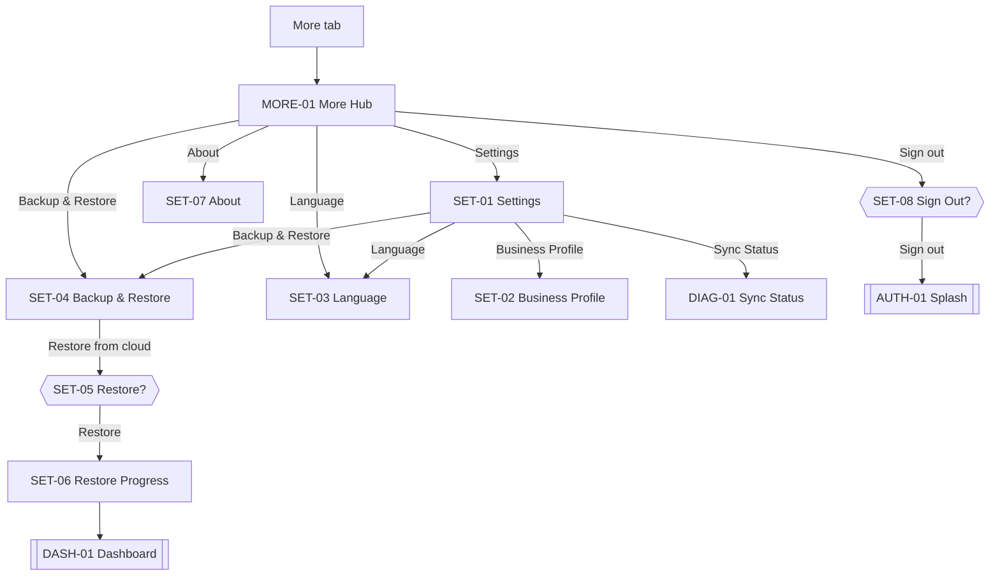

# 12 · More & Settings

The More tab is a menu into settings, backup/restore, language, about, and sign-out. Settings themselves live as sub-screens. This section also owns diagnostics (Sync Status).

Sources: [../ux/03-screen-inventory.md#more-tab](../ux/03-screen-inventory.md#more-tab), [../ux/04-screen-flows.md#flow-12--backup-automatic](../ux/04-screen-flows.md#flow-12--backup-automatic), [Flow 13](../ux/04-screen-flows.md#flow-13--restore-automatic-on-new-device--see-flow-3), [Flow 14](../ux/04-screen-flows.md#flow-14--language-change), [Flow 15](../ux/04-screen-flows.md#flow-15--sign-out), [../ux/12-offline-ux.md#sync-states-user-visible](../ux/12-offline-ux.md#sync-states-user-visible).

## Feature Navigation

## Cross-Feature Dependencies

- **Requires**: [settings-repository](../../src/repositories/settings-repository.ts); [sync-engine](../../src/sync/sync-engine.ts); [restore-service](../../src/sync/restore-service.ts); [i18n](../../src/i18n/index.ts).
- **Provides**: business profile edits, language switch, backup/restore, sync visibility, sign-out.

---

### MORE-01 · More Hub

- **Surface type**: Screen
- **Template**: T5 Settings
- **Route / trigger**: More tab (index 3).
- **Purpose**: List of everything that doesn't fit in Dashboard / Entries / Reports.
- **Business goal**: Non-daily concerns stay out of the way of the golden path · Protects [Simple Over Feature Rich](../product-principles.md#simple-over-feature-rich).

**Primary CTA**

- `N/A` — menu screen.

**Secondary CTA**

- `N/A`.

**Entry points**

- More tab tap.
- Re-tap current tab: scroll to top; second re-tap already at root.

**Exit points**

- `Settings` → SET-01.
- `Backup & Restore` → SET-04.
- `Language` → SET-03.
- `About` → SET-07.
- `Sign out` → SET-08.
- Bottom nav → other tab.

**Design System components**

- [App Bar](../design-system/08-component-library.md#app-bar) (title `More`, no back, no trailing)
- [Section Header](../design-system/08-component-library.md#section-header) — `Settings`, `Data`, `Account`
- [List Item](../design-system/08-component-library.md#list-item) rows with leading icon + chevron trailing (destructive Sign out has no chevron)
- [Bottom Navigation](../design-system/08-component-library.md#bottom-navigation)

**Content data**

- **Reads**: none — static list; `Language` row shows current language name in its own script per [Language Selector](../design-system/08-component-library.md#language-selector).
- **Writes**: none.

**States**

- **Loading**: `N/A`.
- **Empty**: `N/A`.
- **Offline**: identical.
- **Success**: `N/A`.
- **Error**: `N/A`.

**Motion**

- Instant cross-fade on tab switch.
- Standard push to sub-screens.

**Accessibility**

- First focus: first row.
- `Sign out` row uses `status.danger` text color and is announced as `Sign out, destructive`.

**Dependencies**

- **Required first**: AUTH-05.
- **Data written**: none.

**Priority**

- **MVP wave**: `P1`.

---

### SET-01 · Settings

- **Surface type**: Screen
- **Template**: T5 Settings
- **Route / trigger**: MORE-01 → `Settings`.
- **Purpose**: Grouped list of business, data, account, and about settings.
- **Business goal**: All configuration in one predictable place · Protects [Consistent Interactions](../product-principles.md#consistent-interactions).

**Primary CTA**

- `N/A` — menu screen.

**Secondary CTA**

- `N/A`.

**Entry points**

- MORE-01 → Settings.
- Deep link `salonkhata://settings`.

**Exit points**

- `Business name` / `Currency` / `Owner name` → SET-02 (single Business Profile screen, per T5 grouping — MVP consolidates to one Business Profile screen to avoid many tiny screens).
- `Language` → SET-03.
- `Backup & Restore` / `Sync status` → SET-04 / DIAG-01.
- `Profile` (owner) → SET-02.
- `Sign out` → SET-08.
- `Version` / `Terms & Privacy` → SET-07.

**Design System components**

- [App Bar](../design-system/08-component-library.md#app-bar) (title `Settings`, leading back)
- [Section Header](../design-system/08-component-library.md#section-header) — `Business`, `Data`, `Account`, `About`
- [List Item](../design-system/08-component-library.md#list-item) rows per section per [17-screen-templates.md#template-5-settings](../design-system/17-screen-templates.md#template-5-settings)

**Content data**

- **Reads**: current business name, currency, language, last backup timestamp, sync pending count, app version.
- **Writes**: none directly.

**States**

- **Loading**: `N/A` (fields are already cached in memory).
- **Empty**: `N/A`.
- **Offline**: identical.
- **Success**: `N/A`.
- **Error**: `N/A`.

**Motion**

- Standard push from MORE-01.

**Accessibility**

- Grouped rows read as `<section>: <row>`.

**Dependencies**

- **Required first**: settings repository; sync engine.
- **Data written**: none.

**Priority**

- **MVP wave**: `P1`.

---

### SET-02 · Business Profile

- **Surface type**: Screen
- **Template**: T3 Form
- **Route / trigger**: SET-01 → Business name / Currency / Owner name row.
- **Purpose**: Edit business name, owner name, currency in one form.
- **Business goal**: Owner corrects the salon name or switches currency without hunting · Protects [Simple Over Feature Rich](../product-principles.md#simple-over-feature-rich).

**Primary CTA**

- **Label**: `t("common.save")` — `Save`
- **Destination**: SET-01 with GLB-SNACK `Updated`.

**Secondary CTA**

- **Label**: `t("common.close")` — `x` (leading in app bar)
- **Destination**: SET-01 unchanged; GLB-DIALOG-DISCARD if dirty.

**Entry points**

- SET-01 row tap.

**Exit points**

- Save → SET-01 + snackbar.
- Close `x` → SET-01 (or Discard).

**Design System components**

- [App Bar](../design-system/08-component-library.md#app-bar) (leading `x`, title `Business profile`)
- [Text Field · name](../design-system/08-component-library.md#text-field) — Business name (required)
- [Text Field · name](../design-system/08-component-library.md#text-field) — Owner name (optional)
- Row: Currency (looks like a text field, opens a small select sheet with common currencies; MVP defaults to `INR` and single option)
- [Button](../design-system/08-component-library.md#button) primary in fixed footer

**Content data**

- **Inputs**: business name (required), owner name (optional), currency.
- **Reads**: current settings row.
- **Writes**: `settings` update; `sync_outbox` enqueue.
- **Validation**: business name non-empty.

**States**

- **Loading**: Save button loading state during write.
- **Empty**: `N/A`.
- **Offline**: identical.
- **Success**: GLB-SNACK `Updated`.
- **Error**: inline validation; storage snackbar.

**Motion**

- Standard push from SET-01.

**Accessibility**

- First focus: business name.

**Dependencies**

- **Required first**: settings repository.
- **Data written**: `settings`, `sync_outbox`.

**Priority**

- **MVP wave**: `P1`.

---

### SET-03 · Language

- **Surface type**: Screen
- **Template**: T5 (list variant)
- **Route / trigger**: MORE-01 or SET-01 → Language.
- **Purpose**: Switch app language instantly (no restart).
- **Business goal**: Family Helper switches to their preferred script mid-session · Protects [Translation Ready](../product-principles.md#translation-ready).

**Primary CTA**

- **Label**: implicit — tapping a row applies immediately.
- **Destination**: same screen (localized) per [Flow 14](../ux/04-screen-flows.md#flow-14--language-change).

**Secondary CTA**

- `N/A`.

**Entry points**

- MORE-01 → Language.
- SET-01 → Language row.

**Exit points**

- Row tap → immediate re-render (no navigation).
- Back → caller.

**Design System components**

- [App Bar](../design-system/08-component-library.md#app-bar) (title `Language`, leading back)
- [Language Selector](../design-system/08-component-library.md#language-selector) list with [Radio](../design-system/08-component-library.md#radio) trailing

**Content data**

- **Reads**: current language.
- **Writes**: `settings.language` update; `sync_outbox` enqueue.
- **Validation**: `N/A`.

**States**

- **Loading**: `N/A`.
- **Empty**: `N/A`.
- **Offline**: identical.
- **Success**: silent (UI update is the feedback) per [11-success-ux.md#success-feedback-matrix](../ux/11-success-ux.md#success-feedback-matrix).
- **Error**: `N/A` — local write.

**Motion**

- Instant re-render on selection.

**Accessibility**

- Language name announced in its own script.
- No language codes (`en`, `hi`) shown per [Language Selector](../design-system/08-component-library.md#language-selector).

**Dependencies**

- **Required first**: i18n live.
- **Data written**: `settings.language`.

**Priority**

- **MVP wave**: `P1`.

---

### SET-04 · Backup & Restore

- **Surface type**: Screen
- **Template**: T5 Settings
- **Route / trigger**: MORE-01 → Backup & Restore; SET-01 → Data section.
- **Purpose**: Show backup status, allow manual `Backup now` and `Restore from cloud`.
- **Business goal**: Owner sees data safety and can trigger restore on a new device · Protects [Local Truth](../product-principles.md#local-truth) and [Offline First](../product-principles.md#offline-first).

**Primary CTA**

- **Label**: `t("backup.now")` — `Backup now` (Secondary Button)
- **Destination**: same screen with progress bar (if > 500 ms) then GLB-SNACK `Backup complete` per [12-offline-ux.md#backup](../ux/12-offline-ux.md#backup).

**Secondary CTA**

- **Label**: `t("backup.restore")` — `Restore from cloud` (Destructive Ghost)
- **Destination**: SET-05.

**Entry points**

- MORE-01 → Backup & Restore.
- SET-01 → Restore row.

**Exit points**

- Backup now → same screen + snackbar.
- Restore from cloud → SET-05.
- Back → caller.

**Design System components**

- [App Bar](../design-system/08-component-library.md#app-bar) (title `Backup & Restore`, leading back)
- Status row — `Last backup: <timestamp>` or `No backup yet` per [09-empty-states.md#no-backup-first-sync-in-progress](../ux/09-empty-states.md#no-backup-first-sync-in-progress)
- [Progress](../design-system/08-component-library.md#progress) linear (only visible during manual backup > 500 ms)
- [Button](../design-system/08-component-library.md#button) Secondary — `Backup now`
- [Button · Destructive Ghost](../design-system/08-component-library.md#button) — `Restore from cloud`

**Content data**

- **Reads**: last backup timestamp, cloud backup existence.
- **Writes**: none directly (backup triggers sync engine).

**States**

- **Loading**: initial timestamp fetch (fast).
- **Empty**: `No backup yet` inline empty per [09-empty-states.md#no-backup-first-sync-in-progress](../ux/09-empty-states.md#no-backup-first-sync-in-progress).
- **Offline**: `Backup now` fails with subtle snackbar `Couldn't reach the server. Retry.`; `Restore from cloud` shows dialog `You need internet to restore. Please connect and try again.` per [12-offline-ux.md#restore--no-network](../ux/12-offline-ux.md#restore--no-network).
- **Success**: GLB-SNACK `Backup complete · just now`.
- **Error**: sync engine surfaces retries in DIAG-01; SET-04 stays clean unless manual action fails.

**Motion**

- Progress bar fades in / out with the operation.

**Accessibility**

- Timestamps use accessible relative time (`Last backup, 2 minutes ago`).
- Destructive button announced as `Restore from cloud, destructive`.

**Dependencies**

- **Required first**: sync engine.
- **Data written**: none directly.

**Priority**

- **MVP wave**: `P2`.
- **Rationale**: MVP can ship with automatic background sync; manual backup/restore lands in the sync wave.

---

### SET-05 · Restore Confirmation

- **Surface type**: Dialog
- **Template**: — (Dialog component)
- **Route / trigger**: SET-04 `Restore from cloud`.
- **Purpose**: Confirm the destructive action of replacing local data with cloud data.
- **Business goal**: Prevents accidental data loss.

**Primary CTA**

- **Label**: `t("backup.restore")` — `Restore` (destructive)
- **Destination**: SET-06.

**Secondary CTA**

- **Label**: `t("common.cancel")` — `Cancel`
- **Destination**: SET-04 unchanged.

**Entry points**

- SET-04.

**Exit points**

- Restore → SET-06.
- Cancel / scrim tap / back → SET-04.

**Design System components**

- [Dialog](../design-system/08-component-library.md#dialog) destructive
- Title H3 `Restore from cloud?`
- Body `This will replace your current data.`
- Two [Button](../design-system/08-component-library.md#button)s

**Content data**

- **Reads**: none.
- **Writes**: none.

**States**: all `N/A` — dialog.

**Motion**

- Fade + scale 200 ms per [Dialog](../design-system/08-component-library.md#dialog).

**Accessibility**

- First focus: Cancel (safe default).

**Dependencies**

- **Required first**: SET-04 with cloud backup detected.
- **Data written**: none.

**Priority**

- **MVP wave**: `P2`.

---

### SET-06 · Restore Progress

- **Surface type**: Screen (blocking — the app is not interactive during restore per [12-offline-ux.md#behavior-during-restore-in-progress](../ux/12-offline-ux.md#behavior-during-restore-in-progress))
- **Template**: T4 (progress variant — a progress-and-status layout using the Report template's app bar + centered content)
- **Route / trigger**: SET-05 confirmed.
- **Purpose**: Show restore progress with Cancel; hand off to DASH-01 on success.
- **Business goal**: Owner watches the return-of-data with clarity · Protects [Local Truth](../product-principles.md#local-truth) via atomic restore.

**Primary CTA**

- **Label**: `t("common.cancel")` — `Cancel` (Secondary)
- **Destination**: SET-04 with GLB-SNACK `Restore cancelled`; local data intact.

**Secondary CTA**

- **Label**: `t("common.tryAgain")` — `Try again` (only visible on failure)
- **Destination**: same screen restart.

**Entry points**

- SET-05 confirmed.
- AUTH-06 Restore (automatic on new device — same progress screen semantics but launches into DASH-01 on completion).

**Exit points**

- Success → DASH-01 with GLB-SNACK `Restored`.
- Cancel → SET-04 with `Restore cancelled` snackbar.
- Failure → per [10-error-ux.md#restore-failures](../ux/10-error-ux.md#restore-failures) — progress screen shows `Restore failed at X%` with `Try again` / `Cancel`; local data untouched.

**Design System components**

- [App Bar](../design-system/08-component-library.md#app-bar) (title `Restoring`, no back — Cancel is the escape)
- [Progress](../design-system/08-component-library.md#progress) linear determinate
- Body copy — `Restoring your data…` with percentage
- [Button](../design-system/08-component-library.md#button) Secondary — `Cancel`

**Content data**

- **Reads**: restore progress from [restore-service](../../src/sync/restore-service.ts).
- **Writes**: local SQLite atomically replaced on success per [12-offline-ux.md#restore-flow](../ux/12-offline-ux.md#restore-flow).

**States**

- **Loading**: this screen *is* the loading state.
- **Empty**: `N/A`.
- **Offline**: not reachable — SET-05 requires network to confirm.
- **Success**: → DASH-01 + snackbar.
- **Error**: inline `Restore failed at X%` with `Try again`, `Cancel`.

**Motion**

- Progress bar animates per [13-motion-flow.md#progress-bar-restore](../ux/13-motion-flow.md#progress-bar-restore) — smooth even under reduced motion.

**Accessibility**

- Announce percentage changes at 10% intervals via `accessibilityLiveRegion="polite"`.
- Cancel remains in thumb reach.

**Dependencies**

- **Required first**: SET-05 confirmed OR AUTH-06 Restore.
- **Data written**: entire local SQLite (atomic).

**Priority**

- **MVP wave**: `P2`.

---

### SET-07 · About

- **Surface type**: Screen
- **Template**: T5
- **Route / trigger**: MORE-01 → About.
- **Purpose**: Version, terms, privacy.
- **Business goal**: Legal/store requirement; trust surface.

**Primary CTA**

- `N/A`.

**Secondary CTA**

- `N/A`.

**Entry points**

- MORE-01 → About.

**Exit points**

- `Terms & Privacy` → opens external browser.
- Back → MORE-01.

**Design System components**

- [App Bar](../design-system/08-component-library.md#app-bar) (title `About`, leading back)
- [List Item](../design-system/08-component-library.md#list-item) rows: `Version <string>` (trailing), `Terms & Privacy` (chevron)

**Content data**

- **Reads**: app version.
- **Writes**: none.

**States**: all `N/A` — static.

**Motion**: standard push.

**Accessibility**: standard.

**Priority**

- **MVP wave**: `P2`.

---

### SET-08 · Sign Out Confirmation

- **Surface type**: Dialog
- **Template**: — (Dialog)
- **Route / trigger**: MORE-01 → `Sign out`.
- **Purpose**: Confirm sign-out with reassurance that local data persists.
- **Business goal**: Prevents accidental sign-out.

**Primary CTA**

- **Label**: `t("auth.signOut")` — `Sign out` (destructive)
- **Destination**: AUTH-01 (session cleared per [Flow 15](../ux/04-screen-flows.md#flow-15--sign-out)).

**Secondary CTA**

- **Label**: `t("common.cancel")` — `Cancel`
- **Destination**: MORE-01 unchanged.

**Entry points**

- MORE-01 → Sign out.

**Exit points**

- Sign out → AUTH-01.
- Cancel / scrim tap / back → MORE-01.

**Design System components**

- [Dialog](../design-system/08-component-library.md#dialog)
- Title H3 `Sign out?`
- Body `Sign out? Your data will remain on this device.`
- Two [Button](../design-system/08-component-library.md#button)s

**Content data**

- **Reads**: none.
- **Writes**: session cleared on confirm.

**States**: all `N/A` — dialog.

**Motion**

- Fade + scale 200 ms.

**Accessibility**

- First focus: Cancel.

**Priority**

- **MVP wave**: `P1`.

---

### SET-09 · Delete All Data (Post-MVP)

- **Surface type**: Dialog
- **Route / trigger**: (Post-MVP) SET-01 → Advanced.
- **Purpose**: Nuclear reset — clear local data and cloud backup.
- **Priority**: `Post-MVP`.

No further spec until promoted.

---

### DIAG-01 · Sync Status

- **Surface type**: Screen
- **Template**: T5 (with actions)
- **Route / trigger**: SET-01 → Sync status; DASH-01 sync-line tap; deep link `salonkhata://sync`.
- **Purpose**: Show pending sync count, last successful sync, retry action, and error log.
- **Business goal**: Single source of truth for sync questions per [12-offline-ux.md#what-the-user-should-always-understand](../ux/12-offline-ux.md#what-the-user-should-always-understand) · Protects [Offline First](../product-principles.md#offline-first).

**Primary CTA**

- **Label**: `t("sync.retryNow")` — `Retry now` (Secondary Button; shown when pending > 0 or last sync failed)
- **Destination**: same screen; on success — status updates to `Just synced`; on failure — GLB-SNACK `Still can't sync · Check your internet.` per [12-offline-ux.md#manual-retry](../ux/12-offline-ux.md#manual-retry).

**Secondary CTA**

- `N/A`.

**Entry points**

- SET-01 → Sync status.
- DASH-01 sync line tap.
- Deep link `salonkhata://sync`.

**Exit points**

- Retry now → same screen.
- Back → caller.

**Design System components**

- [App Bar](../design-system/08-component-library.md#app-bar) (title `Sync status`, leading back)
- Status rows — `Last synced: <time>`, `Pending items: <count>`, connectivity state (`Online` / `You're offline`) per [09-empty-states.md#no-internet-informational-only](../ux/09-empty-states.md#no-internet-informational-only)
- [Button](../design-system/08-component-library.md#button) Secondary — `Retry now`
- Log list (post-MVP: recent failures)

**Content data**

- **Reads**: sync engine state (last sync, pending count, current status).
- **Writes**: triggers manual sync attempt on Retry.

**States**

- **Loading**: `N/A` — state is cached.
- **Empty**: `Everything is up to date` if pending = 0 and last sync succeeded recently.
- **Offline**: `You're offline · X pending items` per [10-error-ux.md#offline-errors](../ux/10-error-ux.md#offline-errors) offline surface allowance.
- **Success**: `Just synced` line update on Retry success.
- **Error**: GLB-SNACK on Retry failure.

**Motion**

- `Syncing…` line shows activity indicator during retry.

**Accessibility**

- Status announced via `accessibilityLiveRegion="polite"` on state changes.

**Dependencies**

- **Required first**: sync engine.
- **Data written**: triggers sync engine push.

**Priority**

- **MVP wave**: `P2`.

---

### DIAG-02 · Audit Log (Post-MVP)

- **Surface type**: Screen
- **Route / trigger**: (Post-MVP) SET-01 → History.
- **Purpose**: Surface the sync audit log for conflict inspection.
- **Priority**: `Post-MVP` per [00-screen-map.md#ambiguities--reconciliations](00-screen-map.md#ambiguities--reconciliations) (Ref A3) and [../ux/12-offline-ux.md#conflict-resolution](../ux/12-offline-ux.md#conflict-resolution).

No further spec until promoted.
