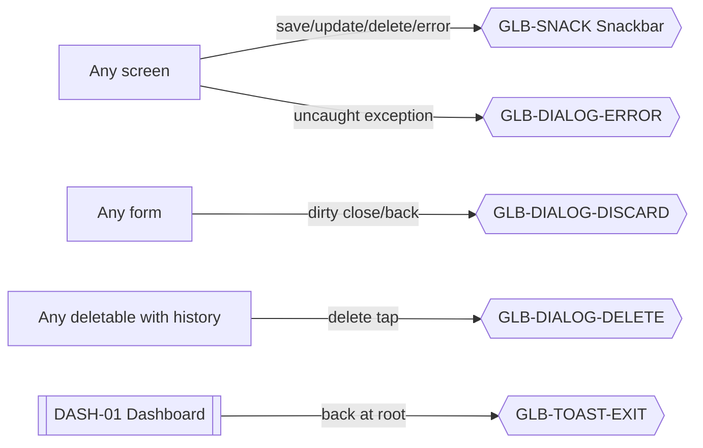

# 13 · Global Overlays

Snackbars, dialogs, skeletons, and Android exit hints are shared across every feature file. This document is the single source of specification — feature files reference IDs here instead of duplicating.

Sources: [../ux/11-success-ux.md](../ux/11-success-ux.md), [../ux/10-error-ux.md](../ux/10-error-ux.md), [../ux/06-form-ux.md#discard-changes-guard](../ux/06-form-ux.md#discard-changes-guard), [../ux/06-form-ux.md#deleting-data](../ux/06-form-ux.md#deleting-data), [../ux/12-offline-ux.md](../ux/12-offline-ux.md), [../design-system/08-component-library.md#snackbar--toast](../design-system/08-component-library.md#snackbar--toast), [../design-system/08-component-library.md#dialog](../design-system/08-component-library.md#dialog).

## Feature Navigation

Overlays are not navigable — they attach to whichever screen invokes them.

## Universal Rules

- **One snackbar visible at a time.** Never stack. See [11-success-ux.md#success--undo-coexistence](../ux/11-success-ux.md#success--undo-coexistence).
- **Dialogs are for blocking decisions only.** Confirmations, destructive actions, or unrecoverable failures per [10-error-ux.md#error-tiering](../ux/10-error-ux.md#error-tiering).
- **Never a modal for sync events.** Sync noise stays in DIAG-01 per [12-offline-ux.md#what-the-user-should-never-see](../ux/12-offline-ux.md#what-the-user-should-never-see).
- **Every overlay honors reduced motion.** No bumps, no bounces, no confetti under reduced-motion settings per [13-motion-flow.md#reduced-motion-behavior](../ux/13-motion-flow.md#reduced-motion-behavior).

---

### GLB-SNACK · Snackbar

- **Surface type**: Overlay
- **Template**: — (Snackbar component)
- **Route / trigger**: Any successful mutation (Save, Update, Delete, Restore, Backup) or subtle error/retry per [10-error-ux.md](../ux/10-error-ux.md).
- **Purpose**: Non-blocking feedback for background events.
- **Business goal**: Owner never has to acknowledge success · Protects [Speed Over Complexity](../product-principles.md#speed-over-complexity).

**Primary CTA (optional, per variant)**

- `Add another` (5 s) — re-opens the form with defaults preserved.
- `Undo` (8 s) — restores a soft-deleted row.
- `Retry` (8 s on error) — re-runs the failed request.

**Secondary CTA**

- Auto-dismiss after 3 / 5 / 8 s per [11-success-ux.md#snackbar-anatomy](../ux/11-success-ux.md#snackbar-anatomy).

**Entry points**

- After Save on INC-01, EXP-02, EXP-03, EMP-02, EMP-03, SRV-02, SRV-03, COM-03, SET-02.
- After Delete on any of the above (undo variant when fresh, plain when with-history).
- After Restore complete (SET-06 → DASH-01).
- After Backup complete (SET-04).
- On subtle network errors (OTP send failure, pull-to-refresh failure, storage full).

**Exit points**

- Auto-dismiss after duration.
- Action tap → per action semantics.
- New snackbar → replaces the current one (never stacks).

**Design System components**

- [Snackbar](../design-system/08-component-library.md#snackbar--toast) — icon + label + optional action label
- Positioned bottom-centered above bottom nav per [08-component-library.md#snackbar--toast](../design-system/08-component-library.md#snackbar--toast)

**Content data**

- **Copy**: from [11-success-ux.md#success-feedback-matrix](../ux/11-success-ux.md#success-feedback-matrix); localized via `t()` keys.
- **Reads**: none.
- **Writes**: on `Undo` — clears `deleted_at` and enqueues update; on `Retry` — re-triggers the operation.

**States**

- **Loading**: `N/A`.
- **Empty**: `N/A`.
- **Offline**: identical — snackbar is UI-only.
- **Success**: is the state.
- **Error variant**: uses `status.danger` icon tint and Retry action.

**Motion**

- Slide up + fade in 200 ms per [13-motion-flow.md#snackbar-in](../ux/13-motion-flow.md#snackbar-in).
- Check icon scale bump 1.0 → 1.1 → 1.0 (120 ms); skipped under reduced motion.
- Slide down + fade out 200 ms on dismiss.

**Accessibility**

- Announced via `accessibilityLiveRegion="polite"`.
- Action buttons have accessibility labels.
- Focus remains on the invoking screen; snackbar does not steal focus.

**Dependencies**

- **Required first**: none (universal).
- **Data written**: depends on action.

**Priority**

- **MVP wave**: `P0`.
- **Rationale**: Every mutation depends on snackbar feedback per Product Principle [Consistent Interactions](../product-principles.md#consistent-interactions).

---

### GLB-TOAST-EXIT · Android Exit Hint

- **Surface type**: Overlay (Android toast)
- **Template**: — (Toast component; equivalent to Snackbar but uses OS conventions)
- **Route / trigger**: Hardware back on DASH-01 when no history exists.
- **Purpose**: Tell Android users to press back again to exit, per Android convention.
- **Business goal**: Prevents accidental exit without a modal · Protects [Consistent Interactions](../product-principles.md#consistent-interactions).

**Primary CTA**

- `N/A` — passive.

**Secondary CTA**

- `N/A`.

**Entry points**

- DASH-01 hardware back with no history.

**Exit points**

- Second back tap within 2 s → app exits.
- Toast auto-dismisses after 2 s; second back after that → shows toast again (no exit) — this matches Android convention.

**Design System components**

- Native Android toast (not a custom snackbar) so the copy uses standard OS placement.
- Copy: `t("app.exitHint")` — `Press back again to exit.`

**Content data**

- **Reads**: none.
- **Writes**: none.

**States**: `N/A`.

**Motion**

- OS-provided toast animation.

**Accessibility**

- Screen reader announces the copy.

**Dependencies**

- **Required first**: DASH-01.

**Priority**

- **MVP wave**: `P1`.
- **Rationale**: Android platform expectation.

---

### GLB-DIALOG-DISCARD · Discard Changes

- **Surface type**: Dialog
- **Template**: — (Dialog component)
- **Route / trigger**: Any form (INC-01, EMP-02, EMP-03, SRV-02, SRV-03, EXP-02, EXP-03, COM-03, SET-02) closed via `x`, hardware back, or swipe-down while dirty.
- **Purpose**: Prevent silent data loss.
- **Business goal**: The app never loses user input silently · Protects [Consistent Interactions](../product-principles.md#consistent-interactions) — same guard on every form.

**Primary CTA**

- **Label**: `t("common.discard")` — `Discard` (destructive)
- **Destination**: closes the form, returns to caller with GLB-SNACK `Discarded`.

**Secondary CTA**

- **Label**: `t("common.cancel")` — `Cancel`
- **Destination**: dialog dismisses, form unchanged.

**Entry points**

- Every form's close / back event when dirty.

**Exit points**

- Discard → close form.
- Cancel / scrim tap / hardware back → dialog dismisses (form stays open).

**Design System components**

- [Dialog](../design-system/08-component-library.md#dialog) destructive
- Title H3 `Discard changes?`
- Body `Your changes will not be saved.`
- Two [Button](../design-system/08-component-library.md#button)s

**Content data**

- **Reads**: none.
- **Writes**: none.

**States**: all `N/A`.

**Motion**

- Fade + scale 200 ms per [Dialog](../design-system/08-component-library.md#dialog).

**Accessibility**

- First focus: Cancel (safe default).
- Scrim tap defaults to Cancel — never silently commits Discard.

**Dependencies**

- **Required first**: an open dirty form.

**Priority**

- **MVP wave**: `P0`.
- **Rationale**: The golden path form (INC-01) needs this immediately.

**Note**: INC-04 in [05-income-entry.md](05-income-entry.md#inc-04--discard-changes) is the specialized instance used in the golden path documentation — same copy, same behavior. Other forms share this GLB dialog.

---

### GLB-DIALOG-DELETE · Delete Confirmation

- **Surface type**: Dialog
- **Template**: — (Dialog component)
- **Route / trigger**: Delete tap on any entity that has historical references (Employees / Services with existing transactions per [06-form-ux.md#deleting-data](../ux/06-form-ux.md#deleting-data) Flavor B).
- **Purpose**: Confirm a destructive action that soft-deletes an entity referenced by history.
- **Business goal**: Owner never accidentally removes a name that appears in past reports · Protects [Local Truth](../product-principles.md#local-truth).

**Primary CTA**

- **Label**: `t("common.delete")` — `Delete` (destructive)
- **Destination**: caller with GLB-SNACK `Deleted` (no undo — dialog was the confirmation per [06-form-ux.md#deleting-data](../ux/06-form-ux.md#deleting-data)).

**Secondary CTA**

- **Label**: `t("common.cancel")` — `Cancel`
- **Destination**: dialog dismisses.

**Entry points**

- EMP-04 / EMP-03 Delete when the employee has transaction references.
- SRV-04 / SRV-03 Delete when the service has transaction references.

**Exit points**

- Delete → soft-delete + snackbar.
- Cancel → dialog dismisses.

**Design System components**

- [Dialog](../design-system/08-component-library.md#dialog) destructive
- Title H3 (entity-specific): `Delete this employee?` / `Delete this service?`
- Body (entity-specific): `Past transactions will keep this employee's records.` / `Past transactions will keep this service's records.`
- Two [Button](../design-system/08-component-library.md#button)s

**Content data**

- **Reads**: entity reference count (to decide whether to show this dialog vs snackbar-undo flavor).
- **Writes**: sets `deleted_at` on confirm.

**States**: all `N/A`.

**Motion**

- Standard dialog fade + scale 200 ms.

**Accessibility**

- First focus: Cancel.
- Never `Are you sure?` — always name the reason per [06-form-ux.md#deleting-data](../ux/06-form-ux.md#deleting-data).

**Dependencies**

- **Required first**: entity has ≥ 1 transaction reference.

**Priority**

- **MVP wave**: `P1`.
- **Rationale**: Ships with EMP-03 / SRV-03 in the entities wave.

---

### GLB-DIALOG-ERROR · Generic Error

- **Surface type**: Dialog
- **Template**: — (Dialog component)
- **Route / trigger**: Fatal uncaught exception per [10-error-ux.md#unexpected-errors-uncaught-exceptions](../ux/10-error-ux.md#unexpected-errors-uncaught-exceptions).
- **Purpose**: Recover from an unexpected exception without crashing the app.
- **Business goal**: Trust — even when something goes wrong, data is safe and recovery is one tap away · Protects [Local Truth](../product-principles.md#local-truth).

**Primary CTA**

- **Label**: `t("common.tryAgain")` — `Try again`
- **Destination**: restarts the current stack per [10-error-ux.md#unexpected-errors-uncaught-exceptions](../ux/10-error-ux.md#unexpected-errors-uncaught-exceptions).

**Secondary CTA**

- **Label**: `t("common.contactSupport")` — `Contact support` (Post-MVP; hidden in MVP)
- **Destination**: WhatsApp deep link (Post-MVP).

**Entry points**

- Global error boundary.

**Exit points**

- Try again → restart current stack.
- Contact support (Post-MVP) → external.

**Design System components**

- [Dialog](../design-system/08-component-library.md#dialog) informational
- Icon `alert-triangle`
- Title H3 `Something went wrong`
- Body `The app hit an unexpected problem. Please try again. Your data is safe.`
- [Button](../design-system/08-component-library.md#button) primary — `Try again`

**Content data**

- **Reads**: none surfaced to user; error details go to engineering logs.
- **Writes**: none.

**States**: all `N/A`.

**Motion**

- Standard dialog fade + scale 200 ms.

**Accessibility**

- First focus: Try again.
- No error codes shown per [10-error-ux.md#copy-style](../ux/10-error-ux.md#copy-style).

**Dependencies**

- **Required first**: global error boundary component.

**Priority**

- **MVP wave**: `P1`.

---

## Global Skeleton Conventions

Skeletons are not a separate ID — every list/dashboard/report screen defines its own loading state referencing [Loading Skeleton](../design-system/08-component-library.md#loading-skeleton). Rules recapped here:

- Skeletons for **first load only** per [12-lists.md](../design-system/12-lists.md).
- Skeleton shapes mirror the final content (card / row / money card).
- Shimmer left-to-right, 480 ms loop.
- Under reduced motion: static opacity pulse (0.4 ↔ 0.7) at 480 ms cadence.
- Never use skeletons for user-triggered actions — use Button loading state instead.

## Global Offline Behavior

The app has **no offline banner and no offline error state on core screens** per [12-offline-ux.md#the-offline-contract](../ux/12-offline-ux.md#the-offline-contract). The only surface that acknowledges connectivity is DIAG-01. Every feature file's Offline state notes "identical to online" — this is intentional and enforced.

## Global Audit Log Note

MVP writes an audit log entry on each conflict resolution via [sync-engine](../../src/sync/sync-engine.ts), but **there is no user-facing UI in MVP** per [12-offline-ux.md#conflict-resolution](../ux/12-offline-ux.md#conflict-resolution). DIAG-02 is documented as Post-MVP in [00-screen-map.md](00-screen-map.md) (Ref A3).
