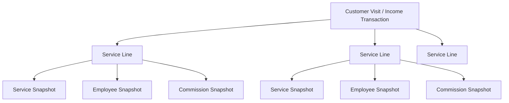

# Service Engine

The Service Engine defines how Salon Khata models salon services, customer visits, employee assignment, and employee earnings. It is the source of truth for implementing service entry, service reporting, and commission calculation.

Salon Khata is a notebook replacement for small Indian salons. The engine should cover 90-95% of men's salons, women's salons, and unisex salons without becoming an ERP.

## Goals

- Keep daily income entry fast enough for a busy counter.
- Represent real salon work accurately enough for owner trust.
- Calculate employee earnings without spreadsheet work.
- Preserve historical records when services, prices, employees, or commission rules change later.
- Avoid appointment booking, payroll, attendance, inventory, GST, tax, and accounting behavior.

## Core Model

The service line is the atomic unit of the Service Engine.

A customer visit can contain many service lines. Each service line has one service, one assigned employee, one price snapshot, one quantity, and one commission calculation. Visit totals are derived by summing service lines.

## Recommended MVP Model

### Service Structure

A service is an item the salon sells, such as `Haircut`, `Beard`, `Facial`, `Hair Spa`, `Hair Color`, `Waxing`, or `Threading`.

MVP fields:

| Field | Required | Recommendation |
| --- | --- | --- |
| `name` | Yes | Human-readable service name, unique among non-deleted services in one salon. |
| `category_id` | Yes in current app flow | Used only for organization and filtering. |
| `male_price` | At least one price required | Price for male customers when offered. Store in paise. |
| `female_price` | At least one price required | Price for female customers when offered. Store in paise. |
| `is_active` | Yes | Inactive services are hidden from new income entry but remain available in history. |
| `sort_order` | Yes | Supports owner-friendly ordering and recent/common ordering. |
| shared sync/audit fields | Yes | Required for offline-first SQLite and sync. |

The product concept may describe this as a default price, but implementation can support male and female prices because Indian salons commonly price the same service differently by customer type. Gender is pricing availability, not service identity.

Examples:

- `Haircut`: male price and female price may differ.
- `Beard`: male price may be set, female price may be blank or zero.
- `Facial`: female price may be common, male price may also be offered in unisex salons.

Do not add duration to the MVP service model. Duration belongs to appointment booking and staff scheduling.

Do not add consumables to the MVP service model. Consumables belong to inventory and product cost tracking.

### Service Category

Categories exist to organize services and make selection faster.

Recommended default categories:

- Hair
- Facial / Skin
- Waxing
- Threading
- Manicure & Pedicure / Nails
- Massage / Spa
- Makeup
- Others

Categories must not influence MVP commission rules. Commission rules are defined by employee and service, not by category.

### Customer Visit

A customer visit represents one bill or one saved income entry.

Example:

| Service line | Employee | Price |
| --- | --- | --- |
| Haircut | Rahul | Rs 150 |
| Facial | Priya | Rs 800 |
| Hair Wash | Rahul | Rs 200 |

This should be stored as one visit with three service lines, not as three separate visits.

Every selected service becomes a separate service line. This is the cleanest model because pricing, employee assignment, and commission are all naturally line-level decisions.

### Service Line

MVP fields:

| Field | Required | Recommendation |
| --- | --- | --- |
| `service_id` | Yes | Link to the selected service. |
| `service_name_snapshot` | Yes | Freeze the service name at save time. |
| `service_price_snapshot` | Yes | Freeze the selected price at save time. |
| `employee_id` | Yes | Employee who performed this service line. |
| `employee_name_snapshot` | Yes | Freeze employee name at save time. |
| `quantity` | Yes | Default `1`; must be at least `1`. |
| `line_amount` | Yes | `service_price_snapshot * quantity`. |
| `commission_rule_type_snapshot` | Nullable | `percentage`, `fixed`, or null when no rule exists. |
| `commission_rule_value_snapshot` | Nullable | Basis points for percentage, paise for fixed, null for no rule. |
| `commission_amount` | Yes | Calculated employee earning for this line. |

The current implementation stores employee identity at the transaction header level. The target Service Engine should move employee assignment to the service-line level so one customer visit can include different employees.

### Visit Header

The visit header stores bill-level information and totals.

Recommended fields:

- Salon ID
- Business date
- Payment mode
- Gross amount
- Discount amount, if discounts are enabled outside this engine
- Net customer amount
- Total commission amount
- Remarks, optional
- Shared sync/audit fields

Header totals are derived from service lines. The header should not be the source of truth for individual employee earnings.

## Employee Assignment

Indian salons commonly use these patterns:

1. One employee performs one service.
2. One customer takes multiple services from different employees.
3. The same employee performs multiple services for one customer.
4. Two employees help with one large service, such as bridal makeup, hair color, or spa work.

MVP must support the first three patterns:

- One service line has exactly one employee.
- One visit can contain multiple service lines.
- Different service lines in the same visit can have different employees.
- The same employee can own multiple service lines in the same visit.

Postpone two employees on one service line. It adds split logic, settlement questions, and more entry friction than most small salons need.

MVP workaround for two-employee work:

- If the owner wants to pay only one person, assign the service line to that employee.
- If the owner wants to track two payable parts, enter two service lines that reflect the actual payable work.

Future enhancement:

- Add multi-employee split only if enough salons ask for it.
- Support percentage split per line, such as Rahul 60% and Priya 40%.
- Keep this out of the default entry path.

## Employee Earnings Rules

### Common Indian Salon Commission Models

Common real-world models include:

| Model | Example | MVP Recommendation |
| --- | --- | --- |
| Fixed amount per service | Rs 50 for every haircut | Support. Simple and common. |
| Percentage per service | 30% of facial amount | Support. Common for beauty and premium services. |
| Different commission by employee | Senior employee gets 40%, junior gets 25% | Support via employee-service rules. |
| Different commission by service | Haircut Rs 30, facial 25%, color 20% | Support via employee-service rules. |
| Salary plus commission | Rs 15,000 salary + incentives | Future. Payroll-adjacent. |
| Monthly target-based commission | Extra 5% after Rs 50,000 services | Future. Requires period close and target logic. |
| Category-wide commission | 20% on all Hair services | Future or nice-to-have. Not MVP. |
| Product sale commission | Commission on shampoo or cream sales | Future. Inventory/product feature. |

### MVP Commission Rule

Commission is configured for one employee and one service.

Supported rule types:

- `fixed`: fixed paise amount per service quantity.
- `percentage`: basis points of line gross amount.

Missing rule means zero commission.

Only one active rule can exist for one employee-service pair.

### Calculation

Fixed commission:

$$
commission = fixed\_value \times quantity
$$

Percentage commission:

$$
commission = round(line\_amount \times basis\_points / 10000)
$$

Examples:

| Service line | Rule | Calculation | Commission |
| --- | --- | --- | --- |
| Haircut Rs 150 x 1 | Fixed Rs 30 | Rs 30 x 1 | Rs 30 |
| Facial Rs 800 x 1 | 25% | Rs 800 x 2500 / 10000 | Rs 200 |
| Beard Rs 100 x 2 | Fixed Rs 20 | Rs 20 x 2 | Rs 40 |

If customer discounts are enabled elsewhere in the product, employee commission should still be calculated from the gross service line amount by default. The discount is an owner/customer billing decision, not an automatic reduction in employee work credit.

## Combo Services

Indian salons often sell offers such as `Haircut + Beard`, `Facial + Cleanup`, or `Hair Spa + Hair Wash`.

There are two possible models.

### Option A: One Service

Example: create one service named `Haircut + Beard` priced at Rs 220.

Advantages:

- Very simple.
- Fast to select.
- Easy for salons that sell the combo as one package.
- Works with the existing service and commission model.

Disadvantages:

- Reports show the combo as one service, not separate haircut and beard counts.
- Commission goes to one employee on one line in MVP.

### Option B: Multiple Service Items Grouped Together

Example: selecting `Haircut + Beard` expands to `Haircut` and `Beard` service lines.

Advantages:

- Better service-wise reporting.
- Allows different employees per underlying service.
- Allows different commission rules per service.

Disadvantages:

- Requires package price allocation.
- Requires more complex edit and reporting behavior.
- Slows down the MVP entry path.

### Recommendation

For MVP, treat combos as normal services only when the salon sells and reports them as one package.

If the owner wants accurate service-wise reporting or different employees, enter the underlying services as separate service lines.

Postpone grouped combo templates. They are useful later, but not required for the notebook replacement MVP.

## Service Categories

Categories should exist for organization and speed.

MVP category rules:

- A service belongs to one category.
- Categories can be system defaults or owner-created.
- Inactive categories are hidden from normal selection.
- Soft-deleted categories are not shown in normal lists.
- Categories help filter or group service lists.
- Categories do not affect commission calculation.
- Categories do not override service pricing.
- Categories do not create accounting or inventory behavior.

Why categories should not control commission in MVP:

- Salons often pay differently within the same category.
- `Haircut`, `Hair Color`, and `Hair Spa` may all be Hair services but have different earning rules.
- Category rules create override questions that slow down setup.
- Employee-service rules are explicit and easier to explain.

## Business Rules

### Service Rules

1. A service name is required.
2. Service names should be unique among non-deleted services for one salon after normalization.
3. At least one valid price is required.
4. Prices are stored in minor currency units. For INR, store paise.
5. A zero or blank gender-specific price means the service is not directly priced for that customer type.
6. If one gender price is missing, the app may fall back to the available price to keep income entry fast.
7. Services can be active or inactive.
8. Inactive services are hidden from default income entry lists.
9. Services are soft-deleted, not permanently deleted.
10. Editing a service never changes historical visit lines.

### Visit Rules

1. One visit represents one customer bill or saved income entry.
2. One visit must contain at least one service line.
3. One visit can contain multiple service lines.
4. The same service can appear more than once only if the product deliberately supports duplicate lines; otherwise use quantity.
5. Visit gross amount is the sum of all service line amounts.
6. Visit total commission is the sum of all service line commission amounts.
7. Visit net customer amount is gross minus bill-level discount when discounts are enabled.
8. Saving a visit writes to local SQLite first.
9. Sync failure must not block saving a visit.

### Service Line Rules

1. A service line has exactly one service.
2. A service line has exactly one employee in MVP.
3. Quantity defaults to `1` and must be at least `1`.
4. Line amount equals selected price times quantity.
5. The selected service name and price are snapshotted at save time.
6. The selected employee name is snapshotted at save time.
7. Commission is calculated before save and snapshotted on the line.
8. Later changes to services, employees, or rules do not recalculate existing lines.

### Employee Assignment Rules

1. Active employees appear in income entry assignment lists.
2. Inactive employees are hidden from new assignment lists.
3. Historical visits continue to show inactive or deleted employee snapshots.
4. One employee can be assigned to many service lines in one visit.
5. Different service lines in one visit can be assigned to different employees.
6. Multi-employee assignment for one service line is not MVP.

### Commission Rules

1. A commission rule belongs to one employee and one service.
2. Rule type must be `fixed` or `percentage`.
3. Fixed values are stored in paise.
4. Percentage values are stored in basis points.
5. Percentage values must be greater than `0` and no more than `10000` basis points.
6. Fixed values must be greater than `0`.
7. Missing rule means zero commission.
8. Only one active rule can exist per employee-service pair.
9. Clearing a rule makes future matching service lines earn zero commission.
10. Clearing or editing a rule does not change historical service lines.
11. Commission is calculated from the gross service line amount, not the discounted bill amount.

### Reporting Rules

1. Reports use saved visit and service-line snapshots.
2. Reports exclude soft-deleted transaction rows.
3. Reports may include inactive or deleted services and employees through snapshots.
4. Employee commission reports sum service-line commission amounts.
5. Service reports count service lines and quantities, not only visit headers.
6. Category reports are future unless category snapshots are added to service lines.

## MVP, Nice To Have, And Future

### Must Have For MVP

- Services with name, category, price, active/inactive state, and soft delete.
- Male/female price support where already present, with simple fallback behavior.
- Service categories for organization only.
- Customer visit with multiple service lines.
- One employee per service line.
- Multiple employees across different lines in one visit.
- Fixed and percentage commission rules per employee-service pair.
- Missing commission rule equals zero.
- Service, employee, price, rule, and commission snapshots on saved lines.
- Integer money math and basis-point percentage math.
- Offline-first save to SQLite.

### Nice To Have

- Recent-first services and employees.
- Owner-controlled service sort order.
- Quantity stepper for repeated same service.
- Quick add service during income entry.
- Quick add employee during income entry.
- Simple commission preview while configuring a rule.
- Service search when the salon has many services.
- Category filtering in service selection.

### Future Enhancements

- Multi-employee split on one service line.
- Salary plus commission.
- Target-based commission.
- Monthly incentives.
- Category-wide commission defaults.
- Employee-level default commission.
- Combo templates that expand into service lines.
- Package price allocation across service lines.
- Duration and appointment booking.
- Consumables and inventory tracking.
- Product sale commission.
- Payroll and attendance.
- GST and taxation.

## Implementation Alignment Notes

This section resolves known differences between older docs and current implementation direction.

### Service Price Model

Older documentation describes a single `services.price`. Current implementation includes `male_price` and `female_price` plus a legacy `price` column.

The Service Engine should treat male and female prices as the current MVP pricing model. The legacy single price can remain for backward compatibility, but new service logic should use the gender-specific prices and snapshot the selected price onto the service line.

### Service Categories

Current implementation includes `service_categories` and `services.category_id`. This is acceptable for MVP as long as categories remain organizational and do not influence commission, accounting, or inventory behavior.

### Employee On Visit Header

Current income entry stores `employee_id` and `employee_name_snapshot` on the transaction header. That only supports visits where one employee owns every selected service.

The target Service Engine requires employee assignment on each service line. Header-level employee can be retained temporarily for backward compatibility, primary employee display, or migration, but employee earnings must come from service lines.

### Commission Rule Integrity

The repository should enforce the product rule that only one active rule exists per employee-service pair. If multiple active rows exist because of old data or sync conflict, the app should repair or choose a deterministic latest rule and avoid creating another duplicate.

### Discounts

Discounts are outside the Service Engine scope. If present in income entry, discounts affect customer payable amount and salon net collection. They do not reduce employee commission by default.

### Historical Immutability

Saved service lines are historical facts. Editing a master service, price, category, employee, or commission rule affects future visits only.

## Example Flows

### Men's Salon Visit

Customer takes haircut and beard from Rahul.

| Line | Employee | Rule | Commission |
| --- | --- | --- | --- |
| Haircut Rs 150 | Rahul | Fixed Rs 30 | Rs 30 |
| Beard Rs 80 | Rahul | Fixed Rs 20 | Rs 20 |

Visit gross: Rs 230. Total commission: Rs 50.

### Women's Salon Visit

Customer takes facial from Priya and hair wash from Rahul.

| Line | Employee | Rule | Commission |
| --- | --- | --- | --- |
| Facial Rs 800 | Priya | 25% | Rs 200 |
| Hair Wash Rs 200 | Rahul | Fixed Rs 40 | Rs 40 |

Visit gross: Rs 1,000. Total commission: Rs 240.

### Combo Offer

Salon sells `Haircut + Beard` for Rs 220 and pays Rahul Rs 50.

MVP entry:

| Line | Employee | Rule | Commission |
| --- | --- | --- | --- |
| Haircut + Beard Rs 220 | Rahul | Fixed Rs 50 | Rs 50 |

If the salon wants separate service reports, enter `Haircut` and `Beard` as separate lines instead of using a combo service.

## Non-Goals

The Service Engine must not implement:

- GST or taxation.
- Inventory or consumable usage.
- Payroll or salary calculation.
- Attendance.
- Appointment booking.
- Accounting ledgers.
- Vendor or product purchase tracking.

These areas may connect to service data in the future, but they should not complicate the MVP service entry model.