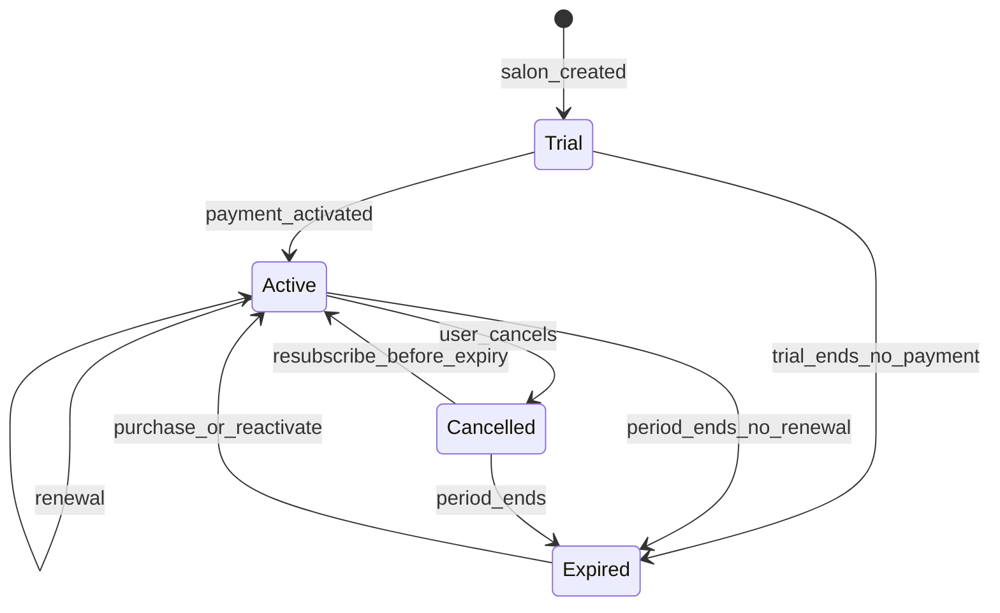
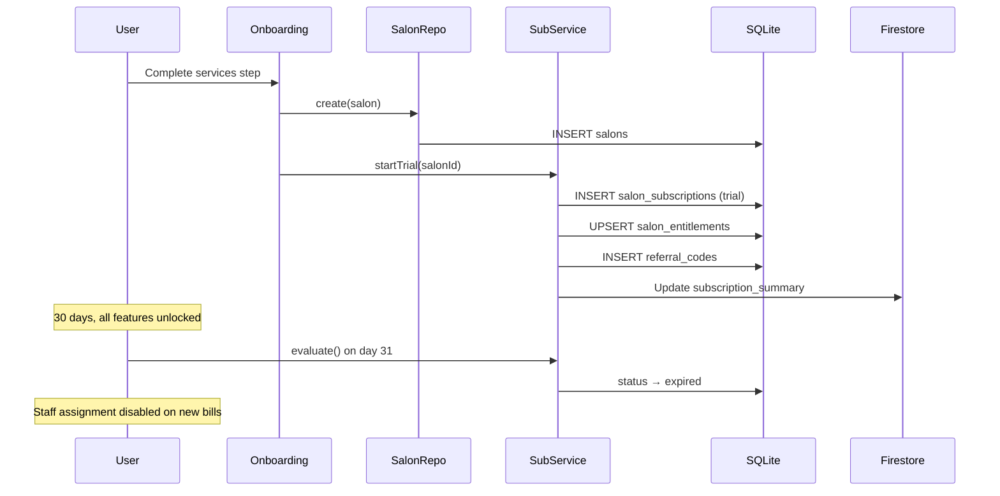
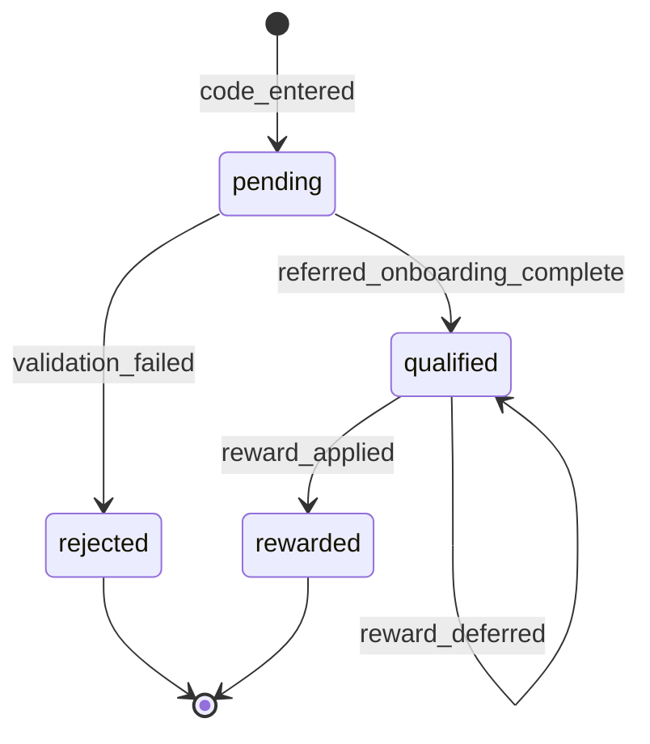

# Subscription, Trial, Referral & Plan Management System

**Status:** Design specification (not yet implemented)  
**Last updated:** 2026-07-22  
**Applies to:** Salon Khata — offline-first Expo/React Native app

This document is the single source of truth for designing and building the SaaS subscription layer. It aligns with existing architecture: SQLite as local source of truth, Firestore per-record sync, Firebase Auth (`salon.id = owner Firebase uid`), repository/domain layer boundaries, and offline-first principles.

---

## Table of contents

1. [Product requirements (PRD)](#1-product-requirements-prd)
2. [Database schema](#2-database-schema)
3. [Entity relationships](#3-entity-relationships)
4. [Subscription lifecycle](#4-subscription-lifecycle)
5. [Trial lifecycle](#5-trial-lifecycle)
6. [Referral lifecycle](#6-referral-lifecycle)
7. [Plan management architecture](#7-plan-management-architecture)
8. [Permission / access control design](#8-permission--access-control-design)
9. [API design](#9-api-design)
10. [Offline sync considerations](#10-offline-sync-considerations)
11. [Edge cases](#11-edge-cases)
12. [Security considerations](#12-security-considerations)
13. [Recommended folder structure](#13-recommended-folder-structure)
14. [Implementation plan](#14-implementation-plan)

---

## 1. Product requirements (PRD)

### 1.1 Problem statement

Salon Khata is a daily bookkeeping app for small salons. To sustain the product, salons need a subscription model that:

- Gives every new salon a generous trial to experience full value.
- Degrades gracefully after trial without blocking core operations.
- Incentivizes upgrade through staff-assignment restrictions (not data lockout).
- Supports referrals for organic growth.
- Is payment-gateway-ready without implementing payments now.

### 1.2 Goals

| Goal | Success metric |
| --- | --- |
| Trial conversion | % of trials that activate a paid plan within 30 days |
| Retention after expiry | Owner can still bill; no forced logout |
| Referral growth | Trackable referral funnel with reward hooks |
| Engineering velocity | New plans/features added via config, not refactors |
| Offline reliability | Subscription state cached locally; gates work offline |

### 1.3 Non-goals (this phase)

- Razorpay / Stripe / RevenueCat integration
- In-app purchase flows
- Multi-salon ownership per account
- Staff login (future; today only owner uses the app)
- GST invoicing for subscription receipts
- Proration, refunds, chargebacks

### 1.4 User stories

#### Trial

| ID | As a… | I want… | So that… |
| --- | --- | --- | --- |
| T-1 | New salon owner | A 30-day trial with all features | I can evaluate the full product |
| T-2 | Trial user | To assign staff on bills and see commissions | My daily workflow matches a paid salon |
| T-3 | Trial user | To see how many trial days remain | I know when to subscribe |

#### Post-trial (expired, no active subscription)

| ID | As a… | I want… | So that… |
| --- | --- | --- | --- |
| E-1 | Expired owner | To log in and view all historical data | I never lose my records |
| E-2 | Expired owner | To create bills without staff assignment | I can keep basic operations running |
| E-3 | Expired owner | To see reports on past data | I can review business performance |
| E-4 | Expired owner | Clear upgrade prompts when I try premium actions | I understand what subscription unlocks |

#### Active subscription

| ID | As a… | I want… | So that… |
| --- | --- | --- | --- |
| S-1 | Subscribed owner | Full staff assignment on bills | Commission tracking works normally |
| S-2 | Subscribed owner | All premium features | I get value for my payment |

#### Referral

| ID | As a… | I want… | So that… |
| --- | --- | --- | --- |
| R-1 | Salon owner | A unique referral code to share | I can invite other salons |
| R-2 | New salon owner | To enter a referral code once during onboarding | My referrer gets credit |
| R-3 | System | To block self-referrals and duplicates | Referral integrity is maintained |

### 1.5 Feature matrix by entitlement state

| Capability | Trial | Active paid | Expired (no sub) |
| --- | :---: | :---: | :---: |
| Login | ✅ | ✅ | ✅ |
| View all historical data | ✅ | ✅ | ✅ |
| View reports | ✅ | ✅ | ✅ |
| Create bills (owner-only) | ✅ | ✅ | ✅ |
| Assign staff on bills | ✅ | ✅ | ❌ |
| Commission calculation on new bills | ✅ | ✅ | ❌ (zero / owner-only) |
| Manage employees | ✅ | ✅ | ✅ (view/edit existing; assignment gated at billing) |
| Manage services | ✅ | ✅ | ✅ |
| Export / backup | ✅ | ✅ | ⚠️ Optional gate (product decision) |
| Cloud sync | ✅ | ✅ | ✅ (offline-first; sync not blocked) |

> **Design principle:** Expiry restricts *new premium actions*, not *data access*. This matches offline-first: local SQLite always has the data.

### 1.6 Key business rules

1. **One salon = one Firebase uid = one subscription account.**
2. **Trial starts at salon creation** (onboarding complete), not first login.
3. **Trial duration:** 30 calendar days (configurable per plan catalog).
4. **Referral code entry:** once per salon, during onboarding (before or at salon creation).
5. **Self-referral:** rejected if `referrer_salon_id === referred_salon_id`.
6. **Duplicate referral:** one referral record per referred salon (unique constraint).
7. **Staff assignment gate:** when `canAssignStaffOnBill === false`, income entry UI hides employee pickers and saves bills with a synthetic "owner" employee context (no per-line staff, zero commission on new lines).
8. **Existing bills with staff assignments remain unchanged** — snapshots are immutable.

### 1.7 UX requirements

- Persistent trial countdown banner on dashboard (days remaining).
- Post-expiry banner: "Trial ended — subscribe to assign staff and track commissions."
- Referral code screen in onboarding (optional field, skippable).
- "Share referral code" in More → Account.
- Upgrade CTA surfaces at staff-assignment touchpoints (income entry), not on every screen.
- All strings via i18n (`subscription.*` keys in `en.json` / `hi.json`).

---

## 2. Database schema

### 2.1 Design principles

- **Plan catalog** is mostly server-authoritative (Firestore + optional local cache).
- **Subscription state** is per-salon, cached locally for offline gates.
- **Referrals** are append-only events with extensible JSON metadata for future rewards.
- **Payment records** are stored but not processed in this phase.
- Follow existing conventions: UUID `id`, ISO UTC timestamps, soft-delete, sync columns on syncable tables.

### 2.2 New SQLite tables (migration 019+)

#### `subscription_plans` — local cache of plan catalog

Read-only cache populated on app start / pull. Not user-editable on device.

| Column | Type | Notes |
| --- | --- | --- |
| `id` | TEXT PK | Stable slug, e.g. `trial`, `monthly`, `quarterly`, `yearly` |
| `salon_id` | TEXT | Always `__global__` for catalog rows (or NULL) |
| `display_name` | TEXT | e.g. "Monthly Plan" |
| `billing_period_days` | INTEGER | 30, 90, 365; trial = 30 |
| `price_paise` | INTEGER | List price in paise; trial = 0 |
| `currency` | TEXT | Default `INR` |
| `is_trial` | INTEGER | `1` for trial plan |
| `is_active` | INTEGER | `1` = purchasable / visible |
| `sort_order` | INTEGER | UI ordering |
| `grace_period_days` | INTEGER | Default 0 |
| `features_json` | TEXT | JSON map of feature flags (see §7) |
| `metadata_json` | TEXT NULL | Extensible: `{ "razorpay_plan_id": "..." }` |
| shared columns | | `created_at`, `updated_at`, `deleted_at` |

Index: `idx_plans_active` on `is_active`, `deleted_at`.

#### `salon_subscriptions` — current + historical subscription periods

One **active** row per salon at a time (enforced in domain/repo). History kept via status transitions, not hard delete.

| Column | Type | Notes |
| --- | --- | --- |
| `id` | TEXT PK | UUID |
| `salon_id` | TEXT FK | `salons.id` |
| `plan_id` | TEXT FK | `subscription_plans.id` |
| `status` | TEXT | `trial`, `active`, `expired`, `cancelled` |
| `started_at` | TEXT | ISO UTC |
| `expires_at` | TEXT | ISO UTC; inclusive end-of-day semantics in domain |
| `cancelled_at` | TEXT NULL | When user/admin cancelled |
| `grace_ends_at` | TEXT NULL | `expires_at + grace_period_days` |
| `source` | TEXT | `trial`, `purchase`, `referral_reward`, `admin`, `payment_webhook` |
| `external_subscription_id` | TEXT NULL | Future: Razorpay sub id |
| `metadata_json` | TEXT NULL | Extensible |
| shared + sync columns | | Full sync columns (016) |

Indexes:

- `idx_salon_sub_salon_status` on `salon_id`, `status`, `deleted_at`
- Partial unique: one non-terminal active/trial row per salon (enforced in repo transaction)

#### `subscription_payments` — payment history ledger

| Column | Type | Notes |
| --- | --- | --- |
| `id` | TEXT PK | UUID |
| `salon_id` | TEXT FK | |
| `subscription_id` | TEXT FK | `salon_subscriptions.id` |
| `plan_id` | TEXT FK | Plan at time of payment |
| `amount_paise` | INTEGER | |
| `currency` | TEXT | |
| `status` | TEXT | `pending`, `completed`, `failed`, `refunded` |
| `provider` | TEXT | `manual`, `razorpay`, `stripe`, … |
| `provider_payment_id` | TEXT NULL | |
| `provider_payload_json` | TEXT NULL | Raw webhook payload for audit |
| `paid_at` | TEXT NULL | |
| shared + sync columns | | |

Index: `idx_sub_payments_salon` on `salon_id`, `paid_at`.

#### `referral_codes` — one code per salon

| Column | Type | Notes |
| --- | --- | --- |
| `id` | TEXT PK | UUID |
| `salon_id` | TEXT FK UNIQUE | One code per salon |
| `code` | TEXT UNIQUE | Human-friendly, e.g. `RIYA7K2M` (8 chars, no ambiguous chars) |
| `is_active` | INTEGER | `1` default |
| shared + sync columns | | |

Indexes:

- `UNIQUE(code)` where `deleted_at IS NULL`
- `UNIQUE(salon_id)` where `deleted_at IS NULL`

#### `referrals` — referral events

| Column | Type | Notes |
| --- | --- | --- |
| `id` | TEXT PK | UUID |
| `salon_id` | TEXT FK | Referrer's salon id |
| `referrer_salon_id` | TEXT FK | Denormalized for queries |
| `referred_salon_id` | TEXT FK UNIQUE | One referral per referred salon |
| `referral_code` | TEXT | Code used |
| `status` | TEXT | `pending`, `qualified`, `rewarded`, `rejected` |
| `referred_at` | TEXT | ISO UTC |
| `qualified_at` | TEXT NULL | e.g. when referred salon completes onboarding |
| `rewarded_at` | TEXT NULL | When reward applied |
| `rejection_reason` | TEXT NULL | `self_referral`, `duplicate`, `invalid_code`, … |
| `reward_json` | TEXT NULL | Extensible: `{ "type": "subscription_days", "days": 7 }` |
| `metadata_json` | TEXT NULL | Future: campaign id, attribution |
| shared + sync columns | | |

Indexes:

- `UNIQUE(referred_salon_id)` where `deleted_at IS NULL`
- `idx_referrals_referrer` on `referrer_salon_id`, `status`

#### `salon_entitlements` — denormalized snapshot for fast local reads

Updated whenever subscription changes. Avoids joins on every screen.

| Column | Type | Notes |
| --- | --- | --- |
| `salon_id` | TEXT PK | |
| `subscription_id` | TEXT NULL | Current subscription row |
| `plan_id` | TEXT NULL | |
| `status` | TEXT | Computed: `trial`, `active`, `expired`, `cancelled`, `none` |
| `is_trial` | INTEGER | `0`/`1` |
| `is_active` | INTEGER | Paid + not expired (incl. grace) |
| `expires_at` | TEXT NULL | |
| `grace_ends_at` | TEXT NULL | |
| `remaining_days` | INTEGER | Cached; recomputed on read in domain |
| `features_json` | TEXT | Merged effective feature flags |
| `evaluated_at` | TEXT | Last time snapshot was computed |
| `updated_at` | TEXT | |

> This table is **derived state**. Source of truth is `salon_subscriptions` + `subscription_plans`. Rebuilt on subscription change and on app boot.

### 2.3 Firestore layout (authoritative for subscription)

#### Top-level salon doc (extends existing `/salons/{sid}`)

```json
{
  "owner_uid": "firebase-uid",
  "member_uids": [],
  "subscription_summary": {
    "status": "trial",
    "plan_id": "trial",
    "expires_at": "2026-08-21T18:30:00.000Z",
    "grace_ends_at": null,
    "updated_at": "2026-07-22T18:30:00.000Z"
  },
  "referral_code": "RIYA7K2M"
}
```

`subscription_summary` is a **denormalized mirror** for security rules and quick client fetch on sign-in. Detailed history stays in synced entity collections.

#### Synced entities (add to `SyncEntityType`)

| Entity type | Aggregate | Notes |
| --- | --- | --- |
| `subscription_plans` | Global catalog | Pulled read-only; `salon_id = __global__` |
| `salon_subscriptions` | Per salon | |
| `subscription_payments` | Per salon | |
| `referral_codes` | Per salon | |
| `referrals` | Per salon | Referrer's salon_id scopes the row |

#### Global plan catalog (optional alternative)

```
/config/subscription_plans/{planId}
```

Use this for admin-managed plans without per-salon sync. Client pulls on boot and caches into `subscription_plans`. Either approach works; **recommended: global Firestore config + local cache** to avoid syncing identical rows to every salon.

### 2.4 Migration sketch (019)

```sql
-- 019-subscription-system.ts (idempotent)
CREATE TABLE IF NOT EXISTS subscription_plans (...);
CREATE TABLE IF NOT EXISTS salon_subscriptions (...);
CREATE TABLE IF NOT EXISTS subscription_payments (...);
CREATE TABLE IF NOT EXISTS referral_codes (...);
CREATE TABLE IF NOT EXISTS referrals (...);
CREATE TABLE IF NOT EXISTS salon_entitlements (...);

-- Seed local trial plan + paid plans (or pull from Firestore on first run)
INSERT OR IGNORE INTO subscription_plans (id, ...) VALUES ('trial', ...);
```

Onboarding hook: after `SalonRepository.create()`, call `SubscriptionService.startTrial(salonId)`.

---

## 3. Entity relationships

```mermaid
erDiagram
    SALONS ||--o| SALON_ENTITLEMENTS : has
    SALONS ||--o{ SALON_SUBSCRIPTIONS : has
    SALONS ||--o| REFERRAL_CODES : owns
    SALONS ||--o{ REFERRALS : refers
    SALONS ||--o{ REFERRALS : referred_as

    SUBSCRIPTION_PLANS ||--o{ SALON_SUBSCRIPTIONS : defines
    SALON_SUBSCRIPTIONS ||--o{ SUBSCRIPTION_PAYMENTS : paid_by

    REFERRAL_CODES ||--o{ REFERRALS : used_in

    SALONS {
        text id PK
        text owner_uid
    }

    SUBSCRIPTION_PLANS {
        text id PK
        text display_name
        int billing_period_days
        int price_paise
        text features_json
    }

    SALON_SUBSCRIPTIONS {
        text id PK
        text salon_id FK
        text plan_id FK
        text status
        text started_at
        text expires_at
    }

    SALON_ENTITLEMENTS {
        text salon_id PK
        text status
        int remaining_days
        text features_json
    }

    REFERRAL_CODES {
        text id PK
        text salon_id FK
        text code UK
    }

    REFERRALS {
        text id PK
        text referrer_salon_id FK
        text referred_salon_id FK UK
        text status
        text reward_json
    }

    SUBSCRIPTION_PAYMENTS {
        text id PK
        text subscription_id FK
        int amount_paise
        text provider
    }
```

### Relationship rules

| Relationship | Cardinality | Rule |
| --- | --- | --- |
| Salon → Subscription | 1 active period | At most one `trial` or `active` row; history via status |
| Salon → Referral code | 1:1 | Generated at salon creation |
| Salon → Referral (as referred) | 1:1 | Unique `referred_salon_id` |
| Plan → Subscription | N:1 | Plan catalog is versioned by `id`; price changes don't mutate old rows |
| Subscription → Payments | 1:N | Each renewal creates a payment row |

---

## 4. Subscription lifecycle



### State definitions

| Status | Meaning |
| --- | --- |
| `trial` | Within 30-day trial window |
| `active` | Paid (or comped) subscription in good standing |
| `expired` | Trial or paid period ended; no grace |
| `cancelled` | User cancelled; may still have access until `expires_at` |

### Transitions (domain service)

| Event | From | To | Action |
| --- | --- | --- | --- |
| `startTrial` | — | `trial` | Create subscription row, plan=`trial`, expires=now+30d |
| `activateSubscription` | `trial`/`expired` | `active` | New or update row, set plan, extend `expires_at` |
| `renewSubscription` | `active` | `active` | Extend `expires_at` by plan period; log payment |
| `cancelSubscription` | `active` | `cancelled` | Set `cancelled_at`; access until `expires_at` |
| `expireSubscription` | `trial`/`active`/`cancelled` | `expired` | Cron or lazy-eval on app open |
| `applyReferralReward` | any | varies | Extend `expires_at` or upgrade; log in `reward_json` |

### Lazy vs scheduled expiry

- **Lazy evaluation (recommended for MVP):** On app boot and every 24h foreground, `SubscriptionService.evaluate(salonId)` compares `now` to `expires_at` / `grace_ends_at` and transitions status.
- **Cloud Function (Phase 2):** Nightly job updates Firestore `subscription_summary` for push notifications.

---

## 5. Trial lifecycle



### Trial rules

1. **Start:** `started_at = onboarding_completed_at` (UTC).
2. **End:** `expires_at = started_at + 30 days` (use domain date math, end of local business day optional).
3. **No payment during trial:** `subscription_payments` empty.
4. **Trial is not restartable** per salon (one trial per `salon_id` / Firebase uid).
5. **Referral during trial:** Allowed; reward applied when qualification rules met (e.g. referred salon completes onboarding).

---

## 6. Referral lifecycle



### Flow

1. **Code generation:** On salon creation, generate unique 8-char code (`referral_codes`).
2. **Code entry:** New user enters optional code in onboarding (before salon row exists).
3. **Validation (server-authoritative via Cloud Function or client + rules):**
   - Code exists and `is_active = 1`
   - `referrer_salon_id !== referred_salon_id`
   - `referred_salon_id` has no existing referral row
4. **Record creation:** Insert `referrals` with `status = pending`.
5. **Qualification:** When referred salon completes onboarding → `status = qualified`.
6. **Reward (future):** Cloud Function or admin applies reward → update `reward_json`, `status = rewarded`, optionally extend referrer's subscription.

### Referral code format

- Charset: `ABCDEFGHJKLMNPQRSTUVWXYZ23456789` (no 0/O/1/I)
- Length: 8
- Collision: retry on unique constraint violation

### Extensible rewards (`reward_json`)

```json
{
  "type": "subscription_days",
  "days": 7,
  "applied_to": "referrer",
  "subscription_extension_id": "uuid"
}
```

Future types: `credit_paise`, `cashback_paise`, `plan_upgrade` — no schema change needed.

---

## 7. Plan management architecture

### 7.1 Plan catalog (config-driven)

Plans are **data, not code**. Stored in Firestore `/config/subscription_plans/{planId}` and cached locally.

```json
{
  "id": "monthly",
  "display_name": "Monthly",
  "billing_period_days": 30,
  "price_paise": 29900,
  "currency": "INR",
  "is_trial": false,
  "is_active": true,
  "sort_order": 1,
  "grace_period_days": 3,
  "features": {
    "assign_staff_on_bill": true,
    "commission_tracking": true,
    "advanced_reports": true,
    "export_backup": true,
    "multi_device_sync": true
  },
  "metadata": {
    "razorpay_plan_id": null
  }
}
```

### 7.2 Default plans

| Plan ID | Period | Price (INR) | Notes |
| --- | --- | --- | --- |
| `trial` | 30 days | ₹0 | Auto-assigned |
| `monthly` | 30 days | TBD | |
| `quarterly` | 90 days | TBD | |
| `yearly` | 365 days | TBD | |

### 7.3 Feature flags

| Flag key | Trial | Active | Expired |
| --- | :---: | :---: | :---: |
| `assign_staff_on_bill` | true | true | false |
| `commission_tracking` | true | true | false |
| `view_reports` | true | true | true |
| `manage_staff` | true | true | true |
| `create_bills` | true | true | true |
| `export_backup` | true | true | false* |
| `premium_reports` | true | true | false* |

\*Product toggles — default shown; adjust in plan config without code changes.

### 7.4 Grace period

- Configured per plan: `grace_period_days` (default 0 for trial, 3 for paid — product decision).
- During grace: treat as `active` for entitlements (`is_active = true` until `grace_ends_at`).
- `grace_ends_at = expires_at + grace_period_days`.

### 7.5 Adding future plans

1. Admin adds doc to `/config/subscription_plans/new_plan`.
2. Client pulls catalog on boot → upserts `subscription_plans`.
3. Payment webhook passes `plan_id` → `activateSubscription(planId)`.
4. No app release required for pricing/display; feature flags travel with plan doc.

---

## 8. Permission / access control design

### 8.1 Centralized entitlement layer

All subscription checks go through **one module** — no scattered `if (trial)` in screens.

```
src/domain/entitlement-service.ts   ← pure functions (no React)
src/session/entitlement-context.tsx ← React context (optional)
src/hooks/useEntitlements.ts        ← thin hook for screens
```

### 8.2 Core types

```typescript
type EntitlementStatus = "trial" | "active" | "expired" | "cancelled" | "none";

type EntitlementSnapshot = {
  salonId: string;
  status: EntitlementStatus;
  planId: string | null;
  isTrial: boolean;
  isActive: boolean;          // active OR trial OR in grace
  isExpired: boolean;
  expiresAt: string | null;
  graceEndsAt: string | null;
  remainingDays: number;
  features: Record<string, boolean>;
};

type EntitlementQuery =
  | "isOnTrial"
  | "isSubscriptionActive"
  | "hasSubscriptionExpired"
  | "canAssignStaffOnBill"
  | "canUsePremiumFeatures"
  | "canAccessReports"
  | "canManageStaff"
  | "canCreateBills";
```

### 8.3 API surface (`entitlement-service.ts`)

```typescript
function buildSnapshot(
  subscription: SalonSubscription | null,
  plan: SubscriptionPlan | null,
  now?: Date
): EntitlementSnapshot;

function can(snapshot: EntitlementSnapshot, query: EntitlementQuery): boolean;

// Convenience
function canAssignStaffOnBill(snapshot: EntitlementSnapshot): boolean;
function canUsePremiumFeatures(snapshot: EntitlementSnapshot): boolean;
// ...
```

### 8.4 Decision table

| Query | Logic |
| --- | --- |
| `isOnTrial` | `status === "trial" && now < expires_at` |
| `isSubscriptionActive` | `status === "active" && now < grace_ends_at` |
| `hasSubscriptionExpired` | `!isOnTrial && !isSubscriptionActive` (after grace) |
| `canAssignStaffOnBill` | `features.assign_staff_on_bill === true` |
| `canUsePremiumFeatures` | `isOnTrial \|\| isSubscriptionActive` |
| `canAccessReports` | always `true` (view historical) |
| `canManageStaff` | always `true` (CRUD employees; billing assignment is separate) |
| `canCreateBills` | always `true` |

### 8.5 UI integration points

| Screen / component | Gate |
| --- | --- |
| `IncomeEntryScreen` | Hide employee pickers when `!canAssignStaffOnBill`; auto-assign owner pseudo-employee; `canSave` without per-line employee |
| `IncomeEntryScreen` save | Pass `commissionAmount: 0` when staff assignment disabled |
| Dashboard | Trial/expiry banner via `useEntitlements()` |
| Reports | No gate (read-only) |
| Employees | No gate |
| More → Upgrade | Show plan catalog when expired |
| Onboarding | Referral code field |

### 8.6 Owner-only billing (expired mode)

When staff assignment is disabled:

- Bills save with `employee_id` = owner placeholder UUID (constant `OWNER_EMPLOYEE_ID`) or NULL with snapshot `"Owner"`.
- Per-line `employee_id` on items = NULL.
- Commission = 0 on new lines.
- Existing historical bills unchanged.

---

## 9. API design

### 9.1 Layering

| Layer | Responsibility |
| --- | --- |
| **Cloud Functions** (future) | Webhooks, referral validation, authoritative writes |
| **Firestore** | `subscription_summary`, entity sync, plan catalog |
| **Repositories** | SQLite CRUD + `trackChange()` |
| **Domain services** | `subscription-service.ts`, `entitlement-service.ts`, `referral-service.ts` |
| **Application** | Orchestration on onboarding, sign-in refresh |

### 9.2 Domain service API (`subscription-service.ts`)

```typescript
// Lifecycle
function startTrial(salonId: string): SalonSubscription;
function activateSubscription(input: {
  salonId: string;
  planId: string;
  source: "purchase" | "referral_reward" | "admin" | "payment_webhook";
  externalSubscriptionId?: string;
  payment?: NewSubscriptionPayment;
}): SalonSubscription;

function renewSubscription(salonId: string, payment: NewSubscriptionPayment): SalonSubscription;
function cancelSubscription(salonId: string, reason?: string): SalonSubscription;
function evaluateAndRefresh(salonId: string, now?: Date): EntitlementSnapshot;

// Read
function getCurrentSubscription(salonId: string): SalonSubscription | null;
function getEntitlements(salonId: string): EntitlementSnapshot;
function listActivePlans(): SubscriptionPlan[];
```

### 9.3 Referral service API (`referral-service.ts`)

```typescript
function generateReferralCode(salonId: string): ReferralCode;
function validateReferralCode(code: string, referredSalonId: string): ValidationResult;
function applyReferralCode(code: string, referredSallonId: string): Referral;
function qualifyReferral(referredSalonId: string): void;
function getReferralsForSalon(salonId: string): Referral[];
function getMyReferralCode(salonId: string): string;
```

### 9.4 Repository API (sketch)

```typescript
class SubscriptionRepository {
  getCurrentBySalon(salonId: string): SalonSubscription | null;
  insert(sub: SalonSubscription): void;
  updateStatus(id: string, status: SubscriptionStatus, timestamps: ...): void;
  upsertEntitlements(snapshot: SalonEntitlementsRow): void;
  getEntitlements(salonId: string): SalonEntitlementsRow | null;
}

class ReferralRepository { ... }
class PlanRepository { ... }
```

### 9.5 Cloud Function endpoints (future — payment-ready)

| Endpoint | Method | Purpose |
| --- | --- | --- |
| `POST /webhooks/razorpay` | HTTP | Verify signature → `activateSubscription` / `renewSubscription` |
| `POST /referrals/validate` | Callable | Server-side validation before client commit |
| `POST /referrals/apply` | Callable | Atomic apply + duplicate check |
| `GET /plans` | HTTP | Public plan catalog |

**MVP without payment:** Admin script or Firestore console manually sets `subscription_summary` + synced `salon_subscriptions` row; client pulls on sign-in.

### 9.6 Client refresh on sign-in

```typescript
// AuthProvider after resolveSalonFor()
await subscriptionRepo.pullSummaryFromFirestore(salonId); // read top-level doc
await subscriptionService.evaluateAndRefresh(salonId);
eventBus.emit("subscription:changed", { salonId });
```

---

## 10. Offline sync considerations

### 10.1 Principles

1. **Subscription gates use local cache** (`salon_entitlements`) — never block billing on network.
2. **Writes commit to SQLite first** — same as all business data.
3. **Subscription entities sync** like other aggregates via `trackChange()`.
4. **Plan catalog** pulled on boot when online; stale cache acceptable for display (use last-known plans).
5. **Clock skew:** Use server `subscription_summary.updated_at` from Firestore on pull to correct local expiry if drift > 5 min.

### 10.2 Sync entity registration

Add to `SyncEntityType` and `ENTITY_PULL_ORDER`:

```
subscription_plans (global, early)
referral_codes
salon_subscriptions
referrals
subscription_payments
```

`salon_entitlements` is **not synced** — rebuilt locally from subscription + plan.

### 10.3 Conflict resolution

| Entity | Strategy |
| --- | --- |
| `salon_subscriptions` | **Server wins** for status/expiry (payment authority). Client cannot set `active` without server ack in production. |
| `referrals` | **Server wins** on status/reward fields |
| `referral_codes` | Immutable after create; LWW on `is_active` |
| `subscription_plans` | Read-only on client; server/catalog wins |

For MVP without payment: client-created trial is trusted (device-generated). When payment goes live, add Firestore rules:

```
// Only Cloud Functions may set status = 'active' on salon_subscriptions
```

### 10.4 Offline expiry

If user is offline past `expires_at`:

- Local `evaluateAndRefresh()` transitions to `expired` based on device clock.
- On reconnect, pull `subscription_summary`; if server says `active` (payment while offline), upgrade local state.
- Show toast: "Subscription updated" on reconciliation.

### 10.5 Event bus

```typescript
eventBus.emit("subscription:changed", { salonId, snapshot });
```

Subscribers: `IncomeEntryScreen`, dashboard banner, `useEntitlements` hook.

---

## 11. Edge cases

| # | Scenario | Handling |
| --- | --- | --- |
| 1 | User changes device date to extend trial | On sync, server `expires_at` wins; optional tamper flag in analytics |
| 2 | Payment succeeds while offline | Webhook updates Firestore; client pulls on reconnect |
| 3 | User subscribes on day 29 of trial | `activateSubscription` transitions trial → active; new `expires_at = now + plan period` (or trial remaining + paid — product rule: **replace trial**) |
| 4 | Cancelled but before `expires_at` | `status = cancelled`, entitlements remain active until expiry |
| 5 | Referral code entered after salon created | Reject — code must be captured in onboarding before `referrals` insert |
| 6 | Invalid referral code | Silent skip or inline error; onboarding continues |
| 7 | Self-referral | `status = rejected`, `rejection_reason = self_referral` |
| 8 | Duplicate referral for same referred salon | Unique constraint; second attempt rejected |
| 9 | Referrer deleted salon | Referral row preserved; `referrer_salon_id` orphaned but valid for audit |
| 10 | Edit old bill with staff during expired | Allowed — editing existing bills keeps snapshots |
| 11 | New bill line during expired | No staff picker; owner-only |
| 12 | Plan deactivated (`is_active = 0`) | Existing subscriptions honored until expiry; not available for new purchases |
| 13 | Plan price change | Old subscriptions keep `plan_id` snapshot; new purchases use updated catalog |
| 14 | Grace period overlap | `isSubscriptionActive` true until `grace_ends_at` |
| 15 | Multiple rapid subscription writes | Repo transaction + single active row constraint |
| 16 | App reinstall | Pull from Firestore restores subscription state |
| 17 | Dev reset (More screen) | Clear subscription tables + re-trial policy: **no** — dev reset should not grant new trial in production |
| 18 | Timezone boundaries | Store UTC; display remaining days in local TZ |

---

## 12. Security considerations

### 12.1 Threat model

| Threat | Mitigation |
| --- | --- |
| Client fakes `active` subscription | Firestore rules: clients cannot write `status: active` without Function token; `subscription_summary` write restricted |
| Referral farming | Server validation; rate limit code lookups; device fingerprint logging (future) |
| Code brute-force | 8-char alphanumeric = large space; rate limit callable |
| Sync tampering | Server-authoritative fields on subscription status |
| App Check bypass | Existing `hasAppCheck()` in `firestore.rules` |

### 12.2 Firestore rules (sketch)

```javascript
match /salons/{sid} {
  // Owner can read subscription_summary
  allow read: if authed() && salonMember(sid);

  // Owner cannot directly set active subscription (MVP: merge trial only)
  allow update: if authed() &&
    resource.data.owner_uid == request.auth.uid &&
    (!request.resource.data.diff(resource.data).affectedKeys()
      .hasAny(['subscription_summary']) ||
     request.resource.data.subscription_summary.status in ['trial']);
}

match /config/subscription_plans/{planId} {
  allow read: if authed();
  allow write: if false; // Admin SDK only
}
```

Production: move `active` transitions to Cloud Functions with Admin SDK.

### 12.3 PII

- Referral codes are not PII.
- `referrals` links salon ids only.
- Payment payloads in `provider_payload_json` — encrypt at rest in Firestore (future).

### 12.4 Audit

- All status transitions append to `subscription_payments` or `metadata_json` changelog.
- `sync_history` captures push/pull for debugging.

---

## 13. Recommended folder structure

```
src/
├── domain/
│   ├── entitlement-service.ts      # Pure permission queries
│   ├── subscription-service.ts       # Lifecycle orchestration (pure where possible)
│   ├── referral-service.ts           # Code gen, validation rules
│   └── subscription-types.ts         # Shared types
│
├── repositories/
│   ├── subscription-repository.ts
│   ├── subscription-plan-repository.ts
│   ├── referral-repository.ts
│   └── subscription-payment-repository.ts
│
├── session/
│   ├── entitlement-context.tsx       # Provider wrapping snapshot
│   └── use-entitlements.ts           # Hook
│
├── features/
│   ├── subscription/
│   │   ├── TrialBanner.tsx
│   │   ├── ExpiredBanner.tsx
│   │   ├── UpgradeScreen.tsx         # Plan picker (no payment yet)
│   │   └── SubscriptionStatusCard.tsx
│   │
│   └── onboarding/
│       └── ReferralCodeStep.tsx      # New onboarding step
│
├── cloud/
│   └── subscription-summary.ts         # Firestore read/write for top-level doc
│
├── sync/
│   └── entity-order.ts               # Add new entity types
│
└── database/
    └── migrations/
        └── 019-subscription-system.ts

functions/src/
├── subscriptions/
│   ├── activate.ts                   # Future webhook handler
│   ├── renew.ts
│   └── evaluate-expiry.ts            # Nightly cron
└── referrals/
    ├── validate.ts
    └── apply-reward.ts

docs/
└── subscription-system.md              # This document
```

---

## 14. Implementation plan

Correct development order — each step builds on the previous and is independently testable.

### Phase 1 — Foundation (domain + schema)

| Step | Task | Files |
| --- | --- | --- |
| 1.1 | Add migration 019 with all tables + seed trial plan | `019-subscription-system.ts` |
| 1.2 | Define TypeScript types | `subscription-types.ts` |
| 1.3 | Implement `entitlement-service.ts` with full test coverage | `domain/` |
| 1.4 | Implement `subscription-service.ts` (startTrial, evaluate, activate stub) | `domain/` |
| 1.5 | Unit tests for entitlement decision table | `*.test.ts` |

### Phase 2 — Persistence

| Step | Task | Files |
| --- | --- | --- |
| 2.1 | `SubscriptionRepository` + `PlanRepository` | `repositories/` |
| 2.2 | `ReferralRepository` + code generator | `repositories/`, `referral-service.ts` |
| 2.3 | Wire `upsertEntitlements` on every subscription mutation | repo + service |
| 2.4 | Register sync entities + serializer/deserializer | `sync/` |

### Phase 3 — Onboarding integration

| Step | Task | Files |
| --- | --- | --- |
| 3.1 | Call `startTrial()` after salon create | `ServicesStep.tsx` |
| 3.2 | Generate referral code on salon create | `subscription-service.ts` |
| 3.3 | Add optional `ReferralCodeStep` in onboarding | `features/onboarding/` |
| 3.4 | `applyReferralCode` with validation | `referral-service.ts` |
| 3.5 | i18n keys for onboarding + banners | `en.json`, `hi.json` |

### Phase 4 — Entitlement context + UI gates

| Step | Task | Files |
| --- | --- | --- |
| 4.1 | `EntitlementProvider` in `AppRoot` / `AuthProvider` | `session/` |
| 4.2 | `evaluateAndRefresh` on sign-in | `AuthProvider.tsx` |
| 4.3 | Trial + expired banners on dashboard | `features/dashboard/` |
| 4.4 | Gate `IncomeEntryScreen` staff assignment | `features/income/` |
| 4.5 | Owner-only bill save path (zero commission) | `IncomeEntryScreen.tsx` |
| 4.6 | Upgrade screen (plan list, no checkout) | `features/subscription/` |

### Phase 5 — Cloud + sync

| Step | Task | Files |
| --- | --- | --- |
| 5.1 | `subscription_summary` on `/salons/{sid}` | `cloud/subscription-summary.ts` |
| 5.2 | Pull summary on sign-in; merge with local | `AuthProvider` |
| 5.3 | Firestore plan catalog `/config/subscription_plans` | Firebase console + pull |
| 5.4 | Update `firestore.rules` for subscription fields | `firestore.rules` |
| 5.5 | Sync integration tests | manual / e2e |

### Phase 6 — Referral completion

| Step | Task | Files |
| --- | --- | --- |
| 6.1 | Qualify referral on referred onboarding complete | `referral-service.ts` |
| 6.2 | Share referral UI in More screen | `features/more/` |
| 6.3 | Referral list (pending / qualified) for referrer | `features/subscription/` |

### Phase 7 — Payment-ready hooks (no gateway)

| Step | Task | Files |
| --- | --- | --- |
| 7.1 | `activateSubscription` from manual admin trigger | CLI / Firestore |
| 7.2 | `subscription_payments` insert on activation | `subscription-service.ts` |
| 7.3 | Cloud Function stubs (deployed but unused) | `functions/src/subscriptions/` |
| 7.4 | Document webhook contract | `docs/subscription-system.md` |

### Phase 8 — Polish

| Step | Task |
| --- | --- |
| 8.1 | Update `docs/implementation-status.md` |
| 8.2 | Update `docs/database-schema.md` |
| 8.3 | QA matrix: trial → expired → subscribe → staff assign |
| 8.4 | Analytics events: `trial_started`, `trial_expired`, `referral_applied` |

### Testing checklist

- [ ] New salon gets 30-day trial and referral code
- [ ] Trial: staff assignable, commission calculated
- [ ] Day 31: status expired, staff pickers hidden
- [ ] Expired: bills save with owner-only, commission 0
- [ ] Expired: reports still render
- [ ] Manual activate: staff assignment restored
- [ ] Referral: valid code links salons
- [ ] Referral: self-referral rejected
- [ ] Referral: duplicate rejected
- [ ] Offline: gates work from `salon_entitlements`
- [ ] Reconnect: server subscription overrides local

---

## Appendix A — Payment webhook contract (future)

```typescript
// POST /webhooks/razorpay (Cloud Function)
interface WebhookPayload {
  event: "subscription.activated" | "subscription.charged" | "subscription.cancelled";
  salon_id: string;
  plan_id: string;
  provider_subscription_id: string;
  provider_payment_id: string;
  amount_paise: number;
  paid_at: string; // ISO UTC
}

// Handler pseudocode
async function handleWebhook(payload: WebhookPayload) {
  switch (payload.event) {
    case "subscription.activated":
      await adminSdk.activateSubscription(payload);
      break;
    case "subscription.charged":
      await adminSdk.renewSubscription(payload);
      break;
    case "subscription.cancelled":
      await adminSdk.cancelSubscription(payload.salon_id);
      break;
  }
  await updateSubscriptionSummary(payload.salon_id);
}
```

No changes to `entitlement-service.ts` or UI gates when this is added.

---

## Appendix B — Income entry changes (expired mode)

```typescript
// IncomeEntryScreen.tsx (conceptual)
const { canAssignStaffOnBill } = useEntitlements();

// canSave: require employee only when assignment allowed
const canSave = billItems.length > 0 && (
  canAssignStaffOnBill
    ? billItems.every((i) => !!i.employeeId)
    : true
);

// On save when !canAssignStaffOnBill:
// - employee_id = OWNER_PLACEHOLDER_ID
// - each item: employee_id = null, commission_amount = 0
```

---

## Appendix C — Glossary

| Term | Definition |
| --- | --- |
| Entitlement | Effective permission set derived from subscription + plan |
| Plan catalog | Server-managed list of purchasable plans |
| Grace period | Days after `expires_at` where paid features still work |
| Owner placeholder | Synthetic employee used for owner-only bills |
| Subscription summary | Denormalized Firestore field for fast auth-time read |
